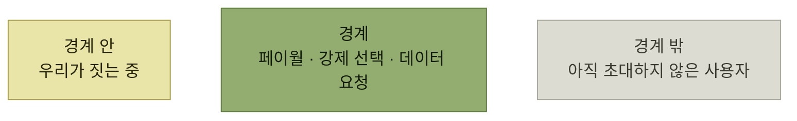

# 단계적으로 만들기와 실험 버전

> [인터랙션 설계](./README.md)

## 빠른 복습
- **겨냥하고 싶은 사용자 시나리오가 있지만 최우선 순위는 아닐 수** 있다. **그런데 지금 무언가를 만들어두지 않으면 나중에 그 시나리오를 지원하기가 훨씬 어려워진다** — **함정문 결정trapdoor decision**이다.
- 이런 경우 **기능을 개발하는 동안 경계를 설정**한다. **건설 현장의 안전모 착용 구역을 둘러싼 철제 울타리**를 떠올리면 된다.
- **경계는 나중에 기능을 추가할 수 있는 시간을 확보**해 준다.
- **"코드가 논쟁을 이긴다code wins arguments"** — **돌아가는, 시연 가능한 코드가 추상적 토론이나 시나리오, 요구 사항 문서보다 설득력** 있다.
- **때로는 무언가를 만들어 가정을 시험하는 게 가장 좋은 연구 방법**이다. **실험을 중단해야 할 수도 있지만, 그래도 괜찮다.**

> [!TIP]
> **함정문 결정에는 경계를 먼저 세우세요**
>
> 미래 선택지를 잃을 위험이 있다면 접근 범위와 데이터를 통제하면서 작은 실험으로 가정을 검증할 시간을 확보하세요.

## 경계를 세운다

*경계가 있는 동안에는 무엇을 만들고 어떻게 마무리할지 선택지가 열려 있다*

> **이 울타리는 작업자가 내부에서 집을 짓는 동안 외부인의 접근을 막아** 줍니다. **결국에는 사람들을 내부로 초대하겠지만, 그 전에 벽과 설비, 안전 장치를 모두 갖춘 뒤에야** 가능합니다. **외부인이 경계 밖에 있기 때문에, 여전히 무엇을 만들고 어떻게 마무리할지에 대해 다양한 선택지**를 가질 수 있습니다.

| 상황 | 경계 |
| --- | --- |
| **서비스에 무료 티어를 두고 싶지만 안티스팸 보호와 효율성 최적화가 필요** | **그게 추가될 때까지는 페이월이 경계** |
| **좋은 기본값을 주고 싶지만 어떤 값이어야 할지 확신이 없다** | **사용자에게 충분한 정보를 기반으로 선택하도록 유도**하되, **선호도가 파악되거나 개선 작업이 완료되면 더 이상 선택을 요구하지 않는다** |
| **미래 기능이 데이터 수집을 필요로** 한다 | **데이터를 미리 확보해두지 않으면 기존 사용자에게서 정보를 다시 얻기가 어렵다.** **일부 초기 사용자를 떨어져 나가게 만들지도 모른다는 걸 알면서도 데이터를 요청**하고, **성장에 해가 되거나 사용자가 불만을 제기하면 나중에 중단**할 수 있다 |

표를 읽는 법. 둘째 줄이 ["기본값 없음"](./3-안전한-기본값과-기본값-없음.md)을 **영구 정책이 아니라 임시 경계**로 재해석한다. 셋째 줄은 **비대칭성**이 근거다 — **지금 안 받으면 나중에 못 받지만, 지금 받았다가 나중에 안 받는 것은 쉽다.**

## EntSchema의 서술 요구

> **EntSchema의 서술은 마지막 범주에 속합니다.** **최우선 순위는 새 모델 작성 속도를 끌어올리는 것**이었어요. 그러나 **모델 사용자를 위한 훌륭한 서술도 함께** 원했습니다. **서술을 미리 요구하지 않으면 대부분 작성자가 쓰지 않을 것이고, 나중에 추가하려면 마이그레이션이 필요해질 게 뻔했어요.**

> 그러면서도 **마찰이 너무 커져 작성자가 질리지 않을까 걱정**했습니다. **아마 양쪽의 장점을 모두 취하는 균형이 있었겠지만, 다른 집중할 문제가 많았습니다.**

**"더 좋은 답이 있었을 것"이라고 인정하면서도 그때는 못 했다**고 적는 대목이 정직하다. ["집중할 수 있을 때 만들라"](./6-어포던스-출시-타이밍.md) 의 반대 상황이다.

### 경계를 조금씩 낮췄다

| 시점 | 조치 |
| --- | --- |
| **처음** | **설명이 없는 필드를 허용하지 않았다** |
| **피드백 후** | **설명을 건너뛰고 싶은 사람을 위해 `.self_explanatory()` 태그를 빠르게** 추가했다. 다만 **이건 노란 어포던스** — **중요한 문서를 건너뛰는 용도로 쉽게 쓰일 수** 있었다 |
| **보완** | **스키마의 일부 필드는 반드시 서술이 있어야 한다고 요구**해 **사용자가 최소한 듬성한 주석 작업이라도 거치게** 했다. **초안 모드에서는 이 체크를 하지 않아 프로토타이퍼를 귀찮게 하지 않았다** |
| **나중** | **의미 없는 주석을 잡아내는 휴리스틱 검증**을 추가했다 |

표를 읽는 법. 네 줄이 **"강하게 시작해 조금씩 푸는" 방향**이다. 반대 순서(**느슨하게 시작해 나중에 조이기**)였다면 **기존 스키마 전부를 마이그레이션**해야 했다.

### 쓸모없는 주석 잡기

> 나중에 보니 **`Post`의 `text` 필드에 '게시물의 텍스트'처럼 쓸모없는 서술이 잔뜩** 달렸어요. **어느 해커톤 동안 저는 의미 없는 주석을 잡아내는 휴리스틱 검증**을 추가했습니다. **전체 텍스트가 클래스와 필드 이름에 '의', '그' 같은 채움말을 섞은 정도라면 쓸모없는 주석으로 표시**했어요. **보완하거나 `self_explanatory`로 바꾸라고 요청**했습니다.

> **귀찮을 것이라고 걱정했고 실제로 그랬지만, "걸렸네요!" 하며 웃는 쪽지를 몇 통 받았어요. 좀 더 사려 깊어지도록 떠밀려 기뻤던 엔지니어들**이었죠.

> **처음에는 단순하지만 명확한 방식으로 시작했고, 이후 시간이 지나면서 기능을 개선하고 경계를 낮춰 갔습니다.** **사용자 피드백도 없고 다른 기본적인 문제를 파악해 가던 시점에 처음부터 이렇게 세심하게 설계하려 했다면 너무 성급한 접근**이었을 것입니다.

## 실험 버전부터 시작하기

> **기능을 출시할 때 늘 완벽하게 확신하고 충분히 조사한 상태일 수는** 없습니다. **때로는 무언가를 만들어 가정을 시험하는 게 가장 좋은 연구 방법**입니다.

**기능을 [도그푸딩](../04-자사-제품-체험/README.md)하거나 [실험으로 출시](../05-지속적인-사용자-이해/README.md)** 해 정보를 모은다 — **일부 사용자에게만 기능 플래그를 내보내거나 A/B 테스트를 돌리고, 코멘트 요청을 보내고, 베타 사용자에게 테스트를 부탁**한다.

**EntSchema에서는 실험을 돌릴 수 없었지만 도그푸딩으로 검증**했다.

- **처음 몇 개 스키마를 직접 만들고, 사용자가 하기 전에 모델을 짓는 고통과 기쁨을 먼저** 겪었다.
- **오래된, 실전에서 검증된 모델 일부를 EntSchema로 마이그레이션해 실제 프로덕션 유스 케이스를 다루고 있는지** 확인했다.

> **실제 사용 상황에 설계를 시험한 덕분에 중요한 기능을 일찍 우선순위 매기는 데 도움이** 됐습니다.

**둘째 항목이 특히 좋은 도그푸딩**이다. 새 모델만 만들어 봤다면 **레거시가 요구하는 것들을 못 봤을** 것이고, EntSchema의 핵심 가치였던 [자동 마이그레이션](./2-사례-연구-entschema.md)도 검증되지 않았을 것이다.

## 함께 읽기
- [다음 절 — 얼마나 일반적으로 만들 것인가](./8-제한적-기능-대-확장-가능한-기능.md)
- [4.1 도그푸딩](../04-자사-제품-체험/1-도그푸딩으로서의-테스트.md)
