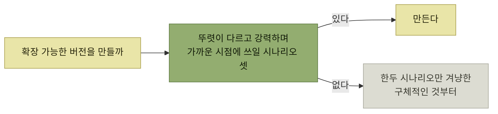

# 제한적 기능 대 확장 가능한 기능

> [인터랙션 설계](./README.md)

## 빠른 복습
- **더 많은 유스 케이스를 열어주는 확장 가능한 버전을 만들어야 할까, 아니면 특정 시나리오만 맞추는 좁은 버전을 만들어야 할까.**
- **유연한 쪽이든 의견이 뚜렷한 쪽이든 개인 편향이 있을 수** 있다. **시나리오 기반 설계가 그 기본값을 넘어서게** 도와준다.
- **확장성은 복잡성을 더하고, 빨간색·노란색 어포던스를 함께 끌고** 온다.
- **성급한 확장성**의 대표적 예는 **첫 게임도 못 만든 스튜디오가 게임 플랫폼의 뼈대를 세우는 것**이다.

> [!NOTE]
> **확장 가능한 기능은 세 시나리오로 정당화하세요**
>
> 서로 뚜렷하고 강력하며 가까운 시점에 쓰일 시나리오 셋이 없다면, 사용자가 신경 쓰는 한두 시나리오를 겨냥한 구체적인 기능부터 시작하세요.

## EntSchema의 판단

**`varchar_field`와 `int64_field` 같은 데이터베이스 수준 타입을 쓸지, `timestamp_field`, `string_enum_field`, `email_string_field` 같은 애플리케이션 수준 타입을 쓸지** 결정할 때 **세 가지 설득력 있는 시나리오 동기**가 나왔다.

| 시나리오 | 내용 |
| --- | --- |
| **입력 검증** | **객체 작성자는 입력된 이넘이 유효하고 지정된 값인지 확인해 손상된 데이터베이스 객체가 만들어지지 않게** 하고 싶어 한다. **이메일은 유효한 이메일 주소**여야 한다 |
| **가독성** | **사용자는 타입만 슬쩍 보고도 필드와 엣지가 무엇을 위한 건지** 알고 싶어 한다 |
| **프로덕션 내 객체 인스펙터** | **엔지니어는 `timestamp_field`에서 예쁘게 출력된 데이터를** 보고 싶어 한다. **`url_string_field`의 웹 주소를 클릭 가능하게** 만들고, **ID 필드의 `User` 객체에 링크를 렌더링**하길 원한다 |

표를 읽는 법. 세 시나리오가 **서로 다른 페르소나**(작성자·읽는 사람·디버깅하는 엔지니어)를 향한다. [3의 법칙](./6-어포던스-출시-타이밍.md)이 **"세 명의 고객"뿐 아니라 "세 개의 시나리오"로도 성립**하는 사례다.

*'3의 법칙'의 또 다른 버전*

## 확장 가능한 버전의 비용

- **출시할 가치가 있는 기능이라면 테스트할 가치도** 있다. **세 가지 시나리오를 기반으로 개발한다면 시나리오마다 [시나리오 테스트](../04-자사-제품-체험/3-시나리오-기능-e2e-사용자-수락-테스트.md)를 작성**하라. **생각만큼 확장 가능한지 확인**하게 해 준다.
- **확장성은 복잡성을 더하고, 빨간색·노란색 어포던스를 함께 끌고** 온다. **그것들도 찾아내고 줄여** 두라.
- **유스 케이스 사이 우선순위 격차가 클 때는 조심**하라.

마지막 항목의 실제 판단이 흥미롭다.

> 앞 목록에서 **시나리오는 우선순위 순으로 내려갑니다. 런타임 검증이 가장 급했어요.** **밸리데이터 같은 좁은 것을 만들 수도 있었지만, 마지막 항목도 꽤 설득력**이 있었어요. **객체 출력기는 시간이 될 때까지 미뤘죠.** 다시 말해, **만들 토대만 미리 깔고 실제 시공은 나중에** 했어요.

**"토대만 깔고 시공은 나중에"** 가 [앞 절의 함정문 결정](./7-단계적으로-만들기와-실험-버전.md)에 대한 답이다. **타입 정보를 스키마에 받아두는 것(토대)** 은 나중에 못 하지만, **인스펙터를 예쁘게 만드는 것(시공)** 은 언제든 할 수 있다.

## 성급한 확장성

> **스튜디오에서 첫 비디오 게임을 만들고 있다**고 해봅시다. **스튜디오의 꿈은 여러 게임을 만드는 것이니, 게임을 찍어낼 플랫폼의 뼈대를 세우고** 싶어집니다. 다만 **첫 게임을 완성할 자금조차 확실하지 않다면, 일반성을 최소한으로 유지하는 편이** 낫습니다.

> **두 번째, 세 번째 게임을 만들 자금이 생길 때까지 기다리세요.** **덤으로, 그때쯤이면 게임 사이의 공통 요소와 대비 요소가 보이기 시작합니다. 어떤 추상화가 맞을지 고르는 데 도움**이 되죠.

**기다림이 두 가지를 준다** — **자금(그때까지 살아남았다는 증거)** 과 **정보(무엇이 공통인지)** 다. 하나의 사례만으로 뽑아낸 추상화는 대개 **그 하나에 맞춰진 모양**이 된다.

## 함께 읽기
- [다음 절 — 요약과 비밀번호 관리자 예제](./9-요약과-예제.md)
- [7.5 과잉 엔지니어링](../07-시뮬레이션을-통한-제품-탐색/6-우선순위의-기준과-네-가지-잔혹한-진실.md#과소-엔지니어링과-과잉-엔지니어링)
