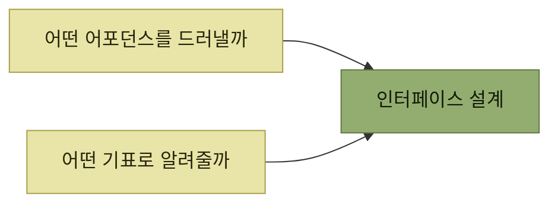

# 인터랙션 설계

> [AI 시대의 엔지니어링 전략](../README.md)

## 소파는 앉는 것이고, 고양이에게는 긁는 것이다

> **디테일 하나하나를 완벽하게 만들어라. 완벽하게 만들 디테일의 수는 줄여라.**
> — 잭 도시, 블록 창업자

> **어포던스는 제품이 실제로 쓰이는 방식**입니다. **우리가 의도했든 안 했든 상관없습니다.** **소파는 앉을 수 있도록 만들어졌지만 고양이가 긁을 수 있다는 사실을 알아냅니다.** **앉을 수 있다는 것과 긁을 수 있다는 건 모두 어포던스이지만, 설명서에는 하나만 적힙니다.**

**어포던스가 위험할 때**도 있다 — **야외 콘서트장에서 의자들이 서로 꽉 묶여 있는 광경**은 **관객 대피 통로를 막는 일과, 누군가 의자를 집어 던지는 일을 함께 막기** 위해서다.

> **허술한 코드와 프로토콜 탓에 디지털 세계에는 원치 않는 어포던스가 넘쳐납니다.** **스팸 문자와 이메일, 프라이버시 침해, 돈세탁, 피싱**이 그렇죠. **피할 수 없는 경우도 있지만, 미리 내다본 설계였다면 막을 수 있었던 경우도 많습니다.**

> [!IMPORTANT]
> **의도한 어포던스만 강조하세요**
>
> 제품이 허용하는 행동뿐 아니라 오용될 행동까지 살펴보고, 안전하고 생산적인 경로가 가장 잘 보이도록 설계해야 합니다.

## 어포던스와 기표

**도널드 노먼은 어포던스 개념을 널리 알렸고, 같은 책에서 기표 개념도 함께** 제시했다([2장](../02-제품-내-사용자-안내/README.md)의 토대가 된 개념이다).

> **어포던스가 제품이 할 수 있는 일이라면, 기표는 그것으로 무엇을 해야 할지 판단하게 해주는 단서**입니다.

> **의자는 던질 수 있다는 어포던스**를 갖습니다. **그러나 그렇게 쓰라는 강한 기표는 없죠.** 반대로 **던지기 용도임을 드러내려는 물건은 손잡이를 달거나, 손에 쏙 들어오는 공 모양을 하거나, 공기역학적 디자인으로 신호**를 보냅니다.

### 코드에서는

**자바나 C#에서 퍼블릭 메서드는 어포던스**이고, **`public` 키워드는 그 메서드가 클래스 밖 호출자를 위한 어포던스라는 점을 알리는 기표**다. **파이썬에서는 `def`가 메서드의 기표**이며, **프라이빗 메서드가 없어 관례로 이름 앞에 언더스코어를 붙여 바깥에서 호출하지 말라는 신호**를 보낸다 — **강제력은 없고 그저 '신사협정'** 이며, **'출입 금지' 표지판처럼 반(反)기표**라 부를 수도 있다.

| 구분 | 어포던스 | 기표 | 비고 |
| --- | --- | --- | --- |
| **퍼블릭 메서드**(자바/C#) | **있음** | **있음** | **호출 가능하고, 사용자도 그렇게 기대함** |
| **프라이빗 메서드**(자바/C#) | **없음** | **없음** | **호출할 수 없고, 사용자도 기대하지 않음** |
| **일반 메서드**(파이썬) | **있음** | **있음** | |
| **언더스코어 메서드**(파이썬) | **있음** | **없음** | **호출은 되지만, 앞머리 언더스코어가 하지 말라고 함** |
| **구현되지 않아 실패하는 공개 메서드** | **없음** | **있음** | **제공될 것처럼 보이지만 실제로는 아님** |

*원서 [표 8-1] 메서드의 어포던스와 기표*

표를 읽는 법. **네 가지 조합이 모두 존재**한다는 것이 요점이다. 특히 **마지막 줄(어포던스 없음 · 기표 있음)이 가장 나쁜 조합**이다 — 사용자는 **할 수 있다고 믿고 시도했다가 실패**한다.

> **기표와 어포던스는 자주 짝을 이뤄** 움직입니다. **객관식 온라인 설문에서 라디오 버튼은 선택지를 하나만 고르라는 신호**를 줍니다. **체크박스 묶음은 여러 개를 고를 수 있다는 신호**입니다.

## 설계란 두 가지 선택이다

> **인터페이스를 설계할 때는 가능한 어포던스를 먼저 늘어놓아 보세요.** **각 어포던스가 어떻게 쓰이고 어떻게 오용될지 짚은 뒤, 원치 않는 어포던스는 빼면** 됩니다. **고처리량을 허용하는 지점이 어디서부터 누군가 고의로 스팸을 날려 서비스를 다운시키는 지점으로 바뀌는 걸까요?**

> **소프트웨어 인터페이스 설계는 결국 어떤 어포던스를 드러낼지, 그것을 사용자에게 어떤 기표로 알려줄지 두 가지 선택입니다.**

*이 장 전체가 이 두 선택을 다룬다*

**어포던스와 기표, 시나리오와 페르소나를 갖추면** 세 가지를 해낼 수 있다.

- **제품의 올바른 사용법으로 주의를 끌고, 잘못된 사용법에서는 주의를 돌린다.**
- **출시할 어포던스의 타이밍을 지혜롭게** 잡는다.
- **기능을 확장 가능하게 만들 때와 좁은 문제를 해결할 때를 구분**한다.

> 경험상 **대부분의 설계 논쟁은 이 트레이드오프 위에서** 벌어집니다. **사용자 시나리오와 페르소나가 그 명료함을 열어줍니다.**

## 목차

- [편향과 이념, 그리고 전제 조건](./1-편향과-이념-그리고-전제-조건.md)
- [사례 연구: EntSchema](./2-사례-연구-entschema.md)
- [안전한 기본값과 기본값 없음](./3-안전한-기본값과-기본값-없음.md)
- [최소 저항 경로와 오작동 신호등](./4-최소-저항-경로와-오작동-신호등.md)
- [누가 언제 결정할 것인가](./5-누가-언제-결정할-것인가.md)
- [어포던스 출시 타이밍](./6-어포던스-출시-타이밍.md)
- [단계적으로 만들기와 실험 버전](./7-단계적으로-만들기와-실험-버전.md)
- [제한적 기능 대 확장 가능한 기능](./8-제한적-기능-대-확장-가능한-기능.md)
- [요약과 예제](./9-요약과-예제.md)

## 함께 읽기

- [2장 제품 내 사용자 안내](../02-제품-내-사용자-안내/README.md) — **기표**를 발견·이해·사용 여정에서 다룬 장.
- [3.7 확인 요청](../03-에러와-경고/7-조기-진단-시프트-레프트.md) — **노란 어포던스에 마찰을 더하는** 방법.
- [『아키텍트 첫걸음』 2.3 설계 원칙](../../아키텍트-첫걸음/2-소프트웨어-설계/3-소프트웨어-설계-원칙과-실천-방법.md) — 인터페이스 설계를 다른 어휘로 다룬 절.
