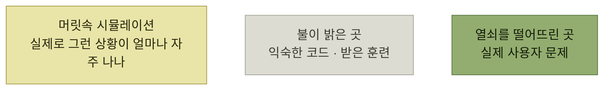

# 프로덕트 아키텍처의 토대

> [프로덕트 아키텍처](./README.md)

## 빠른 복습
- **프로덕트 아키텍처는 인터랙션 디자인과 맞닿아** 있다. **내부 추상화도 그 자체로 축소판 제품**이므로 [8장](../08-인터랙션-설계/README.md)의 **유스 케이스, 3의 법칙, 반복 개발**이 그대로 적용된다.
- 고유의 난점은 **NFR이 만만치 않다**는 점이다. **수도 많고 충족하기도 까다로우며, 모두를 다룰 시간과 예산은 보통 없다.**
- 게다가 **이들 요구 사항은 서로 부딪힌다** — **견고한 데이터 복제가 지연 시간을 키우고, 보안 장벽이 가용성을 갉아먹는** 식이다.
- 그래서 **프로덕트 아키텍처에 편집자의 시각을 적용**해야 한다. **사용자들이 정말 중요하게 여기는 것은 무엇일까?**
- 네 기법 — **줌아웃해서 큰 그림 보기**, **가로등 효과 피하기**, **사용자 임팩트 전달하기**, **시스템-프로덕트 간극을 해소하는 기술 활용**.
- 이 장치들은 **성급한 최적화** — **시간을 들일 만한 근거가 생기기도 전에 NFR을 손보겠다고 코드를 건드리는 일** — 를 막아 준다.

> [!WARNING]
> **가로등 아래의 지표만 최적화하지 마세요**
>
> 측정하기 쉬운 시스템 지표가 아니라 사용자에게 가장 큰 영향을 주는 병목과 실패부터 찾아야 합니다.

## ① 큰 그림 조망

> **어떤 알고리즘을 캐싱으로 개선해 O(n)에서 O(log n)이나 O(1)로 줄일 수** 있다고 해보죠. **얼핏 큰 일처럼 보입니다. 하지만 작업이 늘고 솔루션도 복잡해집니다.**

> **한 발 물러서서 맥락을 보세요.** 이 알고리즘의 실행 시간은 **다른 문제에 비하면 미미할 수** 있습니다. **같은 종류의 문제라도 규모가 한 자릿수 차이로 벌어지면, 한쪽이 다른 쪽을 완전히 압도**합니다.

| 상황 | 왜 무의미한가 |
| --- | --- |
| **사용자가 네트워크 왕복 시간을 거쳐 함수를 호출** | **함수 실행 시간을 마이크로초 단위로 단축하는 것은 거의 의미가 없다** |
| **일주일이 걸리는 택배 배송을 시작하는 과정** | **그 네트워크 왕복 시간을 최적화하는 일도 역시 의미가 없다** |

표를 읽는 법. 두 줄이 **같은 논리를 한 칸씩 옮겨 놓은 것**이다. 어떤 계층에서든 **바로 위 계층의 시간 규모를 보면** 자기 최적화의 값어치가 드러난다.

## ② 가로등 효과 방지

> **많은 엔지니어는 시스템 문제를 분석하고 해결하는 데 중점을 두고 훈련받았기 때문에 불필요한 강화 작업이나 성급한 최적화에 매달리기 쉽죠.**

> **술 취한 남자가 가로등 아래에서 잃어버린 열쇠를 찾고** 있어요. **열쇠를 떨어뜨린 곳은 다른 데**였습니다. **왜 여기서 찾느냐고 물으니 이렇게 답합니다. "여긴 불이 밝잖아요."**

> **우리에게 불이 밝은 영역은 소프트웨어 엔지니어로 받은 훈련, 그리고 가장 익숙한 코드베이스의 한 귀퉁이**입니다.

*[그림 9-1] 가로등 효과 — 찾기 쉬운 곳과 있어야 할 곳은 다르다*

> **술 취한 사람이 되지 마세요.** 기존 코드를 읽다가 **어떤 데이터베이스 접근이 레이스 컨디션에 대비돼 있지 않다는 걸 알아차렸다**고 해보죠. **수정 우선순위를 정하기 전에 실제로 그런 상황이 발생할 가능성이 얼마나 되는지 머릿속에서 먼저 시뮬레이션**해 보세요. **지금 해결하려는 문제와 '이유', 그러니까 해당 문제를 고민하게 만드는 사용자 시나리오 사이에 선을 그어** 보세요.

**"고쳐야 할 진짜 버그를 발견한 상황"에도 이 질문을 하라**는 점이 요점이다. 버그가 실재하는 것과 **지금 고칠 가치가 있는 것**은 다르다.

## ③ 사용자 임팩트로 전달한다

> **사용자는 'O(log n) 알고리즘'이라는 말로 설득되지 않습니다.** 하지만 **"페이지가 25% 더 빨리 로드됩니다"라는 말에는 설득될지** 모릅니다.

| 시스템 언어 | 사용자 언어 |
| --- | --- |
| **"초당 백만 건을 처리하도록 우리 시스템을 확장해야 해요"** — **눈이 풀린다** | **"우리 시스템은 동시 고객 500만 명을 감당합니다"** |

표를 읽는 법. 변환의 재료는 **"평균 활성 고객이 5초마다 한 번씩 요청을 보낸다"** 는 관찰 하나다. **앞 문장은 추상적이지만 뒤 문장은 좋은 의사 결정을 준비**해 준다 — **성장률을 근거로 사용자 수를 투영해, 언제 용량 확장에 투자할지 판단**할 수 있다.

### 다만 항상 이럴 필요는 없다

> **이런 분석이 항상 값싸게 나오지는 않습니다.** **프로덕트 맥락을 확보하는 비용이 비쌀 때 과잉 사고를 권하고 싶지는** 않아요. **모범 사례로 NFR을 개선하는 일은 당연히 정당**합니다.

> **작은 규모의 애플리케이션이라면, 데이터베이스 트랜잭션으로 강한 일관성을 보장하면서 '안전하게 가는' 선택은 충분히 합리적**입니다. **시스템이 이해하기 쉬워져 팀 생산성이 올라가기도** 하고요. **나중에 제품이 규모를 확장해 이 완벽한 일관성 트랜잭션이 병목이 된다면, 그때 가서 일관성 보장을 느슨하게 푸는 걸 고민**하면 됩니다.

> **프로덕트 맥락을 파악해야 할 때와 표준 관행을 따를 때를 판단하는 것은 프로덕트 아키텍트의 핵심 역량**입니다.

## ④ 시스템-프로덕트 간극을 잇는다

> **시스템-프로덕트 간극은 컴퓨팅 기본 요소를 기반으로 구축된 저수준 추상화와, 사용자 작업을 용이하게 하기 위해 만들어진 고수준 컴포넌트 사이의 간극**을 의미합니다.

이 격차는 두 가지로 드러난다.

### 관찰 가능성

> **시스템-프로덕트 간극이 넓으면, 우리의 저수준 결정이 사용자에게 어떤 임팩트를 주는지 판단하기 어렵습니다. 가로등 효과가 심해져요. 큰 그림으로 사고할 권한이 주어지지 않은 셈**이니까요.

| 질문 | 답을 주는 도구 |
| --- | --- |
| **일정한 지연 시간을 가진 마이크로서비스가 제품 플로에 얼마나 영향을** 주나 — **다른 서비스와 병렬로 일어나 전혀 문제가 안 될 수도, 크리티컬 패스일 수도** | **관찰 가능성 도구** |
| **내 웹 페이지 컴포넌트의 과도한 메모리 사용이 앱 피크 메모리에 얼마나 기여**하나 — **그 시점이 사용자가 가장 큰 영향을 받는 순간** | **메모리 프로파일러** |

### 신뢰성

> **컴포넌트에는 근본적 한계가 있고, 그걸 제품에 녹여 넣을 때 이 한계를 감안**해야 합니다. **네트워크 장애는 늘 존재**해요. **시스템 문제를 만날 때마다, 저수준 시스템 컴포넌트를 직접 고칠지, 아니면 그 한계를 보완해 주는 맥락 위에 올려둘지 결정**해야 합니다.

- **에이전틱 AI를 만들고 있다면, LLM은 변덕스럽지만 강력**하다. **실패에 대비해 재시도를 넣는 프레임워크**를 쓰고 **하지 말아야 할 일을 하지 않도록 안전장치**를 둔다.
- **정적 콘텐츠를 제공하는 경우, 모든 사용자가 데이터 센터에 접속하면 시스템이 마비**될 수 있다. **CDN으로 캐싱하고 사용자에게 가까운 복제본**을 둔다.

> **스택의 여러 계층에서 수정이 가능하다는 점이 중요**합니다. **알맞은 기술이 있으면, 저수준 한계를 아예 무관하게 만들거나, 영향이 남아 있어도 그 임팩트와 집중해야 할 지점을 짚어낼 수** 있습니다.

## 함께 읽기
- [다음 절 — 이 장의 사례](./2-사례-연구-스트라이프-결제.md)
- [8.6 3의 법칙](../08-인터랙션-설계/8-제한적-기능-대-확장-가능한-기능.md) — 내부 추상화에도 같은 기준이 적용된다
