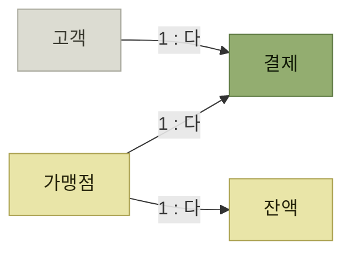

# 사례 연구 - 스트라이프 결제

> [프로덕트 아키텍처](./README.md)

## 빠른 복습
- **스트라이프는 온라인 결제를 초대규모로 처리**한다. **돈의 흐름이 가진 규모와 신뢰성 요구 사항 덕에, 프로덕트 아키텍처를 이야기하기에 좋은 후보**다.
- **고객은 가맹점에게서 온라인으로 물건을** 산다. **가맹점은 자기 계정에 얼마의 돈이 있는지 추적하는 잔액**을 가진다.
- **이 돈은 주기적으로 지급되며, 환불 처리 같은 경우라도 음수로 떨어지면 안 된다.**
- **박스는 꽤 표준적인 이커머스 데이터 스키마**이지만, **이러한 구성은 흥미로운 프로덕트 아키텍처 설계 과제**를 제시한다.

> [!NOTE]
> **같은 데이터 모델도 시나리오마다 보장이 다릅니다**
>
> 고객 결제, 가맹점 지급, 환불은 같은 모델을 거치지만 필요한 지연 시간·가용성·일관성의 균형은 서로 다릅니다.

## 데이터 모델

*[그림 9-2] 단순화한 스트라이프 결제의 데이터 모델 — 화살표 끝이 일대다 관계의 '다' 쪽이다*

> **고객은 가맹점에서 결제**를 합니다. **가맹점은 받은 돈을 저장하고 필요 시 환불하기 위해 잔액**을 가집니다.

## 이 모델이 던지는 질문들

이 장이 뒤에서 다룰 물음들이 이 그림에서 나온다.

| 절 | 이 모델에서 나오는 질문 |
| --- | --- |
| **3절 지연 시간** | **결제 플로의 어느 구간이 동기여야 하고 어느 구간이 비동기여도 되는가** |
| **5절 데이터 일관성** | **고객 잔액과 가맹점 잔액에 같은 일관성 보장이 필요한가** |
| **6절 트레이드오프** | **가맹점 온보딩과 결제에 같은 읽기 전략을 써야 하는가** |

각각 [3절](./3-지연-시간.md), [5절](./5-데이터-일관성.md), [6절](./6-세-요구-사항의-트레이드오프.md)에서 다룬다.

표를 읽는 법. **네 개의 박스와 세 개의 선**밖에 없는 그림인데, **각 관계마다 다른 답이 나온다.** 프로덕트 아키텍처가 **"시스템 전체에 일괄 적용하는 원칙"이 아니라 "관계마다 다르게 내리는 판단"** 이라는 뜻이다.

## 함께 읽기
- [다음 절 — 지연 시간을 사용자 눈으로 보기](./3-지연-시간.md)
- [『WMS 원리와 이해』 6장 재고관리](../../wms-원리와-이해/06-재고관리/README.md) — 잔액이 음수가 되면 안 되는 제약은 재고 수량 제약과 같은 성격이다
