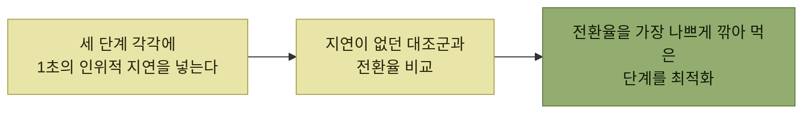

# 지연 시간

> [프로덕트 아키텍처](./README.md)

## 빠른 복습
- **지연 시간, 가용성, 데이터 일관성은 결국 사용자가 제품을 이용하고 원하는 작업을 성공적으로 완료하는지라는 근본적인 목표를 대신하는 지표**다.
- **시스템 지연 시간을 재는 가장 단순한 방법은 엔드포인트, 함수, 원격 프로시저 호출 같은 연산의 시간을 재는 것**이다. 쓸모 있는 데이터이지만 **이 지표들 하나하나가 가로등** 같다.
- **한 연산의 지연 시간이 올라갔다고 해서 사용자에게 보일 수도, 안 보일 수도** 있다.
- 어디가 문제인지 가리는 **리트머스 시험 세 가지**가 있고, 더 엄격하게는 **A/B 테스트로 인위적 지연을 넣어** 본다.
- **분산 추적**이 시스템 지표와 제품 지표를 잇는다.

> [!IMPORTANT]
> **연산 시간이 아니라 시나리오 완료 시간을 보세요**
>
> 개별 호출 지연은 원인을 찾는 자료이고, 최적화 우선순위는 실제 사용자 행동과 전환에 미치는 영향으로 정해야 합니다.

## 상향식 계측의 이점

**모든 연산의 시간을 재두면** 얻는 것들이다.

- **포괄적인 지표 세트를 확보**한다.
- **느린 사용자 인터랙션을 발견했을 때, 각 연산의 세부 데이터가 범인을 잡는 데** 도움을 준다.
- **특정 연산의 지연 시간을 최적화할 때, 그 지표로 개선을 추적**할 수 있다.
- **중대한 회귀 현상이 발생하면 팀원들에게 알린다.**

**스트라이프에서는 각 API 호출이 따로 계측됐고, 데이터베이스와 개별 서비스의 지연 시간도** 계측됐다. 다만,

> **그 빛 아래에서 너무 오래 머물고 싶어집니다. 결국 중요한 건 사용자 경험입니다.**

## 리트머스 시험 세 가지

| 질문 | 스트라이프의 답 |
| --- | --- |
| **사용자나 업스트림 시스템이 적극적으로 기다리고 있는 작업은 무엇이며, 백그라운드에서 일어나는 연산은 무엇인가** | 결제 요청은 **동기 구간과 비동기 구간**으로 나뉜다. **동기 구간에서는 자금이 있는지, 결제를 진행할 수 있는지 검증**하고, **비동기 구간에서는 감사 로그에 트랜잭션을 기록하고 실제로 대상 계정으로 돈을 옮긴다** |
| **가장 흔한 사용자 흐름은 무엇인가** | **가맹점 온보딩보다 결제 플로의 지연 시간을 최적화하는 일이 더 중요**했다. **전자가 후자보다 몇 배나 더 자주** 일어났다 |
| **어떤 상황에서 사용자가 지연 시간에 가장 민감해지나** | **사용자가 계속 읽을지, 살지, 탐색을 이어갈지 확신하지 못하는 시점을 저의도low intent 구간**이라 부른다. **저의도 구간에서 멈칫하면 사용자는 주의가 흐트러지기 쉽다** |

표를 읽는 법. 셋째 줄이 반직관적이다 — **구매를 완결하는 순간에는 사용자가 훨씬 집중**하므로 **약간의 지연을 견딘다.** 반대로 **장바구니에 담으며 둘러보는 중이라면 지연이 이탈로** 이어진다.

여기에 예외가 하나 붙는다.

> 그런데 **사용자 카드가 거절됐다면요?** **그 사실을 알리기까지 시간이 걸리면, 사용자는 다른 탭으로 넘어갔다가 결제가 안 됐다는 걸 알아차리지 못할 수** 있어요. **검증은 되도록 빨리 끝내야** 합니다.

**"실패를 알리는 지연"은 성공 경로의 지연과 다르게 취급해야** 한다는 뜻이며, [3장](../03-에러와-경고/README.md)이 말한 **진단의 중요성**이 성능 문제로 나타난 모습이다.

## 더 엄격하게 — 인위적 지연 A/B 테스트

이커머스 결제 플로의 세 단계다.

1. **장바구니에 상품을 담으며 쇼핑**
2. **결제 페이지를 불러옴**
3. **구매를 완료하면 그 뒤 결제가 처리됨**

> **세 단계 중 어디에 집중할지 고르는 상황**이라 해봅시다. **각 단계를 수백 밀리초씩 개선할 아이디어가 머릿속에 있지만 구현이 싸지는 않고, 가장 임팩트 큰 곳부터 시작**하고 싶습니다. **심지어 지연 시간이 가장 큰 문제인지도 아직 확실치 않습니다.**

> 우리가 움직이려는 **핵심 사용자 지표는 전환율**입니다. **프로덕트 명제는 지연 시간을 줄이면 전환율이 올라간다**는 것입니다. **전환율은 시나리오 지표scenario metric의 한 예**입니다. **시나리오를 통과하는 사용자의 진행 결과를 추적**하기 때문입니다.

*고치기 전에, 고칠 가치가 있는지 실험으로 먼저 잰다*

**"개선하지 말고 악화시켜 본다"** 는 발상이 이 기법의 묘미다. **개선은 비싸지만 지연 주입은 싸다.**

또 다른 시나리오 지표는 **장바구니 담기에서 체크아웃까지의 경과 시간**이다.

> **개선할 방법이 많거든요. 결제 페이지에 카드 번호를 체크섬으로 검증하는 자바스크립트 코드를 잘 짜두면, 오타가 있을 때 플로를 빠르게 끝낼 수** 있습니다. **이를 개별 지표로 따로 추적하지 않더라도, E2E 플로 지표가 잡아내** 줍니다.

**개별 최적화를 일일이 계측하지 않아도 되는 이유**를 보여준다 — 시나리오 지표는 **아직 생각하지 못한 개선까지 담는 그릇**이다. 참고로 이 예의 체크섬 검증은 [3.7의 정적 검증](../03-에러와-경고/7-조기-진단-시프트-레프트.md) 그대로다.

## 분산 추적

> **이 지표가 코드 푸시 뒤 치솟았다면요? 범인을 어떻게 찾을까요?** **제품 지표와 우리가 쌓아온 세밀한 시스템 지표를 잇는 기술이 필요**합니다.

> **각 사용자 흐름에 '트레이스 ID'가 붙고, 이 ID는 온갖 연산을 관통**합니다. **그 연산들이 이 ID로 이벤트를 로깅하면, 우리는 특정 세션의 모든 이벤트를 질의해 큰 지연이 어디서 났는지 찾아낼 수** 있습니다. 그다음 **플레임 그래프나 폭포수 차트로 시각화**합니다.

[그림 9-3]은 **결제 플로의 처음 두 단계에서 스택 각 계층이 쓰는 시간**을 보여준다 — **클라이언트 렌더링 · 네트워크 · 게이트웨이 · API · DB · 캐시** 층이 **`POST: /cart`와 `GET: /checkout`** 구간에 걸쳐 그려진다.

> **하나의 화면에서 다양한 추상화 계층을 동시에 살펴볼 때, 우리는 가장 큰 힘을 발휘**합니다. **전체 트레이스에서 문제 구간으로 '줌인'할 수도, 문제가 난 조각이 속한 트레이스 쪽으로 '줌아웃'할 수도** 있어요.

> **분산 추적 같은 기술에 투자를 미루기 쉽습니다. 매일 쓰는 물건이 아니거든요. 하지만 필요한 순간에는 100배의 생산성을 돌려줍니다.**

## 함께 읽기
- [다음 절 — 전환율에 지연 시간보다 더 크게 영향을 주는 것](./4-가용성.md)
- [『요즘 우아한 백엔드 개발』 11장](../../요즘-우아한-백엔드-개발/11-b마트-oms의-물류주문관리를-통한-출고-최적화/4-동적-출고-예정-시각-시뮬레이션으로-검증하기.md) — 순차 처리의 성능 병목이 실은 시스템 밖에 있었던 사례
