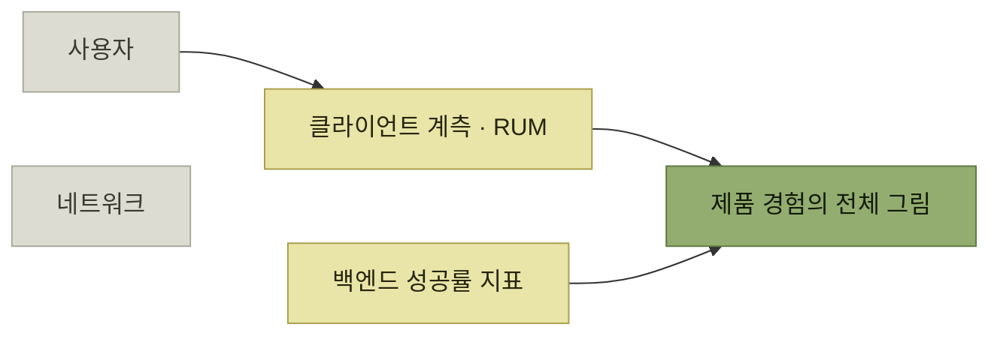

# 가용성

> [프로덕트 아키텍처](./README.md)

## 빠른 복습
- **가용성도 사용자 관점에서 최적화하되 기반 시스템의 동작을 함께 이해**해야 한다.
- 흔한 구성 — **프런트엔드 팀과 서비스를 운영하는 백엔드 팀이 나뉘어 있는 웹사이트.** **백엔드 팀은 자사 서비스 엔드포인트 요청 중 몇 %가 성공하는지 알고** 있다.
- 그런데 **사용자 경험에는 이 지표로 잡히지 않는 부분이 많다.**
- **두 팀이 함께 일하면 제품 경험의 전체 그림**을 그릴 수 있다. **클라이언트를 계측하면 인사이트가 사용자에게 더 가까워지고, 이를 백엔드 지표와 엮으면 가용성 문제의 원점을 콕 집을 수** 있다.
- 간극을 잇는 기술로 **리얼 유저 모니터링(RUM)**, 보완 기술로 **워크플로 엔진**과 **CDN**이 있다.

> [!IMPORTANT]
> **백엔드 성공률만으로 가용성을 판단하지 마세요**
>
> 사용자가 기능을 발견하고 클라이언트를 거쳐 전체 작업을 완료하는 경로를 계측해야 실제 가용성을 알 수 있습니다.

## 백엔드 성공률이 놓치는 것

| 질문 |
| --- |
| **네트워크 요청이 서비스까지 도달하고 있나?** |
| **클라이언트 재시도가 서비스의 일시 장애를 메워주면서 가용성 문제를 지연 시간 증가로 바꿔주고 있나?** |
| **서비스를 호출하는 버튼을 로드하는 웹 페이지 자체가 렌더링되고 있나?** |
| **사용자가 서버에 요청을 보내는 것을 방해하는 클라이언트 측 오류가 발생하고 있나?** |
| **최근 UI 변경 탓에 사용자가 혼란스러워 그 버튼을 더 이상 못 찾는 건 아닌가?** |

표를 읽는 법. 위에서 아래로 갈수록 **백엔드에서 멀어진다.** 마지막 줄은 **가용성 문제가 아예 아닌 것처럼 보이지만**, 사용자 입장에서는 **"기능이 동작하지 않는다"** 는 같은 경험이다 — [2장의 발견 문제](../02-제품-내-사용자-안내/README.md)가 가용성 지표로 나타나는 셈이다.

*클라이언트 지표와 백엔드 지표를 엮어야 원점이 잡힌다*

> **RUM 도구는 페이지 로드 시간, 클라이언트 에러, 네트워크 타임아웃 같은 사용자 경험을 잡아내고, 브라우저나 앱 버전, 지역 같은 사용자 요인과 그 에러를 연결**해 줍니다.

## 시스템 가용성을 보완하는 기술

| 기술 | 무엇을 하나 |
| --- | --- |
| **워크플로 엔진** | **여러 단계에 걸친 사용자 흐름을 조율하면서 동시에 플로 전체를 내려다보는 시야**를 준다. **전체 플로를 끝까지 책임지는데, 이걸 개별 단계의 재시도와 병렬 처리로 달성**해 **가용성 문제에 탄력적**이다. 또 **워크플로는 보통 제품 기능이나 제품 시나리오를 나타내며, 각 단계를 추적**할 수 있어 **한 단계가 실패하거나 느려지면 제품에 미치는 임팩트와 정확히 어디서 문제가 났는지 둘 다** 짚어낸다 |
| **CDN** | **데이터는 클라우드 서비스에 중앙 집중식으로 저장하고 관리되길 원하지만, 사용자는 네트워크 문제와 지연 가능성을 줄이기 위해 데이터가 가까운 곳에 위치하기를** 원한다. **CDN은 정적 데이터를 전 세계에 복제하고 캐싱해, 말 그대로 데이터베이스와 사용자 사이의 간극을 메워**준다 |

표를 읽는 법. 워크플로 엔진의 값은 **재시도 자체가 아니라 "플로 전체를 아는 주체"가 생긴다는 점**이다. 그래서 **가용성 개선과 관찰 가능성 개선이 동시에** 온다 — [1절의 시스템-프로덕트 간극](./1-프로덕트-아키텍처의-토대.md)을 양쪽에서 좁힌다.

**저자가 [5장에서 스트라이프의 워크플로 엔진 테크 리드](../05-지속적인-사용자-이해/6-사용자-지원-플라이휠.md)였다는 점**을 떠올리면, 이 항목은 그 제품이 왜 존재했는지에 대한 설명이기도 하다.

## 함께 읽기
- [다음 절 — 가장 까다로운 과제](./5-데이터-일관성.md)
- [『아키텍트 첫걸음』 3.3](../../아키텍트-첫걸음/3-아키텍처-설계/3-시스템-아키텍처-선정.md) — 가용성을 아키텍처 스타일 선택으로 다룬 절
