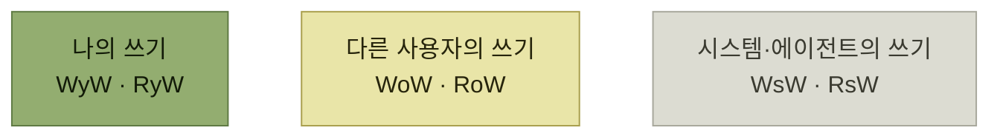

# 데이터 일관성

> [프로덕트 아키텍처](./README.md)

## 빠른 복습
- **데이터 일관성은 사용자 관점에서 풀어내기 가장 까다로운 과제 중 하나**다. **제공 가능한 일관성 수준이 여러 가지고, 그 트레이드오프가 극명하게 갈리기** 때문이다.
- **마틴 클레프만이 『데이터 중심 애플리케이션 설계』에서 말하듯, 일관성 보장은 공짜가 아니다.** **보장이 강한 시스템은 보장이 약한 시스템보다 성능이 나쁘거나 장애 허용성이 떨어질 수** 있다.
- 저자는 **'자기가 쓴 걸 자기가 읽는 일관성' 같은 용어를 더 선호**한다 — **사용자를 용어 안에 품고** 있기 때문이다.
- **즉시 일관성 보장을 누가 혜택을 보는지 기준으로 분류**한다. 행위자는 셋 — **여러분(사용자), 다른 사용자들, 시스템.**
- **이 보장들은 제품 기능의 속성이지 데이터베이스의 속성이 아니다.**

> [!IMPORTANT]
> **일관성을 사용자 사이의 약속으로 표현하세요**
>
> 누가 누구의 쓰기를 언제 읽거나 덮어써야 하는지부터 정한 뒤, 데이터베이스와 애플리케이션 계층의 보장을 선택해야 합니다.

## 사용자 중심 일관성 보장

| 보장 | 의미 |
| --- | --- |
| **자기 쓰기를 정보로 받는 쓰기(WyW)** | **앞으로의 모든 쓰기는 이전 쓰기를 반영함** |
| **자기 쓰기를 읽는 읽기(RyW)** | **사용자가 데이터를 읽으면, 자신이 수행한 이전 쓰기가 모두 반영됨** |
| **다른 사람 쓰기 이후의 쓰기(WoW)** | **제품을 쓰는 다른 사용자가 내 쓰기를 모르고 쓰기를 할 수 없고 반대도 성립함** |
| **다른 사람 쓰기를 읽는 읽기(RoW)** | **다른 사람의 쓰기가 성공했다고 확인되는 즉시, 그 결과를 바로 보게 됨** |
| **시스템 쓰기 이후의 쓰기(WsW)** | **자동화와 에이전트가 일으킨 업데이트가 즉시 효과를 냄** |
| **시스템 쓰기 이후의 읽기(RsW)** | **자동화와 에이전트의 수정이, 시스템에서 확인되는 즉시 전파됨** |

*원서 [표 9-1] 사용자 중심 일관성 보장 — 위에서 아래로 갈수록 강한 보장이다*

표를 읽는 법. **행위자가 나 → 다른 사용자 → 시스템으로 넓어질수록 보장이 비싸진다.** 그리고 **읽기 보장(RyW·RoW·RsW)과 쓰기 보장(WyW·WoW·WsW)이 짝을 이룬다.**

*누구의 쓰기를 누구에게 보장하는가 — 범위가 넓어질수록 비싸진다*

> **데이터베이스는 누가 읽는지에 대한 개념이 대개 없습니다.** 그러니 **의미론을 신중히 고르는 일은 애플리케이션 개발자의 몫**입니다.

> 사실 **보장이 약한 데이터베이스 위에 더 강한 보장을 덧쌓을 수도** 있고 반대로 **데이터베이스에 강하게 일관된 질의를 던져도 자동으로 강한 일관성이 나오지는** 않습니다. **프로덕트 아키텍처의 여러 계층에서 의사 결정**을 해야 합니다.

## 계층별 설계 — 그룹 음식 주문

**여러 사용자가 동시에 장바구니를 편집하다가, 주문을 생성한 사람이 최종 제출하는 그룹 음식 주문 엔드포인트**를 만든다고 하자.

| 계층 | 결정 |
| --- | --- |
| **데이터베이스** | **트랜잭셔널 데이터베이스를 써서 모든 사람의 쓰기를 일관되게 만들 수도 있고, 더 위 계층에서 해결할 수도** 있다 |
| **시스템 설계** | **각 주문자가 같은 테이블에 겹쳐 쓰기를 하게 두지 말고, 데이터베이스의 리스트에 추가append하게** 한다. **이렇게 하면 RoW와 WoW 일관성 문제의 한 범주를 통째로 피할 수** 있다 |
| **엔드포인트 입력** | **클라이언트의 반복된 동일 요청이 장바구니에 추가 주문을 만들어내지 않게** 한다. **클라이언트가 멱등성 키를 제공하게 허용하고, 키가 이미 커밋됐는지 확인**한다 |
| **엔드포인트 출력** | **업데이트된 데이터를 클라이언트에 되돌려** 준다. **그러면 클라이언트는 다시 질의해 오래된 데이터베이스 복제본을 얻을 필요 없이 최신 상태를 확인**한다 |
| **클라이언트** | **쿠키나 로컬 스토리지에 데이터를 보관해 앱 반응성을 높이고, 주기적으로 새로고침** |
| **프로덕트 결정** | **소유자가 결제 플로에 들어가면 장바구니를 잠근다.** **주문 추가와 결제 제출 사이의 레이스 컨디션**을 막는다. **누군가 뒤늦게 추가하려다 잠금에 부딪혀 항의하면 소유자가 잠금을 풀게** 한다 |

표를 읽는 법. **여섯 계층 모두에 손댈 자리가 있다**는 것이 이 표의 메시지다. 특히 **둘째 줄(겹쳐쓰기 대신 append)** 은 **일관성 문제 자체를 없애는** 조치이고, **마지막 줄(장바구니 잠금)** 은 **기술이 아니라 제품 규칙**으로 푸는 방법이다.

**마지막 줄이 [『요즘 우아한 백엔드 개발』 13장](../../요즘-우아한-백엔드-개발/13-wms-재고-이관을-위한-분산-락-사용기/README.md)의 상황과 같다** — 그쪽도 **할당 중에는 취소를 막는 상태 규칙**으로 레이스 컨디션을 풀었다.

## 간극을 메우는 프레임워크

**원자적·트랜잭셔널 의미가 사용자에게 필요한데 기반 데이터베이스가 이를 지원하지 않는 경우**의 기술들이다.

| 기술 | 내용 |
| --- | --- |
| **이벤트 소싱** | **일어난 모든 일을 '이벤트'로 추적해 두고, 장애가 나면 이를 재생하거나 이어서 수행**한다. **체크포인트에서 시작해 새 데이터베이스를 채우는 용도**로도 쓴다. **효과적으로 연산의 한 체인이 하나의 시퀀스로 묶여, 사용자는 전체 시퀀스에 대해 최종 일관 동작을 체감**한다 |
| **사가 패턴** | **여러 로컬 트랜잭션을 순서대로 실행하고, 실패하면 이미 수행한 단계마다 보상 트랜잭션을 실행해 최종 완료 또는 보상된 상태로 수렴을 시도**한다. **중간 상태가 외부에 보일 수 있고 보상도 실패하거나 완전한 역연산이 아닐 수 있으므로, 원자적인 전부-아니면-전무를 보장하는 패턴은 아니다** |
| **데이터 무결성 체커** | **사용자가 신경 쓰는 결과를 기준으로, 데이터베이스들이 서로 일관된지** 확인한다. **금융 거래 이후 지불자와 수취자의 기록이 일치하는지** 같은 검사다 |

표를 읽는 법. 셋째 줄이 앞의 둘과 성격이 다르다 — **막는 것이 아니라 사후에 확인**한다. **완벽한 예방이 비쌀 때, 어긋남을 감지하는 쪽이 실용적**이라는 선택이다.

사가 패턴은 [『아키텍트 첫걸음』 3.3](../../아키텍트-첫걸음/3-아키텍처-설계/3-시스템-아키텍처-선정.md)에서 **임시 상태와 보상 트랜잭션**으로 다룬 그 패턴이다.

## 함께 읽기
- [다음 절 — 스트라이프의 실제 판단들](./6-세-요구-사항의-트레이드오프.md)
- [『요즘 우아한 백엔드 개발』 13장](../../요즘-우아한-백엔드-개발/13-wms-재고-이관을-위한-분산-락-사용기/4-분산-락과-상태-키-함께-사용하기.md) — 동시성 문제를 계층별로 나눠 푼 사례
- [조회 성능 개선 방법](../../주니어-백엔드-개발자가-반드시-알아야-할-실무-지식/03-성능을-좌우하는-db-설계와-쿼리/2-조회-성능-개선-방법.md) — 읽기 복제와 캐시의 성능·일관성 트레이드오프
