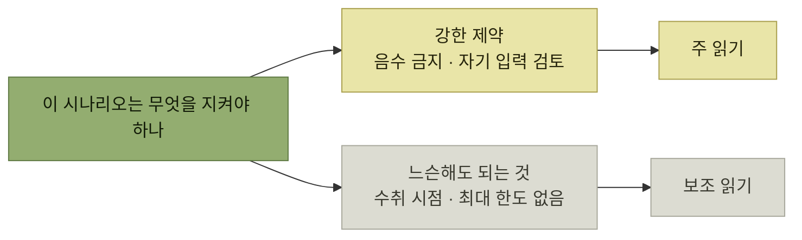
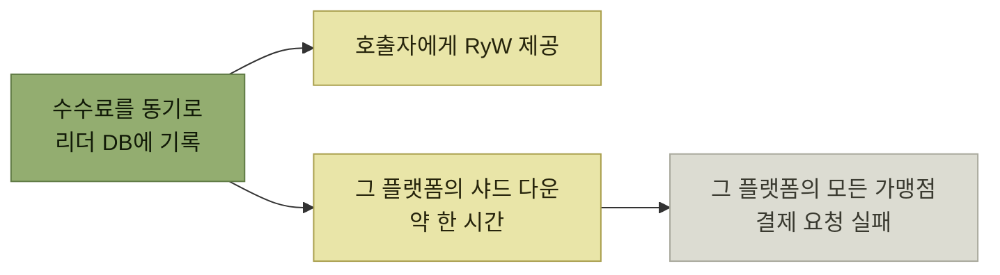

# 세 요구 사항의 트레이드오프

> [프로덕트 아키텍처](./README.md)

## 빠른 복습
- 마틴 파울러 — **"아키텍처는 완벽한 시스템을 짓는 일이 아닙니다. 트레이드오프를 만드는 일입니다."**
- **스트라이프 같은 회사는 보통 샤딩된 데이터베이스에 모델을 저장**하고, **각 샤드는 데이터 손실을 막기 위해 여러 방식으로 복제**된다. **그 복제본 중 하나가 쓰기를 받는 '리더'** 다.
- **주 읽기primary reads는 가용성은 낮지만 일관성 보장이 강하고**, **보조 읽기secondary reads는 가용성은 높지만 보장이 약하다.**
- **초기에 스트라이프의 읽기는 대체로 리더에서** 일어났다. **시스템을 이해하기 쉬웠고 정확성을 보장**했다. 그러나 **회사가 확장되면서 엔지니어가 본인이 지원하는 프로덕트 시나리오에 따라 직접 고르도록 더 공식화**해야 했다.
- **데이터 일관성에 대한 신중한 재고는 스트라이프가 최근 몇 년간 99.999% 신뢰성을 꾸준히 달성해 온 핵심 축** 가운데 하나다.

> [!CAUTION]
> **모든 시나리오에 가장 강한 보장을 적용하지 마세요**
>
> 강한 일관성은 지연 시간과 가용성에 비용을 더하므로, 각 시나리오가 실제로 요구하는 의미론을 기준으로 읽기 경로를 선택해야 합니다.

## 시나리오별 판단

| 시나리오 | 필요한 의미론 | 선택 |
| --- | --- | --- |
| **가맹점 온보딩** | **지원자가 세부 정보를 입력하는 폼을 진행하며 검증**받고, **1인 사업자인지 법인인지에 따라 플로가 갈라져야** 하며, **막바지에 자기 제출을 검토**해야 한다 → **RyW와 WyW** | **주 읽기.** **온보딩되는 평균 가맹점 한 곳에 결제 수십만, 수백만 건이 붙기 마련**이므로 **더 비싼 읽기와 쓰기를 써도 괜찮다** |
| **고객 잔액** | **고객 잔액은 음수가 되면 안 된다.** **빠르게 연속된 두 건의 다른 결제를 감안해 WyW 의미론** | **주 읽기** |
| **가맹점 잔액** | **수취 가맹점은 자금을 즉시 받을 필요가 없다.** **돈을 언제 받을지를 그리 신경 쓰지 않는 경우가 많고, 최대 잔액 한도를 강제할 필요도 없어 RoW가 필요 없다** | **보조 읽기.** **뷰가 약간 오래됐을 수** 있지만 **어색해질 순간은 가맹점이 고객과 직접 통화 중인 경우뿐이고 실제로는 드물다** |

표를 읽는 법. **둘째와 셋째 줄이 같은 '잔액' 객체인데 반대 결론**이다. **음수가 되면 안 되는 쪽(고객)** 은 강한 보장이 필요하고, **늘어나기만 하는 쪽(가맹점)** 은 느슨해도 된다. **같은 데이터 타입이라도 그 데이터가 걸린 제약이 다르면 일관성 요구도 다르다.**

*읽기 전략은 시스템 정책이 아니라 시나리오별 판단이다*

## 가맹점 블랙홀 처리 — 답이 갈리는 경우

> **가맹점이 사기꾼이나 테러리스트로 밝혀지면, 이들에게 돈을 지급하는 기능을 서둘러 차단**해야 합니다. **간단한 접근은 가맹점 테이블에 '블랙홀 비트'를 기록하고, 고객이 가맹점에 결제하려 할 때마다 체크**하는 것입니다.

> **사안의 중대성을 보면, 사용자에게 RsW 의미론을 제공해 결제 때마다 가맹점 테이블을 주 읽기로 조회해야 할까요? 이건 가용성과 성능 문제를 일으킬 수** 있습니다. **보조 읽기로 가면, 보안 업데이트가 과부하 상황에서 전파되기까지 오래 걸릴 수** 있습니다. **일반적으로는 몇 초 안에 끝나겠지만요.**

| 차단이 어떻게 발동되나 | 판단 |
| --- | --- |
| **스트라이프 분석가가 결정을 내리고 버튼을 클릭해야 하는 수동 검토 과정의 일부** | **전파에 몇 초 더 걸린다고 해도 전체 플로에서 큰 문제는 아니다** |
| **자동으로 실행돼, 빠르게 확산되는 조직적인 위협을 방어** | **추가적인 전파 지연은 문제**가 된다. **다른 데이터 아키텍처를 쓰거나, 자동 트리거 보안 조치의 전파에 우선순위를 부여**하는 방법이 있다 |

표를 읽는 법. **같은 기능, 같은 데이터인데 "누가 발동하는가"가 답을 바꾼다.** 사람이 클릭하는 경우 **이미 검토에 수 분이 걸렸으므로 몇 초는 무의미**하고, 자동 방어라면 **그 몇 초가 시스템의 반응 속도 전부**다.

## 장애 하나가 방향을 바꿨다

**스트라이프는 쇼피파이 같은 온라인 스토어 플랫폼이나 도어대시 같은 마켓플레이스도 상대**하며, **이들은 가맹점을 수천, 수백만 곳 단위로 온보딩**한다.

> 그 장애는 **사소한 디테일에서** 비롯됐습니다. **쇼피파이나 도어대시 가맹점이 고객에게서 결제를 받을 때마다 플랫폼에 작은 수수료를 내야 한다**는 점이었습니다.

> 우리는 **이 수수료를 매 결제 요청 시 플랫폼의 리더 데이터베이스에 기록**하고 있었습니다. **불행히도 이를 동기적으로 수행**했습니다. **덕분에 호출자에게 RyW 일관성이 제공돼, 수수료 세부 정보를 즉시 되돌려** 받았습니다. **우리 최대 플랫폼 중 하나를 담고 있던 데이터베이스 샤드가 한 시간 가까이 다운되기 전까지는** 괜찮았습니다. **그 결과 해당 플랫폼에 붙어 있는 모든 가맹점의 결제 요청이 실패**했습니다.

*작은 일관성 이득 하나가 거대한 가용성 결합을 만들었다*

**"수수료 정보를 즉시 돌려준다"는 편의**가 **그 플랫폼 전체 결제의 가용성을 하나의 샤드에 묶어** 버렸다. [이 장 도입부](./README.md)가 말한 **"NFR끼리 부딪힌다"** 의 가장 비싼 예다.

> 사고를 검토한 후 저의 당면 과제는 **플랫폼 수수료 처리를 비동기 방식으로 전환해 병목 현상을 해소**하는 것이었습니다. **이후 팀은 일관성 상태를 보다 폭넓게 재평가**했고, **자연스럽게 수많은 프로덕트 시나리오의 분석으로** 이어졌습니다.

## 함께 읽기
- [다음 절 — 규모가 커질 때](./7-확장성과-확장성-시뮬레이션.md)
- [앞 절 — 일관성 보장의 종류](./5-데이터-일관성.md)
