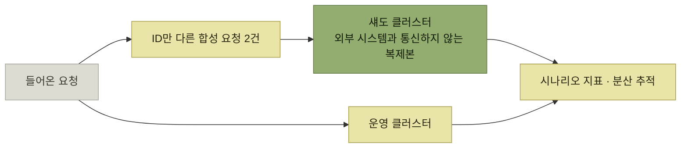

# 확장성과 확장성 시뮬레이션

> [프로덕트 아키텍처](./README.md)

## 빠른 복습
- **인터넷 기반 제품이라면 규모가 커질수록 문제가 발생**한다. **시스템의 처리량은 제한돼 있고, 사용자가 그 한계를 넘으면 결과가 심각**할 수 있다.
- **원인은 격리의 부재**다 — **제품의 일부 사용자가 다른 사용자의 경험에 악영향을 줄 수** 있다.
- 처리량 문제는 두 범주 — **병목은 시스템이 더 많은 동시 사용자를 받아들이지 못하게 가로막는 초크포인트**, **탄력성 문제는 처리량 자체는 더 받아낼 수 있지만 사용자 수요 변화에 충분히 빠르게 반응하지 못하는** 것.
- **두 범주의 문제는 테스트로 사전에 짚어낼 수** 있다.
- 저자는 **'테스트'나 '주입'보다 '시뮬레이션'이라는 용어를 선호**한다 — **현실 세계를 최대한 닮은 테스트 환경과 입력을 만드는 일이 주된 목표**이기 때문이다.

> [!NOTE]
> **확장성 시뮬레이션은 높은 프로덕션 충실도를 목표로 하세요**
>
> 호출 수만 늘리지 말고 실제 트래픽 분포, 데이터 크기, 종속 서비스와 시간에 따른 수요 변화를 함께 재현해야 합니다.

## 왜 '시뮬레이션'인가

> **노련하지 않은 엔지니어에게 '부하 테스트'라고 말하면, 같은 서비스를 몇 백만 번 호출하는 스크립트를 돌리면 된다는 인상을 줄 수** 있습니다. **그렇게 하루를 끝내버릴 수** 있죠.

| 용어 | 무엇을 재나 |
| --- | --- |
| **부하 시뮬레이션** | **일정량의 현실적인 프로덕션 트래픽을 시뮬레이션해, 특정 지점까지 확장 가능한지 판단** |
| **용량 시뮬레이션** | **비슷한 트래픽을 점점 늘려 보내며 시스템의 한계를 찾고, 그 한계에 도달했을 때 얼마나 원활하게 성능이 저하되는지** 확인 |
| **스파이크 시뮬레이션** | **사용자 요청의 실제 급증 상황을 시뮬레이션하기 위해 트래픽을 신속하게 증가**시켜 확장성 검증 |

표를 읽는 법. 셋은 **"얼마나 견디나 / 언제 무너지나 / 얼마나 빨리 따라오나"** 를 각각 묻는다. [『아키텍트 첫걸음』 5.3](../../아키텍트-첫걸음/5-품질-보증과-테스트/3-성능-테스트.md)의 **부하 테스트·장기 실행 테스트·확장성 테스트** 분류와 겹치되, 이 책은 **입력의 현실성**에 방점을 둔다.

## 고충실도 시뮬레이션의 모습

**현재 시스템으로 부하를 두 배까지 감당할 수 있는지, 그리고 얼마나 더 용량을 늘려야 하는지** 알고 싶다면.

*운영 트래픽을 복제해 섀도 클러스터로 보낸다 — 복제 계수를 올리면 용량 시뮬레이션이 된다*

- **코드에 지표, 로깅, 샘플링, 분산 추적을 계측**해 **발견한 문제를 무엇이든 디버깅**할 수 있게 한다.
- **개시한 모든 요청을 타이밍과 함께 기록**해 둬 **시뮬레이션을 재생하고 문제를 재현**할 수 있게 한다.
- **운영 환경의 클러스터를 그대로 복제한 섀도 클러스터**를 구축한다. **외부 시스템과 통신하지 않는다는 점만 제외하면 운영 환경과 최대한 동일**해야 한다.
- **운영 클러스터에 요청이 들어올 때마다 이를 두 개의 유사한 합성 요청으로 복제하되, ID만 다르게** 만들어 보낸다.
- **용량 시뮬레이션을 위해 복제 계수를 늘릴 수** 있어야 한다.
- **메모리 누수나 데이터베이스 인덱스 증가 등 '상태 누적'으로 인해 천천히 쌓이는 문제를 포착하려면 장시간 실행**한다.
- **트래픽을 더 올려 언제 문제가 발생하는지** 짚어낼 수 있게 한다.
- **시스템이 부하를 받을 때 전형적 사용자에게 미치는 임팩트를 이해하도록 시나리오 지표를 측정**한다.

**대규모 신규 고객을 추가하는 상황**이라면 **트래픽을 두 배로 늘리는 대신, 고객이 계획하고 있을 것으로 예상되는 행동에 따라 가상 트래픽을 주의 깊게 추가**한다. 그러면 **기존 전체 사용량이라는 맥락 속에서 해당 고객의 트래픽을 테스트**할 수 있다.

### 이 아키텍처가 주는 것

| 이점 |
| --- |
| **실제로 발생할 문제를 찾아내, 가로등 효과를 피한다** |
| **엔지니어가 조사와 수정의 우선순위를 자신 있게 매긴다** |
| **문제가 발생한 규모와 트래픽이 그 규모에 닿을 시점 예측을 근거로 수정이 얼마나 급한지 이해**한다 |
| **팀이 같은 셋업을 상대로 성능 개선을 테스트**할 수 있다 |

> 이 비전은 **꽤 방대하고, 구축과 운영에 비용이 많이** 듭니다. **많은 팀은 더 적은 자원으로 해결해야** 할 것입니다.

## 적은 자원으로 하는 요령

> **확장성 병목으로 알려진 단일 엔드포인트를 집중적으로 공격하는 것과 같은 단순 부하 테스트는, 그 자체로 투자 대비 수익이 좋을 수** 있습니다. 특히 **실제 사용자 트래픽이 쌓이기 전이라면요.** 다만 **이를 포괄적이라고 오해해서는 안** 됩니다.

> **고충실도 시뮬레이션과 단순 타깃 부하 테스트 스크립트를 섞어 쓰는 것도 잘** 통합니다. **전자는 병목을 찾고, 후자는 그 병목을 재현 가능하고 테스트 가능한 형태로** 바꿉니다.

| 주의할 곳 | 내용 |
| --- | --- |
| **테스트 하네스** | **단순한 반복문으로 요청을 보내면, 이전 요청의 처리 시점에 따라 다음 요청이 지연되면서 병목이 생길 수** 있다. **실제 환경에서는 사용자가 줄을 서서 요청을 보내지 않는다** |
| **시뮬레이션 환경** | **가능한 한 운영 환경과 동일하게.** **평소 운영 환경에서 실행되는 백그라운드 작업도 함께 실행**해 볼 수 있다 |
| **재현성** | **테스트 하네스를 결정론적으로 동작하게 만들고 랜덤 시드를 사용하면 실행 결과의 편차를 줄일 수** 있다 |
| **충실도와 신뢰** | **현실적인 트래픽을 시뮬레이션해 오탐률이 25%인 테스트와, 실제 트래픽과 거의 무관해 오탐률이 90%인 테스트**가 있다면 — **사용하기는 조금 더 어렵더라도 팀은 전자가 보고한 문제를 훨씬 더 신뢰하고 적극적으로 조사**한다 |
| **임팩트 전달** | **성능 저하가 실제 사용자 시나리오에 어떤 영향을 미치는지 시나리오 지표를 통해** 보여준다 |

표를 읽는 법. 넷째 줄이 이 절의 핵심 논거다. **테스트의 값은 정확도가 아니라 "팀이 그 결과를 고치러 가는가"** 로 매겨진다 — [4장의 신호 대 잡음비](../04-자사-제품-체험/2-테스트-종류-고르기.md)와 같은 이야기다.

### 오늘의 트래픽과 다를 때

> **프로덕션 트래픽을 섀도잉하거나, 녹화한 뒤 재생하는 방식이 훌륭한 관행**입니다. 그런데 **걱정하는 트래픽이 오늘의 트래픽과 다르다면요?** 그때는 **고객이 실제로 할 일의 세부를 예측**해야 합니다.

- **개별 대형 고객과 일하고 있다면, 그들과 긴밀히 협력하여 부하 테스트를 수행**한다.
- **개별 호출이 아니라 전체 시나리오를 생성**한다. **고객이 신용카드 폼을 로드한 뒤 바로 결제를 제출**할 수 있으므로, **두 동작을 순차적으로 수행하고 그 사이의 시간 간격은 무작위로 바뀌도록** 작성한다.

### 시간을 의식한다

- **현실은 멈추지 않으니 장시간 테스트**를 돌린다. **메모리 누수로 인해 가비지 컬렉션이 발생하는 문제** 등을 발견하게 된다.
- **달력 효과를 예측**한다. **트래픽이 급증할 것으로 예상되나, 안정적인 흐름인가? 하루 중 특정 시간대에 정점을 찍나? 연중 특정 요일에 정점이 나타나나?** **스트라이프에서는 미국의 블랙 프라이데이와 사이버 먼데이 전통에 맞춰 매년 대대적으로** 준비했다 — **이 기간 트래픽이 지붕을 뚫는다.**
- **제품이 발전하면서 시간에 따라 회귀를 감지할 수 있도록 성능 프로필을 데이터베이스에 기록**해 둔다.

> 도구와 접근 방식을 고를 때는 **프로덕션을 모델링할 수 있는 능력을 목표로 삼되, 병목 현상을 발견했을 때 이를 디버깅할 수 있는 충분한 모니터링 기능을 갖추고 있는지** 확인해야 합니다.

## 함께 읽기
- [다음 절 — 이 모든 것을 고객에게 어떻게 말하나](./8-사용자에게-nfr-전달.md)
- [『아키텍트 첫걸음』 5.3 부하 테스트](../../아키텍트-첫걸음/5-품질-보증과-테스트/3-성능-테스트.md#부하-테스트)
