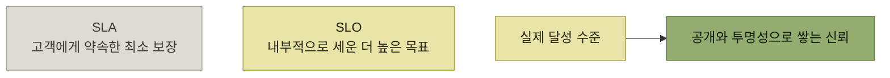

# 사용자에게 NFR 전달

> [프로덕트 아키텍처](./README.md)

## 빠른 복습
- **온라인 플랫폼의 고객은 신뢰할 수 있고 확장 가능한 시스템만 원하지 않는다. 확실한 보장도** 원한다.
- **엔지니어의 역할은 고객에게 어떤 수준까지 보장할 수 있는지 판단하고, 그 내용을 정확하게 전달하며, 신뢰성 목표를 달성할 수 있도록 시스템을 개선**하는 것이다.
- **커뮤니케이션의 두 목적** — **고객과 공급자의 이해관계를 일치시키는 것**, **고객의 신뢰를 얻는 것.**
- **SLA는 목표가 아니라 최소한의 보장 기준**이다. **고객은 실제로 그보다 더 높은 가용성을 원하고**, 회사는 **속으로 더 높은 SLO**를 세운다.
- **SLO는 고객에게 혼란을 주거나 잘못된 기대를 심어줄 수 있기 때문에 일반적으로 외부에 공개하지 않는다.**
- **신뢰를 쌓는 것은 정직하고 투명하게 행동하는 것**이다.

> [!IMPORTANT]
> **SLA와 내부 목표의 역할을 구분하세요**
>
> SLA는 고객에게 약속하는 최소 보장이고, 내부 SLO는 그 약속을 여유 있게 지키도록 운영하는 더 높은 목표입니다.

## SLA

**보장은 서비스 수준 계약(SLA)이라 부르는 계약에** 담기며, 가장 흔히 규율하는 항목은 셋이다.

| 항목 | 내용 |
| --- | --- |
| **가용성** | **서비스 업타임을 퍼센트로 측정** |
| **온콜 응답 시간** | **엔지니어는 장애에 얼마나 빨리 대응해야 하나** |
| **지연 시간** | **핵심 엔드포인트가 얼마나 빠르게 응답하나** |

> 계약서에는 **일정 기간 동안 API 호출의 최소 99.9%는 성공해야 한다**고 명시될 수 있습니다. **회사가 이 기준을 충족하지 못하면 고객에게 일정한 보상**을 제공해야 합니다. **일반적으로는 서비스 크레딧 형태의 환불**이 이루어집니다. **이러한 계약은 기업이 신뢰성을 지속적으로 개선하도록 동기를 부여한다는 점에서 중요한 의미**를 갖습니다.

*SLA는 바닥선이고, 그 위의 실력은 다른 방식으로 보여줘야 한다*

> 따라서 기업은 **SLA에 명시된 최소 기준만 충족하는 것이 아니라는 걸 고객에게 보여 줄 다른 방법**이 필요합니다.

## 투명성으로 신뢰를 쌓는다

- **`https://status.stripe.com` 같은 사이트에서 장기간의 서비스 가용성을 있는 그대로** 공개한다.
- **장애가 발생하면 RCA를 고객에게, 더 나아가 인터넷에** 공개한다.
- **장애 대응 중에도 최신 상태를 공유해, 어떤 단계를 얼마나 빠르게 밟았는지** 보여준다.
- **재발 방지를 위해 이미 진행 중이거나 완료한 개선 조치를 나열**한다.

> **정보를 숨기거나 핑계를 대려는 유혹에 굴복하지 마세요. 자사 인프라 공급사 탓으로 돌리는 건 신뢰를 쌓는 일이 아닙니다.**

| 대응 | 고객이 받아들이는 뜻 |
| --- | --- |
| **한 리전의 장애를 AWS 탓으로만 돌린다** | **여러분이 앞으로도 아무런 계획이 없다는 의미** |
| **재해 대비를 위해 다른 리전이나 클라우드 공급사를 추가하겠다고 말한다** | **여러분이 배우고 더 나아지고 있음을 이해**하고 **장기 고객으로 남을 마음이 커진다** |

표를 읽는 법. **사실관계는 둘 다 같다** — AWS 장애가 원인이었다는 것. 다른 것은 **그다음에 무엇을 하겠다고 말하는가**뿐이다.

## 밖으로 투명하려면 안이 먼저 투명해야 한다

> **고객에게 투명하려면 먼저 사내에서 투명해야** 합니다. **개별 직원이나 매니저가 해고될까 두렵거나 승진을 포기하고 싶지 않거나 해서 무슨 일이 있었는지 말하기 불편하면 사실을 감춥니다. 그러면 고객에게도 끝내 드러나지 않습니다.** 이게 **스트라이프가 '급진적 투명성' 문화를 권장하는 이유** 중 하나입니다.

### 비난 없는 포스트모템

> **팀원들이 모여 운영 중 발생한 사고의 원인을 규명할 때, 실패에 대한 책임을 개인에게 돌리기보다는 사고를 초래한 시스템적 실패에 주로 집중**합니다. **개인이 실수를 했을 때는, 처벌받기보다 이를 통해 교훈을 얻어야** 합니다. 저는 **이런 포스트모템에 참석하는 걸 좋아합니다. 건설적이고, 창의적이고, 동료애가 흐르거든요.**

**데이터베이스 롤아웃 과정에서 어떤 엔지니어가 노브 설정을 잘못해 장애를 냈다**면,

| 질문 | 어디서 다루나 |
| --- | --- |
| **앞으로 개인은 롤아웃을 어떻게 더 잘 검증할 수 있을까** | **매니저나 테크 리드와 비공개로 아이디어를** 주고받는다 |
| **그걸 막을 수 있는 온전성 점검은 왜 마련돼 있지 않았을까** | **그룹 포스트모템의 훌륭한 주제** |

표를 읽는 법. **두 질문을 다른 자리에서 다룬다**는 점이 이 관행의 실무적 핵심이다. 개인의 개선은 사적으로, 시스템의 결함은 공개적으로.

> **모든 인프라는 하나의 제품이므로, 비난 없는 포스트모템은 사용자를 탓하기보다 제품을 탓하는 훈련**입니다.

**[5장의 "잘못한 건 사용자가 아니라 제품"](../05-지속적인-사용자-이해/6-사용자-지원-플라이휠.md)** 이 조직 내부로 들어온 형태다. 이 장을 닫는 문장으로 저자가 이 대목을 고른 이유이기도 하다.

## 함께 읽기
- [다음 절 — 요약과 마지막 예제](./9-요약과-예제-그리고-정리.md)
- [5.3 사용자 지원](../05-지속적인-사용자-이해/6-사용자-지원-플라이휠.md) — 사용자를 탓하지 않는 자세
