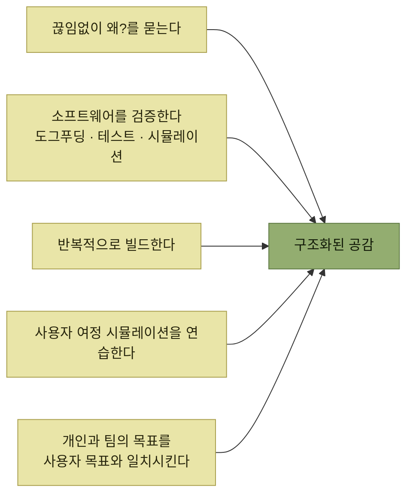

# 요약과 예제, 그리고 정리

> [프로덕트 아키텍처](./README.md)

## 빠른 복습
- **프로덕트 아키텍처 역량을 쥐면, 더 전략적이고 자신 있는 선택을 하게 되고, 사용자도 그만큼 더 행복**해진다.
- 마지막 예제는 **구글 시트와 비슷한 협업 편집 기능** — **동시에 최대 50명이 편집**하고 **팀 브레인스토밍이나 해커톤처럼 사람들이 스프레드시트 셀에 이름을 적어 과업을 맡는 유스 케이스**를 지원한다.
- 책의 마지막 절은 **'구조화된 공감structured empathy'** 이라는 표현으로 전체를 묶는다.

> [!TIP]
> **시스템 선택을 더 긴 사용자 이야기로 검증하세요**
>
> 구조화된 공감은 기술 지표와 트레이드오프를 사용자의 과업, 실패, 회복이 이어지는 시나리오 안에서 판단하게 합니다.

## 9.6 요약

| 조언 | 내용 |
| --- | --- |
| **가로등 아래만 보지 마라** | **사용자와 그들의 행동에 대한 지식에 기대라** |
| **간극을 메우는 도구를 써라** | **워크플로 엔진, 분산 추적 프레임워크, 부하 시뮬레이터** 같은 도구로 **제품 동작을 총체적으로 모델링하면서도 시스템 세부 사항을 함께 추적**하라 |
| **저수준 지표 너머를 보라** | **동시 사용자 수, 시나리오 완료율, 클라이언트 측 가용성** 같은 **사용자에게 직접 영향을 주는 행동**을 추적하고 목표로 삼으라 |
| **일관성을 데이터베이스 관점으로만 보지 마라** | **'자기 쓰기를 읽는'이나 '다른 사람 쓰기 이후의 쓰기' 같은 개념**으로 보고, **각 개인의 읽기와 쓰기가 누구와 동기화돼야 하는지** 고민하라. **프로덕트 기술 스택의 여러 계층에서 창의적으로** 풀라 |
| **트레이드오프의 연속임을 받아들이라** | **사용자가 무엇을 원하는지 이해하고, 그에 맞는 균형**을 찾으라 |
| **시뮬레이션은 현실적으로** | **실제 사용자가 제품을 사용하는 방식을 최대한 현실적으로 재현**하라 |
| **정직하게 소통하라** | **고객과 이해관계를 일치시키는 장치를 마련하는 동시에, 정직하고 투명하게 소통해 신뢰**를 쌓으라 |

## 9.7~9.8 예제와 답안

### 1) 어떤 일관성 보장을 원하나

> **신중한 사용자는 WoW 일관성을 원할** 겁니다. **다른 사람이 방금 셀에 입력한 내용을, 자신도 모르게 덮어쓰고 싶지는 않을** 테니까요.

### 2) 데이터베이스 수준과 제품 수준에서

> **표준적인 조건부 쓰기 방식**을 쓸 수 있습니다. **각 클라이언트가 셀마다 자기 데이터 사본이 얼마나 최신인지 보여주는 시퀀스 번호를 보관**합니다. **사용자가 쓰기를 커밋할 때마다 해당 셀의 글로벌 시퀀스 번호가 증가**합니다. **모든 쓰기는 시퀀스 번호가 일치할 때에만 조건부로 성공**합니다.

> **이럴 때 사용자에게 무엇을 보여줘야 할까요? 최신 값을 자신의 편집 내용과 나란히 보여주는 팝업을 띄우고, 충돌 해결 옵션을 제공**할 수 있겠죠.

> **복사·붙여넣기처럼 여러 셀에 영향을 주는 편집은요?** 제 짐작으로는 **사용자가 원자성을 원할** 겁니다. **전부 적용하거나 전부 거절하고, 그 뒤 충돌 해결 화면을 보여주는** 식으로요. **그렇지 않으면 셀 간 불일치가 금세 혼란스러워지고 관리하기 어려워집니다.**

### 3) 구글이 실제로 한 것과 하지 않은 것

**구글 시트는 사실 강한 일관성 보장을 강제하지 않고 단순한 '마지막 쓴 사람이 이김' 정책**을 쓴다.

| 우회책 | 성격 |
| --- | --- |
| **각 사용자에게 색을 할당하고, 사용자가 셀을 클릭할 때마다 협업자들에게 그 색의 박스가 보인다** | **구글이 이미 하고 있는 것.** **충돌이 가능하다는 강력한 시각 신호를 주어, 사용자끼리 스스로 질서를 잡게** 한다 |
| **시퀀스·히스토리 추적을 하되, 강한 에러를 던지는 대신 해당 셀 옆에 경고 아이콘을 표시**하고 **사용자가 눌러 충돌을 해결** | **구글이 하지 않는 것.** **편집 히스토리를 함께 유지해 맥락을 제공**해야 한다 |

표를 읽는 법. 첫 줄에 대한 저자의 평이 이 책 전체의 결론과 이어진다.

> **구글 입장에서도 비교적 간단히 구현할 수 있는 장치**였을 거예요. **데이터 일관성 문제는 데이터베이스만의 문제가 아니라는 걸 상기**시켜 주죠. **솔루션이 사용자에 가까울수록, 비용 효율적이고 타깃도 정확해지는 경우가 많습니다.**

**"색깔 상자"가 분산 시스템 문제의 해답**이 되는 장면이며, [5절의 계층별 설계](./5-데이터-일관성.md)에서 **프로덕트 결정 계층**이 가장 싸게 이기는 사례다.

### 4) 어떤 지표를 볼 것인가

- **각 서버 호출의 타이밍을 측정해 클라이언트 문제인지 서버 문제인지 범위를** 좁힌다. **서버 내에서는 핵심 데이터베이스 호출을** 측정한다.
- **스프레드시트를 로드하고 렌더링하는 시간**도 별도로, 그리고 함께 추적한다 — **극히 흔한 시나리오이자 제품의 첫인상**이다. (편집과 직접 관련 없는 지표)
- **사용자가 셀에 데이터를 입력하는 순간부터, 그것이 클라우드에 저장되고 다른 사용자들에게 전파되는 시점까지**를 측정한다.
- **색상 박스로 일관성을 보조하는 접근은 박스가 빨리 뜨지 않으면 의미가 없다.** 그래서 **사용자가 셀을 클릭한 뒤 다른 사용자가 그 색상 박스를 보기까지 걸리는 시간**을 측정한다.

**마지막 항목이 이 답안의 백미**다. **3번 답에서 고른 제품 설계(색상 박스)가 새로운 지연 시간 지표를 만들어냈다** — 설계 결정이 곧 계측 대상을 정한다.

### 5) 부하 테스트 접근

> **첫 단계로, 합리적으로 예상되는 최대 수준에 가까운 대규모 실제 시나리오를 구상한 뒤, 여러 사용자를 한 자리에 모아 이를 집중적으로 테스트**해 볼 것입니다. 아니면 **실제 사용 패턴을 기반으로, 테스트하고자 하는 특성을 가진 대규모 세션 몇 개를 선별**할 수도 있습니다.

> 두 경우 모두 **모든 동작을 기록하고 익명화한 뒤, 사용자 없이 액션을 재생할 수 있는 '헤드리스' 브라우저 안에서 부하 시뮬레이션으로 재생**하겠습니다. **서버에만 부하를 집중하고 싶다면 브라우저를 빼고 서버 요청만 기록**해도 됩니다.

> **현실 데이터를 단순 재생하는 것의 한 가지 우려는, 많은 요인이 얽혀 있다는 점**입니다. **클라이언트 측 렌더링 지연을 개선했다면, 사용자 자체가 더 빨라져 데이터베이스에 더 큰 압력**을 가할 수 있습니다. 그래서 **큰 변경 뒤에는 다시 시뮬레이션**하고 싶을 수 있습니다.

> **현실 데이터를 근거로 어디에 문제가 있는지 파악했다면, 시스템의 특정 부분으로 파고들어 그 부분만 실행하는 더 타깃된 부하 테스트**를 만들 수 있습니다. **그러면 최적화하면서 피드백 루프가 더 타이트해지고, 원래의 시뮬레이션 트래픽으로 최적화 결과를 검증**할 수 있습니다.

**"고충실도로 찾고, 타깃 테스트로 고친다"** 는 [7절의 조합 전략](./7-확장성과-확장성-시뮬레이션.md)이 답안에서 반복된다.

## 9.9 정리 — 이 책의 마지막

> **AI 시대의 엔지니어는 드문 기술 조합을 갖추고 있는 존재**입니다. **시나리오, 페르소나, 기표, 어포던스로 사고하는 능력을 기술 역량과 함께 엮으면, 일종의 '구조화된 공감structured empathy'** 이 생깁니다. **이는 엔지니어링 분야와 궁합이 잘 맞고, 트레이드오프를 헤쳐 가는 데 도움**이 됩니다.

> **이 힘을 얻는 가장 중요한 방법은 그저 사용자에게 집중하는 연습을 계속하는 것**입니다.

*책이 마지막으로 남긴 다섯 가지 연습*

- **끊임없이 "왜?"를 물으라.** **사람들은 왜 이렇게 행동할까? 여러분이 만드는 것에서 사람들은 어떤 혜택을 볼까?**
- **소프트웨어를 검증하라.** **도그푸딩하고, 테스트하고, 시뮬레이션하고, 자신과 팀을 고객과 그 피드백에 노출**하라.
- **반복적으로 빌드하라.** **그 자체로 사용자 노출 빈도가 올라간다.**
- **사용자 여정을 시뮬레이션하는 연습을 하라.** **체스 플레이어가 수를 점점 더 멀리 보도록 배우듯, 사용자에 대해 더 길고 더 나은 이야기를 들려주는 능력을 키울 수** 있다.
- **개인과 팀의 목표를 사용자의 목표와 일치시키면, 업무에 집중하는 데 도움**이 된다.

> **이 내용이 여러분에게 변화를 만들어내길 바랍니다.**

**넷째 항목의 체스 비유가 [1장의 시뮬레이션](../01-프로덕트-사고의-기본/7-시나리오의-구성-시뮬레이션.md)과 정확히 맞물리며 책이 닫힌다.** 1장이 **"시나리오 하나를 끝까지 그려 보라"** 로 시작했고, 마지막 페이지는 **"더 길고 더 나은 이야기를 들려주는 능력은 훈련으로 자란다"** 로 끝난다.

## 함께 읽기
- [이 장의 목차](./README.md)
- [책 전체 목차](../README.md)
- [1장 프로덕트 사고의 기본](../01-프로덕트-사고의-기본/README.md) — 책이 시작한 자리
