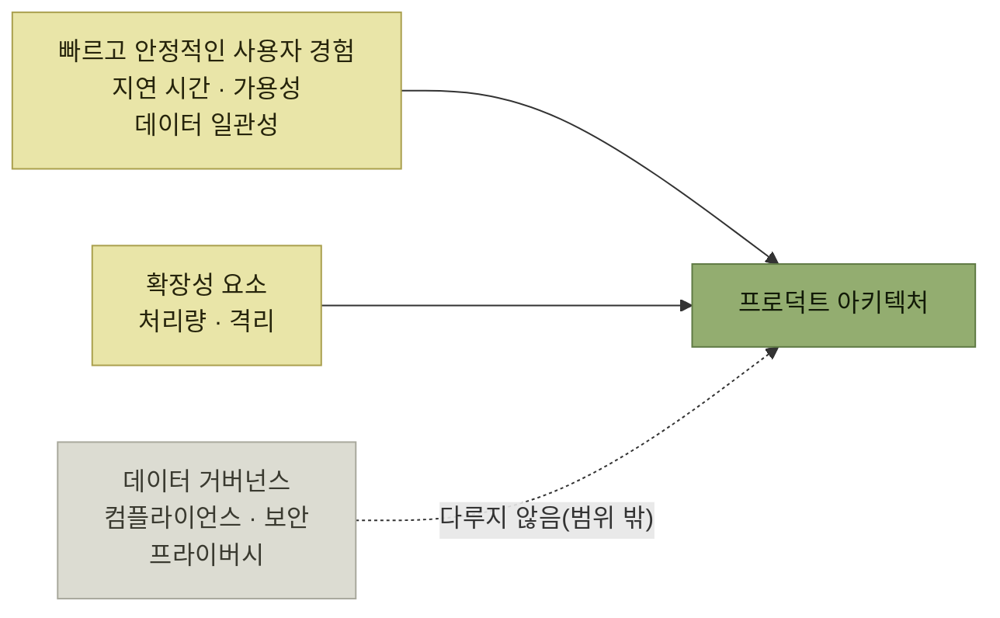

# 프로덕트 아키텍처

> [AI 시대의 엔지니어링 전략](../README.md)

## 보기엔 그럴싸한데 돌아가지 않는 물건

> **소프트웨어에서 의미 있는 요구 사항을 손에 쥐는 일은 드뭅니다.** 손에 쥐었다 해도 **성공의 잣대는 단 하나입니다. 바로 우리 솔루션이 고객의 끊임없이 바뀌는 문제 인식을 풀어주는가**입니다.
> — 제프 앳우드

**기능 요구 사항은 사용자가 원하는 바를 수행할 수 있도록 제품의 어포던스가 갖춰야 할 목표**들이며, **[8장](../08-인터랙션-설계/README.md) 전체가 사실 이에 관한 이야기**였다.

> **여기에만 매달리면 결국 포템킨 마을 같은 소프트웨어가 남습니다. 보기엔 그럴싸한데 실제로는 돌아가지 않는 물건**이죠. 그래서 **NFR도 함께** 살펴야 합니다.

**NFR(비기능 요구 사항)에 드는 것** — **비용, 확장성, 지연 시간, 처리량, 데이터 일관성, 탄력성, 가용성**. **프라이버시와 보안도 빼놓을 수 없는데, 이 책에서 깊이 다루지는 않는다.**

> **NFR은 그 자체로 사용자 목표가 아닙니다. 목표를 이루는 수단입니다.** **제대로 작동하지 않을 때만 사용자 눈에 들어오는 항목**이기도 합니다.

> [!IMPORTANT]
> **NFR을 사용자 목표에서 출발시키세요**
>
> 지연 시간·가용성·일관성·확장성은 독립적인 기술 목표가 아니라 사용자가 과업을 성공적으로 끝내기 위한 수단입니다.

## 프로덕트 아키텍처란

> 저는 이 합성을 **프로덕트 아키텍처**라고 부릅니다. **사용자와 비즈니스 제약이라는 맥락 위에서 수행하는 시스템 설계**를 뜻합니다.

> 저는 이 주제를 좋아합니다. **책 전체에서 가장 엔지니어링 냄새가 짙으면서도, 프로덕트 사고의 힘을 여전히 빌려야** 하거든요. **사용자 중심 사고와 시스템 중심 사고를 완벽하게 융합하는 작업**입니다. 게다가 **프로덕트 매니저나 다른 역할이 설계를 도와주기 가장 어려운 영역**이기도 합니다.

*이 장이 다루는 두 범주와, 생략한 한 범주*

| 범주 | 언제 체감되나 |
| --- | --- |
| **빠르고 안정적인 사용자 경험** | **지연 시간, 가용성, 데이터 일관성** |
| **확장성 요소** | **많은 사용자가 동시에 시스템을 쓸 때 비로소 체감되는 처리량과 격리** |
| **데이터 거버넌스**(생략) | **컴플라이언스, 보안, 프라이버시.** **여기서도 프로덕트 사고의 힘은 잘 드러난다** |

표를 읽는 법. 둘째 줄의 **"비로소 체감되는"** 이 확장성 문제의 성격을 말한다 — **혼자 쓸 때는 아무 문제가 없다.** 그래서 [시뮬레이션](./7-확장성과-확장성-시뮬레이션.md)이 필요하다.

## 목차

- [프로덕트 아키텍처의 토대](./1-프로덕트-아키텍처의-토대.md)
- [사례 연구: 스트라이프 결제](./2-사례-연구-스트라이프-결제.md)
- [지연 시간](./3-지연-시간.md)
- [가용성](./4-가용성.md)
- [데이터 일관성](./5-데이터-일관성.md)
- [세 요구 사항의 트레이드오프](./6-세-요구-사항의-트레이드오프.md)
- [확장성과 확장성 시뮬레이션](./7-확장성과-확장성-시뮬레이션.md)
- [사용자에게 NFR 전달](./8-사용자에게-nfr-전달.md)
- [요약과 예제, 그리고 정리](./9-요약과-예제-그리고-정리.md)

## 함께 읽기

- [『아키텍트 첫걸음』 3.2 품질 속성](../../아키텍트-첫걸음/3-아키텍처-설계/2-아키텍처-드라이버의-핵심-사항.md#품질-속성) — **같은 NFR을 KS X 25010 품질 속성 체계로** 다룬 절. 이 장은 그것을 **사용자 시나리오에 붙여** 본다.
- [『아키텍트 첫걸음』 5.3 성능 테스트](../../아키텍트-첫걸음/5-품질-보증과-테스트/3-성능-테스트.md) — **부하·장기 실행·확장성 테스트**의 분류. 이 장의 **확장성 시뮬레이션**과 짝을 이룬다.
- [8장 인터랙션 설계](../08-인터랙션-설계/README.md) — **기능 요구 사항** 쪽. 이 장은 그 나머지 절반이다.
