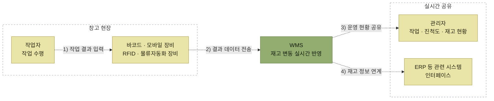

# WMS의 주요 특징

> [WMS 개요](./README.md)

## 빠른 복습

- WMS를 WMS답게 만드는 특징은 세 가지다. **로케이션 관리**, **LOT 관리 기반**, **실시간 재고관리**.
- 로케이션은 보관 공간에 주소를 부여하고 재고를 주소 단위로 구분해 보관하는 것이다. 재고 위치가 작업자의 기억에서 시스템으로 옮겨온다.
- LOT 관리는 생산단위·유통기한·일련번호로 재고를 구분해 FIFO·LIFO 기준의 입출고와 정밀 추적을 가능하게 한다.
- 실시간 재고관리는 바코드·모바일 장비·RFID·자동화 설비로 작업 결과를 즉시 반영해 창고 현황을 실시간으로 유지한다.
- 세 특징의 공통점은 **특정 작업자의 경험과 노하우 의존을 시스템으로 대체**한다는 것이다.

<table>
<thead>
<tr>
<th style="text-align:center; white-space:nowrap">특징</th>
<th style="text-align:center; white-space:nowrap">핵심 내용</th>
</tr>
</thead>
<tbody>
<tr>
<td style="text-align:center; white-space:nowrap">로케이션 관리</td>
<td style="text-align:left">적재단위별로 주소 부여, 재고와 주소를 연결 관리</td>
</tr>
<tr>
<td style="text-align:center; white-space:nowrap">LOT 관리 기반</td>
<td style="text-align:left; white-space:nowrap">생산 LOT·유통기한 관리, 시리얼 관리</td>
</tr>
<tr>
<td style="text-align:center; white-space:nowrap">실시간 재고관리</td>
<td style="text-align:left">바코드·RFID 활용, 모바일 장비 활용, 자동화 설비·로봇 연동</td>
</tr>
</tbody>
</table>

## 1. 로케이션 관리

**로케이션**이란 창고의 보관 공간에 주소를 부여하고 재고를 주소 단위로 구분하여 보관하는 것이다.

이전에는 재고를 **총 수량만** 관리했다. 실제 위치는 작업자만 알고 있었는데, 로케이션이 도입되면서 전산적으로 알 수 있게 됐다. 이 차이가 왜 중요한지는 문제가 생기는 순간에 드러난다. 기억력이 나쁜 작업자이거나 다른 작업자가 대체 투입되었을 경우, 작업 지연과 오류의 원인이 된다.

로케이션은 재고 현황 파악뿐 아니라 **재고 조사와 재고 차이 원인 파악**에도 장점이 있다. 그리고 특정 작업자의 경험·노하우에 의존하지 않고 WMS 시스템에 의해 재고 파악과 작업 지시가 이루어지므로, 작업에 익숙하지 않은 작업자도 바로 투입할 수 있다.

### 총량관리와 로케이션 관리 비교

<table>
<thead>
<tr>
<th style="text-align:center; white-space:nowrap">구분</th>
<th style="text-align:center; white-space:nowrap">총량관리</th>
<th style="text-align:center; white-space:nowrap">로케이션 관리</th>
</tr>
</thead>
<tbody>
<tr>
<td style="text-align:center; white-space:nowrap">개요</td>
<td style="text-align:left; white-space:nowrap">주소 부여 없이 임의로 재고 보관 품목 수가 적을 경우 유리 작업자 기억에 의한 위치 관리</td>
<td style="text-align:left; white-space:nowrap">주소를 부여하여 재고 위치 관리 품목 수가 많을 경우 효과적 시스템에 의한 위치 관리 가능</td>
</tr>
<tr>
<td style="text-align:center; white-space:nowrap">장점</td>
<td style="text-align:left; white-space:nowrap">운영이 단순함 데이터 발생량이 적음</td>
<td style="text-align:left; white-space:nowrap">재고 위치를 정확히 파악 가능 위치별 재고 변동 이력 관리 가능 수시로 재고 파악이 쉬움 초보자 투입 가능</td>
</tr>
<tr>
<td style="text-align:center; white-space:nowrap">단점</td>
<td style="text-align:left; white-space:nowrap">재고 위치 파악이 어려움 초보자 투입이 어려움</td>
<td style="text-align:left; white-space:nowrap">총량관리에 비해 운영이 다소 복잡 발생되는 데이터량이 비교적 많음</td>
</tr>
</tbody>
</table>

로케이션 관리가 언제나 정답인 것은 아니다. 품목 수가 적으면 총량관리가 유리하고, 운영 복잡도와 데이터량이라는 비용이 따라온다. 품목 수가 많아질 때 이 비용을 지불할 가치가 생긴다.

## 2. LOT 관리 기반

PL(Product Liability, 제조물책임)법 등으로 인해 제품을 로트별로 재고 관리하고 입출고 시 이를 추적해야 하는 제품이나 업무가 많아지고 있다.

WMS는 생산단위별, 유통기한, 일련번호 등으로 재고를 구분하여 로케이션 재고관리를 수행할 수 있다. 기존 ERP에서도 불가능한 것은 아니지만 작업 절차가 복잡하고 어려운 경우가 많아 일반적으로는 적용하지 않는다.

WMS는 로케이션 관리와 로트 관리를 함께 이용하여 다음을 수행한다.

- FIFO, LIFO 등의 기준으로 입출고 작업 수행
- 로트별 입출고 이력 관리를 통한 재고 정밀 추적
- 실시간 모니터링

## 3. 실시간 재고관리

WMS는 창고에서 일어나는 작업을 바코드·모바일 장비·RFID·물류자동화 장비 등을 활용하여 재고 변동을 실시간으로 반영하고, 현재 창고의 현황을 실시간으로 관리할 수 있다. 여기서 모바일 장비는 이동 가능한 PC를, 바코드는 휴대용 스캐너 등을 가리킨다.

동작 방식은 단순하다. 창고 작업자가 작업을 수행하면서 그 결과를 바코드 스캐닝 등으로 입력하면, WMS에 바로 실시간으로 반영된다. 아래 도식의 번호는 처리 순서이며, 점선은 정보 흐름을 뜻한다.

*작업 결과가 장비를 거쳐 즉시 WMS에 반영되고, 관리자와 타 시스템으로 실시간 공유된다.*

이를 통해 WMS는 실시간 재고정보를 운영·유지할 수 있고, 현재의 작업 현황·진척도·재고 현황 등을 관리자와 ERP 등 관련 시스템에 인터페이스화하여 실시간으로 공유할 수 있다. 기존의 종이 문서에 의한 작업 지시와 결과 반영 프로세스를 정확도 높고 효율적으로 처리할 수 있게 된 것이다.

근래에는 더 빠르고 정확한 재고관리 업무를 위해 RFID(Radio Frequency Identification) 도입이 늘어나고 있다. 버스카드와 같은 원리로, 여러 개의 태그를 동시에 읽거나 쓸 수 있고 인식도 빠르다.

## 함께 읽기

- 이 특징들이 만들어내는 결과는 [WMS 도입 효과](./4-WMS-도입-효과.md)에서 정리한다.
- 실시간 정보가 다른 시스템으로 흘러가는 구조는 [WMS는 혼자 돌지 않는다](./2-WMS-시스템이란.md#wms는-혼자-돌지-않는다)를 참고한다.
