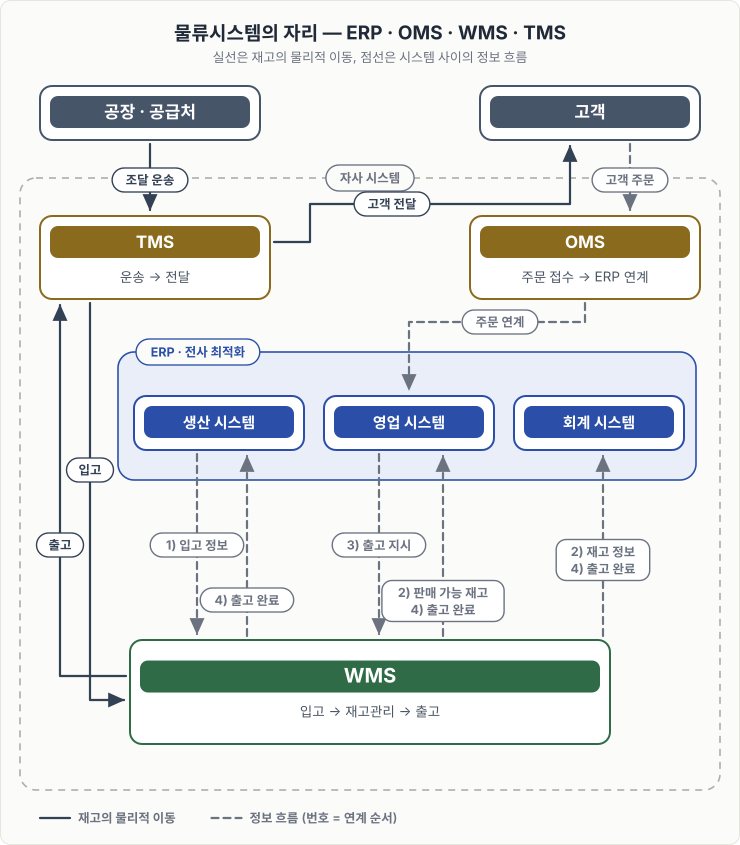

# WMS 개요

> [WMS 원리와 이해](../README.md)

## 왜 ERP만으로는 부족했을까

WMS를 바로 설명하기 전에, 물류시스템이 왜 따로 필요해졌는지부터 짚는 편이 이해가 빠르다. 기업의 관리 시스템은 "무엇이 부족한가"를 하나씩 발견하면서 확장되어 왔다.

*ERP의 확장 과정 — 각 단계는 앞 단계에서 드러난 "부족한 자원"을 끌어안는다.*

과거에는 생산력과 영업력만 있으면 되었기 때문에 전문적인 물류관리 시스템에 대한 요구가 거의 없었고, ERP만으로도 업무가 가능했다. 그런데 시장이 글로벌화되고 B2B 위주 시장에서 고객을 직접 상대하는 B2C 채널이 다양해지면서 다품종 소량생산이 일반화되었다. 유통기한·로트번호·일련번호까지 관리해야 하는 복잡한 물류가 등장하자, ERP가 전체 최적화 관점에서 감당하기 어려운 영역을 특화해서 맡을 시스템이 필요해졌다.

그 특화 시스템이 OMS·WMS·TMS이고, 이 책이 다루는 것은 그중 창고를 맡는 WMS다.

아래 도식에서 실선은 재고의 물리적 이동, 점선은 시스템 사이의 정보 흐름을 뜻한다. `1)~4)`는 [WMS 연계 과정](./2-WMS-시스템이란.md#wms는-혼자-돌지-않는다)의 순서이며, 고객 주문은 출고 지시를 만드는 별도 흐름이다.

*물류시스템은 ERP를 대체하지 않고, ERP가 감당하기 어려운 영역을 특화해 지원한다. 주문은 OMS가 접수해 ERP로 연계하고, 출고 지시는 ERP의 영업시스템이 WMS로 내린다. 재고는 공장·공급처에서 입고되어 WMS를 거쳐 출고된다.*

위 도식의 `공장 · 공급처`는 재고가 실제로 나오는 **물리적 출처**다. [WMS 연계 도식](./2-WMS-시스템이란.md#wms는-혼자-돌지-않는다)에 나오는 `생산 시스템`은 그 공장의 **정보 시스템**이고 ERP 안에 있다. 같은 "생산"이지만 하나는 재고가 나오는 장소, 하나는 입고 정보를 보내는 시스템이므로 구분해서 읽는다.

원서 1장은 TMS를 "고객에게 차량 등의 운송수단으로 안전하게 전달"하는 시스템으로 소개한다. 즉 **출고 쪽 운송만 규정**한다. 다만 실제로는 위 도식처럼 공급처에서 창고로 들어오는 조달·간선 운송도 TMS가 다루는 영역이므로, 입고 운송까지 함께 그렸다. 원서 정의를 넓힌 부분이다.

## 이 장에서 확인할 것

- ERP가 어떤 문제를 풀면서 확장되었고, 왜 물류시스템이 분리되었는가
- WMS의 정의와 기본 목적, 그리고 WMS가 혼자 돌 수 없는 이유
- WMS를 WMS답게 만드는 세 가지 특징: 로케이션, LOT, 실시간
- WMS를 도입하면 실제로 무엇이 좋아지는가

## 목차

1. [ERP와 물류시스템](./1-ERP와-물류시스템.md)
2. [WMS 시스템이란](./2-WMS-시스템이란.md)
3. [WMS의 주요 특징](./3-WMS의-주요-특징.md)
4. [WMS 도입 효과](./4-WMS-도입-효과.md)

## 함께 읽기

- ERP·OMS·WMS·TMS의 경계와 정보 흐름을 다른 도메인에서도 재사용할 수 있게 표현하는 방법은 [시스템 컨텍스트 다이어그램](../../아키텍트-첫걸음/3-아키텍처-설계/6-아키텍처-문서화.md#시스템-컨텍스트-다이어그램의-예)에서 다룬다.
