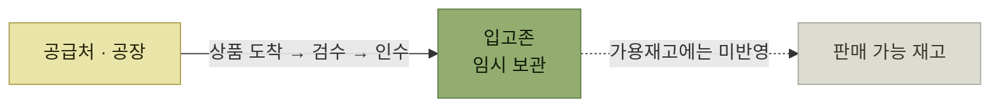
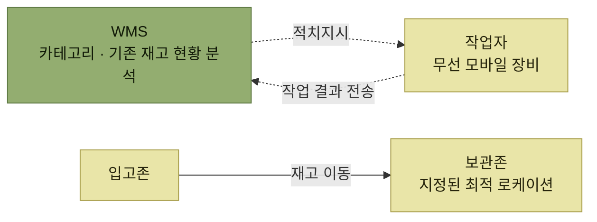

# 입고와 적치

> [WMS 주요 프로세스](./README.md)

## 빠른 복습

- **입고(입하)** 는 공급처에서 도착한 상품을 검수하여 재고를 **영구적으로 인수**하는 단계다.
- 입고가 완료되면 WMS가 관리할 재고는 늘어나지만, 재고는 보관존으로 바로 가지 않고 **임시 영역인 입고존**에 머문다.
- 이때의 재고는 **가용재고에 반영되지 않는다.** 품질 검사 등이 남아 있기 때문이다.
- **적치(Putaway)** 는 입고존의 재고를 옮길 **최적의 보관 로케이션을 선정해 이동**시키는 작업이다.
- 최적 로케이션은 제품 카테고리, 기존 보관된 재고 현황 등을 종합 분석해 시스템이 지정하고, 작업자는 무선 모바일 장비로 지시를 받아 이동 후 결과를 전송한다.

## ① 입고 (= 입하)

공급처(공장)에서 창고(물류창고)에 상품이 도착하고, 이를 **검수하여 재고를 영구적으로 인수**하는 것이 입고다.

여기서 놓치기 쉬운 지점이 하나 있다. 입고가 완료되면 WMS에서 관리해야 할 재고는 증가한다. 그런데 재고가 보관존(storage zone)으로 바로 이동되지는 않는다. 품질 검사 등을 위해 **임시 영역인 입고존(receive zone)으로 이동**한다.

그리고 이 재고는 **가용재고에 반영되지 않는다.**

*입고 완료로 WMS 재고는 늘지만, 입고존의 재고는 아직 가용재고가 아니다*

## ② 적치 (Putaway)

적치는 **입고 완료되어 입고존에 임시 보관 중인 재고를 이동할 최적의 보관 로케이션을 선정하고 이동**시키는 작업이다.

최적의 보관 로케이션을 선정하기 위해 시스템은 다음 정보를 종합적으로 분석한다.

- 제품의 카테고리
- 기존에 보관된 재고 현황
- 그 밖의 관련 정보

분석 결과 가장 최적의 로케이션을 지정하여 작업자에게 전달하면, 작업자는 무선 모바일 장비 등을 통해 **적치지시 내역**을 전달받는다. 해당 재고를 실제 보관 로케이션으로 이동시킨 후 결과를 시스템에 전송하면 적치 작업이 마무리된다.

*적치 — 시스템이 로케이션을 정하고, 작업자가 옮기고, 결과를 되돌려준다*

최적 로케이션 선정에 **빅데이터와 AI를 이용하기도 한다.**

## 함께 읽기

- 입고존·보관존의 정의는 [주요 존의 종류](./1-로케이션과-존.md#주요-존의-종류)에 있다.
- 보관존에 들어간 재고를 다시 옮기는 작업은 [재고이동과 재고보충](./3-재고이동과-재고보충.md)에서 이어진다.
