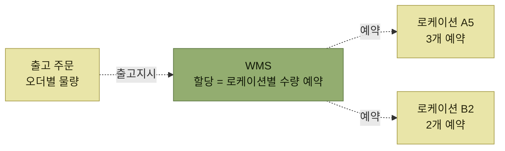
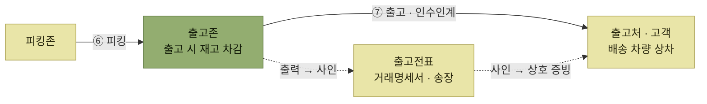

# 할당과 피킹, 출고

> [WMS 주요 프로세스](./README.md)

## 빠른 복습

- **할당(Allocation)** 은 출고지시와 같은 의미다. 출고할 주문 물량을 **어느 로케이션에서 출고할지 미리 예약**해 두는 작업이다.
- 할당은 재고를 옮기지 않는다. **예약만 건다.**
- **프리로케이션 재고 방식**은 제품별 피킹 로케이션을 지정하지 않고, 재고가 보관된 모든 로케이션에서 직접 출고하는 방식이다. 그래서 "어디서 몇 개를 꺼낼지"를 정해줄 할당이 필요해진다.
- WMS는 특성상 동일 제품을 여러 로케이션에 분산 보관하므로 할당은 **반드시 필요**하다.
- **피킹(Picking)** 은 할당을 기반으로 작업자가 출고 대기장으로 재고를 **실제로 이동**시키는 작업이다.
- **출고(Shipping, Outbound)** 는 피킹 완료된 재고를 인수인계하는 단계다. 이때 **출고존의 재고가 차감**되고, 출고전표로 상호 증빙을 남긴다.

## ⑤ 할당 (Allocation)

할당은 **출고지시와 같은 의미**로, 출고해야 할 주문 물량이 어느 로케이션에서 출고되어야 하는지를 **미리 예약해 두는 작업**이다.

### 먼저 — 프리로케이션 재고 방식이란

할당이 왜 필요한지 알려면 **프리로케이션(Free Location) 재고 방식**을 먼저 이해해야 한다. 반대편 방식과 나란히 놓으면 분명해진다.

<div class="tbl" style="overflow-x:auto">
<table>
<thead>
<tr>
<th style="text-align:center; white-space:nowrap"></th>
<th style="text-align:center; white-space:nowrap">고정 로케이션 방식</th>
<th style="text-align:center; white-space:nowrap">프리로케이션 방식</th>
</tr>
</thead>
<tbody>
<tr>
<td style="text-align:center; white-space:nowrap">피킹 로케이션</td>
<td style="text-align:left; white-space:nowrap">제품별로 <b>사전에 지정</b>해 운영</td>
<td style="text-align:left; white-space:nowrap"><b>지정하지 않음</b></td>
</tr>
<tr>
<td style="text-align:center; white-space:nowrap">출고 가능 위치</td>
<td style="text-align:left; white-space:nowrap">정해진 그 자리에서만</td>
<td style="text-align:left; white-space:nowrap">해당 재고가 보관된 <b>모든 로케이션</b></td>
</tr>
<tr>
<td style="text-align:center; white-space:nowrap">"사과 어디 있어?"</td>
<td style="text-align:left; white-space:nowrap">항상 A1</td>
<td style="text-align:left; white-space:nowrap">A1에도, A3에도, B2에도 있을 수 있음</td>
</tr>
</tbody>
</table>
</div>

같은 주문을 두 방식으로 처리하면 이렇게 갈린다.

```text
사과 20개 출고 주문

[고정 로케이션]   사과의 피킹 로케이션은 A1 → A1로 가서 20개를 꺼낸다. 끝.

[프리로케이션]    사과는 A1에 8개, A3에 5개, B2에 12개로 흩어져 있다
                  → "어디서 몇 개를 꺼낼지"를 누군가 정해줘야 한다
```

이 "정해주는 일"이 바로 할당이다.

> [!NOTE]
> **원서에 없는 보충**
>
> 프리로케이션은 빈 로케이션 아무 곳에나 재고를 넣을 수 있어 공간 활용에 유리한 대신, 어디에 무엇이 몇 개 있는지를 **시스템이 전적으로 책임져야** 한다. WMS가 [로케이션 관리](../01-wms-개요/3-WMS의-주요-특징.md#1-로케이션-관리)를 하는 이유와 맞닿아 있다.

### 왜 예약이 필요한가

프리로케이션 재고 방식으로 운영되는 창고에서, 여러 건의 출고 작업과 다수의 작업자가 동시에 피킹(출고) 작업을 수행하는데 미리 할당을 걸어두지 않으면 이런 일이 벌어진다.

1. 작업 후 로케이션별로 남아 있는 재고가 몇 개인지 확인이 어렵다.
2. 작업자들이 어디서 출고해야 하는지 알 수 없다.
3. 혼선이나 작업 비효율이 발생한다.

할당 작업은 **오더별로 어느 로케이션에서 몇 개를 출고해야 하는지를 사전에 예약**함으로써 작업 혼선을 예방한다.

WMS는 특성상 **동일 제품을 다수의 로케이션으로 분산하여 보관**하기 때문에 할당은 반드시 필요하다.



*할당은 정보만 오간다. 재고는 아직 움직이지 않는다*

## ⑥ 피킹 (Picking)

피킹은 **할당(출고지시)을 기반으로 작업자들이 출고 대기장으로 재고를 실제로 이동**시키는 작업이다.

피킹을 위한 작업 지시는 두 가지 방법으로 전달한다.

- 별도의 **피킹 지시서**를 출력한다.
- **모바일 장비** 등으로 작업자에게 전달한다.

지시 내용은 구체적이다. **어느 로케이션에서 몇 개의 재고를 어디로 옮기라**는 사항을 전달한다.

## ⑦ 출고 (Shipping, Outbound)

출고는 피킹 완료된 재고를 **출고처 또는 고객에게 직접 전달하거나 배송 차량에 상차하고, 최종적으로 재고를 인수인계하는** 단계다.

이 시점에 **WMS의 출고존에 있는 재고들이 차감**된다.

출고 시에는 고객과 상호 인수인계를 증빙하는 **출고전표(거래명세서, 송장)** 를 출력하고 사인함으로써 상호 증빙 자료로 활용한다.



*피킹에서 출고까지 — 재고 차감과 증빙이 같은 시점에 일어난다*

## 함께 읽기

- 피킹존에 재고를 미리 내려두는 작업은 [재고보충](./3-재고이동과-재고보충.md#④-재고보충-replenishment)에 있다.
- 출고존의 정의는 [주요 존의 종류](./1-로케이션과-존.md#주요-존의-종류)를 참고한다.
