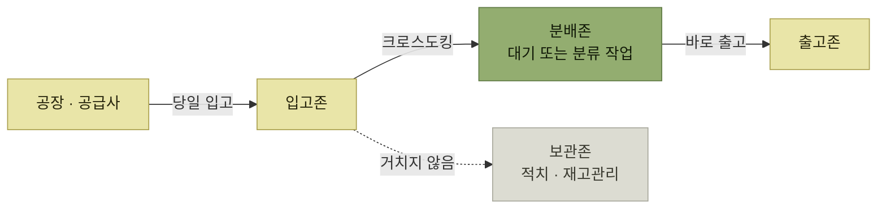

# 크로스도킹

> [WMS 주요 프로세스](./README.md)

## 빠른 복습

- 크로스도킹은 창고에 **미리 일정 수준의 재고를 보유하지 않고 출고하는 방식**이다.
- 출고할 물량을 공장(공급사)에서 **당일 바로 입고받아, 적치 등의 재고관리를 거치지 않고 바로 출고**한다.
- 효과는 두 가지다. **재고비용 절감**, **창고 재고관리 업무 최소화**.
- 유형은 세 가지다. **Trans shipment**(분류 불필요), **Flow-thru**(분류 필요), **Merge-in-transit**(다중 공급처 물량 병합).
- 작업 공간은 **분배존**이다.

## 어떤 방식인가

크로스도킹은 창고에 미리 일정 수준의 재고를 보유하지 않고 출고하는 방식이다.

출고해야 할 물량을 공장(공급사)에 **당일 바로 입고**받아, **적치 등의 재고관리를 거치지 않고 바로 출고 처리**한다.

*크로스도킹 — 보관존을 건너뛴다*

## 효과

- 재고비용 절감
- 창고 재고관리 업무 최소화

## 세 가지 유형

<table>
<thead>
<tr>
<th style="text-align:center; white-space:nowrap">유형</th>
<th style="text-align:center; white-space:nowrap">입고·합류 형태</th>
<th style="text-align:center; white-space:nowrap">분배 거점에서 하는 일</th>
</tr>
</thead>
<tbody>
<tr>
<td style="text-align:left; white-space:nowrap"><b>Trans shipment</b></td>
<td style="text-align:left; white-space:nowrap">사전에 <b>출고처별로 분류되어</b> 입고</td>
<td style="text-align:left; white-space:nowrap">분류 작업 없이 바로 출고 처리</td>
</tr>
<tr>
<td style="text-align:left; white-space:nowrap"><b>Flow-thru</b></td>
<td style="text-align:left; white-space:nowrap"><b>총량으로</b> 입고</td>
<td style="text-align:left; white-space:nowrap">별도 분류장에서 출고처별 분류 후 출고 처리</td>
</tr>
<tr>
<td style="text-align:left; white-space:nowrap"><b>Merge-in-transit</b></td>
<td style="text-align:left">서로 다른 공급처의 구성품이 각각 도착</td>
<td style="text-align:left; white-space:nowrap">주문 단위로 병합해 한 번에 배송</td>
</tr>
</tbody>
</table>

Trans shipment는 출고처별 분류를 공급처에서 끝내고, Flow-thru는 분배 거점에서 분류한다. Merge-in-transit은 여러 공급처에서 출발한 구성품을 운송 중 합류 지점에서 주문 단위로 병합해 고객에게 한 번에 배송한다. 세 방식 모두 장기 보관을 전제로 하지 않는다.

## 함께 읽기

- 크로스도킹 물동량이 대기·작업하는 공간은 [분배존](./1-로케이션과-존.md#주요-존의-종류)이다.
- 크로스도킹을 거치지 않는 일반 흐름은 [입고와 적치](./2-입고와-적치.md)에서 확인한다.
