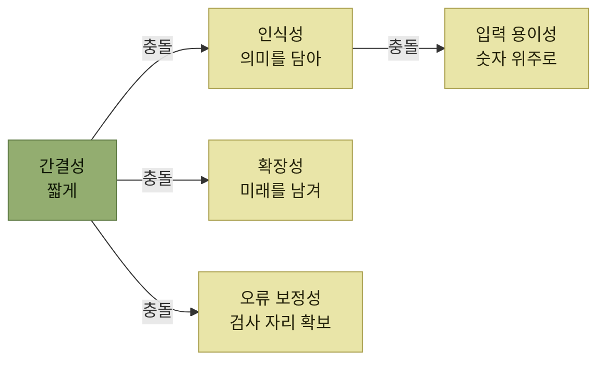

# 코드의 효율적인 설계와 운영

> [기준정보](./README.md)

## 빠른 복습
- **기준정보 코드의 자릿수, 구성, 체계를 어떻게 하느냐에 따라 시스템의 효율성이나 사용자들의 생산성이 좌우**된다.
- 원칙은 다섯 가지 — **간결성 · 인식성 · 확장성 · 입력 용이성 · 오류 보정성**.
- **간결성과 인식성은 서로 당긴다.** 짧게 줄이되 **의미는 남겨야** 한다.
- **확장성은 미래를 내다보는 문제**다. 주민등록번호가 2000년대 출생을 고려하지 못해 **성별 자리에 예외를 둬야 했던 사례**가 대표적이다.
- **입력 용이성** — 영문자와 숫자, 특수문자를 혼용하면 자판 배치 때문에 **입력이 불편하고 느려진다.**
- **오류 보정성**은 **체크디지트**로 확보한다. 계좌번호, 바코드, 주민등록번호, 사업자등록번호에 널리 쓰인다.

## 코드가 생산성을 좌우한다

> 기준정보는 시스템의 근간을 이루는 중요한 정보다. 그중에서 **기준정보 코드의 자릿수, 구성, 체계 등을 어떻게 하느냐에 따라 시스템의 효율성이나 사용자들의 생산성 등을 좌우**한다.

다섯 원칙을 먼저 한 표로 본다.

| 원칙 | 무엇을 요구하는가 |
| --- | --- |
| **간결성** | 구조가 복잡하거나 자릿수가 길면 **사용자가 인식하기 어려워 효율성이 떨어진다** |
| **인식성** | 코드에 **의미를 부여**해 기억하기 쉽고 코드만 봐도 대략적인 내용을 알 수 있게 한다 |
| **확장성** | **향후 얼마나 확장될 것인지를 예측**해 자릿수를 정한다 |
| **입력 용이성** | **빠르고 정확하게 입력**할 수 있어야 한다 |
| **오류 보정성** | 잘못된 코드인지 **사전에 검사해 사용자에게 알려준다** |

표를 읽는 법. 위 두 줄이 서로 반대 방향으로 당긴다. **줄이면 의미가 사라지고, 의미를 넣으면 길어진다.** 나머지 셋은 **미래(확장성) · 입력 순간(용이성) · 실수(보정성)** 라는 서로 다른 시점을 본다.

## 가. 간결성

기준정보 코드를 부여할 때 간결성 관점에서 고려할 것은 셋이다.

- **가급적 길이를 최소한으로 줄인다.**
- **불필요한 의미나 내용은 제거한다.**
- **단어나 의미 등을 축약된 코드화한다.**

| 구분 | 코드 | 비고사항 |
| --- | --- | --- |
| **적절** | `A-001-01` · `F01-01-01` | 인식이 쉽고 비교적 단순함 |
| **적절** | `80010` | 자릿수가 비교적 짧아 기억하기 쉬움 |
| **부적절** | `43343424290823094275` | 코드가 길어 기억하고 입력하기 어렵다 |
| **부적절** | `45-A3-F8-01-45-64` | 코드가 복잡하고 인식하기 어렵다 |

*원서 [그림 3-14] 기준정보 코드 간결성 적용 예시*

## 나. 인식성

> **기준정보 코드가 일련번호나 아무 의미없는 숫자 또는 문자로 구성되어 있으면 해당 코드가 어떤 의미가 있는지 확인하기 어렵고 연관성이 없기 때문에 기억하기에도 어렵다.**

**기준정보의 코드를 설계할 때에는 특정 자릿수나 글자 등에 의미를 부여하게 되면 쉽게 기억할 수 있고 코드만 보더라도 대략적인 내용 파악이 될 수 있는 장점이 있다.**

| 구분 | 코드 | 비고사항 |
| --- | --- | --- |
| **적절** | `A00010` · `B00010` · `C00010` | **코드의 첫 자리 영문자에 의미를 부여**하였다. A: 식품류 · B: 공산품류 · C: 가전제품 |
| **부적절** | `000280` · `0000281` | 의미를 부여하지 않고 **순번으로 코드를 부여**하였다 (코드가 어떤 의미인지 확인하기 어렵다) |

*원서 [그림 3-15] 기준정보 코드 인식성 적용 예시*

표를 읽는 법. 적절한 예의 코드 길이가 부적절한 예와 **거의 같다.** 즉 인식성은 **길이를 늘려서 얻는 것이 아니라, 이미 쓰는 자릿수에 의미를 배치해서 얻는 것**이다.

이 원칙은 사람이 보고 입력하는 **업무 코드**에 유용하다. 반면 데이터베이스의 내부 식별자나 기본 키까지 분류 의미를 담으면, 제품군이나 조직 체계가 바뀔 때 키 변경과 연쇄 마이그레이션이 필요해질 수 있다. 내부 식별자는 안정적인 무의미 키로 두고, 사람이 쓰는 표시 코드와 분류 속성을 분리하는 방식도 함께 검토한다. 따라서 위 표의 순번 코드가 모든 용도에서 부적절하다는 뜻은 아니다.

## 다. 확장성

> 기준정보 코드를 생성할 때 **향후 얼마나 확장될 것인지를 예측하지 않았을 경우 당장은 문제가 없겠지만 향후 시스템에 중대한 문제가 발생될 수도 있다.**

원서가 든 예가 우리에게 익숙하다.

> **우리가 부여받고 있는 주민등록번호의 경우에도 연도의 자릿수가 2자리로 고정되어 있기 때문에, 2000년대 이후에 태어난 사람들은 7번째 자리인 성별 항목의 추가적인 예외를 두어 문제를 해결한 사례**가 있다. **과거 주민등록번호를 2000년대 이후를 고려하지 못했기 때문에 발생한 문제**다.

| 구분 | 코드 | 내용 |
| --- | --- | --- |
| **적절** | 제품코드 **5자리** | 현재 약 1,000여개 제품코드를 생성함 · 향후 5년간 1,000여개 추가 예상 · 향후 10년내 3,000여개 추가 예상 · **5자리 모두 소진 시 첫자리 알파벳으로 확장** |
| **부적절** | 로케이션코드 **랙번호(2자리) + 단수(1자리)** | 현재 랙번호를 최대 90번까지 사용하고 있음 · 향후 랙이 지속적으로 추가될 예정임 · 단수(층수)도 현재는 1자리로 수용 가능하지만 **자동화 설비 도입 시에는 2자리 이상 필요함** |

*원서 [그림 3-16] 기준정보 코드 확장성 관련 예시*

표를 읽는 법. 적절한 예에는 **소진 후의 계획까지** 적혀 있고, 부적절한 예는 **이미 90번까지 차 있는데 계획이 없다.** 자릿수 판단의 기준이 "지금 충분한가"가 아니라 **"언제 소진되고 그다음엔 무엇을 할 것인가"** 라는 뜻이다.

첫 자리를 알파벳으로 확장하려면 저장 칼럼과 연계 시스템이 처음부터 영숫자를 허용해야 한다. 숫자형으로 설계한 뒤 소진 시점에 문자로 바꾸는 것은 단순한 코드 확장이 아니라 스키마·인터페이스 변경이 된다.

> **기준정보의 경우에도 가급적 간결하고 인식하기 쉽도록 설계하되, 반드시 향후 먼 미래를 내다보고 코드를 심사숙고하여 설계하는 자세가 필요하다.**

## 라. 입력 용이성

**기준정보의 코드는 시스템에 데이터를 입력하는 데 있어 빠르게 정확하게 관리하기 위한 목적이 강하다.** **입력 작업을 하는데 영문자와 숫자 또는 특수문자를 혼용하는 경우에는 자판 배치의 특성 상 입력하는 데 불편하고 효율성도 떨어지고 시간도 많이 걸린다.**

| 구분 | 코드 | 내용 |
| --- | --- | --- |
| **적절** | `10020` | 숫자만으로 구성되어 입력이 용이함 |
| **적절** | `A0010` | **첫 자리만 영문자**로 구성되어 비교적 입력이 용이함 |
| **적절** | `2000F` | **끝 자리만 영문자**로 구성되어 비교적 입력이 용이함 |
| **부적절** | `A-34-F-3` · `A45KK3` · `45GGQ3A` | 영문자와 특수문자 또는 숫자가 혼용되어 입력 어려움 |

*원서 [그림 3-17] 기준정보 코드 입력 용이성 관련 예시*

표를 읽는 법. 적절한 예 셋 모두 **영문자가 있어도 한쪽 끝에만 있다.** 인식성을 위해 영문자를 쓰더라도 **자리를 앞이나 뒤로 몰아두면 입력 부담이 크게 줄어든다는** 실무적인 타협점이다. 그래서 **기준정보 코드 체계를 구성할 때 가급적이면 영문자와 숫자의 혼용을 피하는 것을 추천**한다.

## 마. 오류 보정성

**코드를 시스템에 입력하다 보면 사용자의 실수 등으로 잘못된 코드를 입력할 수 있는데, 이러한 상황에서 사전에 정상적인 코드인지 아닌지를 체크하여 사용자에게 알려 줌으로써 시스템의 편의성을 개선할 수 있다.**

| 코드 | 내용 |
| --- | --- |
| **계좌번호** `204-18-11882-3` | **마지막 자리수 `3`이 체크 디지트**다. 은행 계좌번호 고유의 **수식 계산을 통해 나온 값이 마지막 자릿수의 값과 일치하지 않으면 오류 계좌번호**이다 |
| **제품바코드(EAN-13)** `8801073102538` | **마지막 자릿수 `8`이 체크 디지트**다. 바코드가 정상인지 **수식 계산을 통해 나온 값이 마지막 자릿수의 값과 일치하지 않으면 오류 바코드**이다 |

*원서 [그림 3-18] 기준정보 코드 오류 보정성 관련 예시*

> 오류를 체크하기 위해서 일반적으로 **"체크디지트(Check Digit)"** 를 활용한다. **입력값의 오류를 검출하기 위해 사용되는 숫자**를 의미한다. **입력된 값의 특정 규칙에 따라 얻을 수 있는 체크디지트 값이 정상적인지를 체크하여 오류 여부를 확인**한다. 일반적으로 **신용카드, 바코드, 주민등록번호, 사업자등록번호** 등에 널리 쓰인다.

표를 읽는 법. 두 예 모두 **마지막 한 자리를 값이 아니라 검사용으로 쓴다.** 자릿수 하나를 내주는 대가로 **오타를 입력 시점에 잡는다**는 거래다. 앞의 간결성 원칙과 정면으로 부딪히는 지점이며, 그래서 **아무 코드에나 붙이는 것이 아니라 사람이 손으로 자주 입력하는 코드에 붙인다.**

## 다섯 원칙은 서로 당긴다

*간결성은 의미·확장 여유·검사 자리를 확보하려는 요구와 부딪히고, 인식성은 입력 용이성과 충돌할 수 있다. 코드 설계가 취향이 아니라 조정 작업인 이유다.*

원서가 제시한 타협의 실례들을 모으면 이렇게 된다.

- 의미는 **첫 자리 한 글자**에만 넣는다 (인식성 ↔ 간결성)
- 영문자는 **맨 앞이나 맨 뒤 한 자리**로 몰아둔다 (인식성 ↔ 입력 용이성)
- 자릿수는 **10년 뒤 예상 수량**으로 잡고, **소진 시 확장 방법을 미리 정한다** (확장성 ↔ 간결성)
- 체크디지트는 **사람이 직접 입력하는 코드**에 쓴다 (오류 보정성 ↔ 간결성)

## 함께 읽기

- [기준정보 개요 — 구조와 정확성이 별개라는 이야기](./1-기준정보-개요.md)
- [로케이션 — 확장성 사례로 등장한 로케이션코드의 원래 설명](./2-창고관련-기준정보.md#나-로케이션location)
- [제품관련 기준정보 — 확장성 사례의 제품코드 5자리가 붙는 자리](./4-제품관련-기준정보.md)
