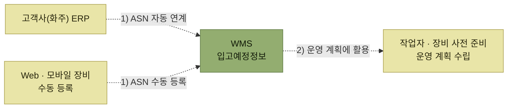

# 입고예정수신 (ASN)

> [입고 프로세스](./README.md)

## 빠른 복습

- **ASN(Advanced Shipping Notice)** = 입고예정정보. 물건보다 **정보가 먼저 도착한다.**
- 담기는 항목은 입고될 예정인 **제품 목록, 수량, 도착 예정시간, 운송 담당자 전표, 전표번호** 등이다.
- 전달 경로는 두 가지다. **ERP → 자동화된 ASN 인터페이스 → WMS**가 일반적이고, 인터페이스가 어려우면 **Web·모바일 장비로 수동 입력**한다.
- 입고가 원활히 이루어지도록 **작업자와 장비를 미리 준비하고, 다른 작업과 겹치지 않게 운영 계획을 수립**하는 데 쓴다.

## ASN이란

입고예정정보(ASN, Advanced Shipping Notice)에는 다음 항목이 전달된다.

- 입고될 예정인 제품 목록
- 수량
- 도착 예정시간
- 운송 담당자 전표, 전표번호

## 어떻게 전달되는가

아래의 점선은 시스템 사이의 정보 흐름을 뜻한다.

*ASN은 자동 인터페이스가 원칙이고, 수동 등록은 예외다.*

**일반적으로는 자동화된 시스템 간 인터페이스 연계**를 통해 전달한다. 다만 시스템 인터페이스가 어려운 경우 Web이나 모바일 장비를 통해 **수동으로 입력**하기도 한다.

## 왜 미리 받아야 하는가

물건이 도착한 뒤에 알면 늦다. ASN을 미리 받아 두는 이유는 준비 때문이다.

- 창고에 입고가 원활히 이루어질 수 있도록 **사전에 작업자와 장비를 미리 준비**한다.
- **다른 작업과 겹치지 않도록** 작업에 대한 운영 계획을 수립한다.

## 이 단계의 장비와 출력물

<table>
<thead>
<tr>
<th style="text-align:center; white-space:nowrap">모바일 장비</th>
<th style="text-align:center; white-space:nowrap">바코드(RFID)</th>
<th style="text-align:center; white-space:nowrap">주요 출력물</th>
</tr>
</thead>
<tbody>
<tr>
<td style="text-align:center; white-space:nowrap"></td>
<td style="text-align:center; white-space:nowrap">O</td>
<td style="text-align:left; white-space:nowrap">입고라벨, 입고예정 LIST</td>
</tr>
</tbody>
</table>

표의 모바일 장비는 **현장 작업 장비**를 뜻한다. 표준적인 ASN 자동 수신에는 현장 장비가 필요 없고, 인터페이스가 어려운 예외 상황에서만 Web·모바일 장비로 수동 등록한다. 이 단계에서 **입고라벨을 만들어** 다음 단계의 검수에 쓴다.

## 함께 읽기

- 받은 ASN으로 실제 물건을 확인하는 단계는 [차량도착과 검수](./2-차량도착과-검수.md)다.
- 예정수량과 실제수량이 어긋났을 때의 처리는 [입고확정](./3-입고확정.md#예정수량과-실제수량이-다를-때)에서 다룬다.
