# 차량도착과 검수

> [입고 프로세스](./README.md)

## 빠른 복습

- 차량이 도착하면 **ASN 정보나 상대방이 발행한 거래명세서(출고전표)** 를 참고해 제품의 상태와 수량을 검수한다.
- 검수는 **수량만 보는 게 아니다.** 내외부 포장 상태, 유통기한 이상 유무, 취급 온도 준수 여부까지 전반적으로 확인한다.
- **모바일 장비로 바코드나 RFID를 스캔**하고, 최종적으로 입고수량 등을 **검수확정** 처리한다.
- 모바일 장비 활용이 어렵다면 **사전에 출력한 검수 출력물**로 체크한다.

## 무엇을 근거로 검수하는가

입고물량을 실은 차량이 도착하면 두 가지를 참고한다.

- 사전에 전달받은 **입고예정(ASN) 정보**
- 상대방이 발행한 **거래명세서(출고전표)**

## 무엇을 확인하는가

수량만 세고 끝나는 작업이 아니다.

- **수량**
- 제품의 **내외부 포장 상태**
- **유통기한** 이상 유무
- **취급 온도** 준수 여부

이를 전반적으로 확인한다.

## 어떻게 검수하는가

실선은 입고 물량의 이동, 점선은 정보 흐름을 뜻한다. 모바일 장비와 출력물은 물량이 이동하는 목적지가 아니라 검수 결과를 입력하는 수단이다.

*모바일 스캔이 기본이고, 출력물 체크는 대체 수단이다.*

모바일 장비의 바코드나 RFID를 스캔하는 방법으로 검수하고, 최종적으로 입고수량 등을 **검수확정 처리**한다.

## 이 단계의 장비와 출력물

<table>
<thead>
<tr>
<th style="text-align:center; white-space:nowrap">모바일 장비</th>
<th style="text-align:center; white-space:nowrap">바코드(RFID)</th>
<th style="text-align:center; white-space:nowrap">주요 출력물</th>
</tr>
</thead>
<tbody>
<tr>
<td style="text-align:center; white-space:nowrap">O</td>
<td style="text-align:center; white-space:nowrap">O</td>
<td style="text-align:center; white-space:nowrap">검수 LIST, 입고라벨</td>
</tr>
</tbody>
</table>

**모바일 장비와 바코드를 모두 쓰는 유일한 단계**다. 현장에서 실물을 대조하는 단계이기 때문이다.

## 함께 읽기

- 검수 근거가 되는 ASN은 [입고예정수신](./1-입고예정수신.md)에서 받는다.
- 검수가 끝나면 [입고확정](./3-입고확정.md)으로 재고가 늘어난다.
