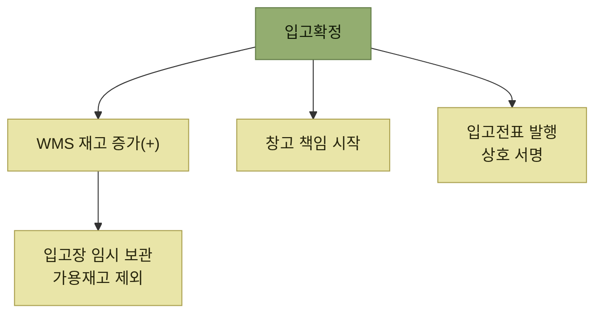

# 입고확정

> [입고 프로세스](./README.md)

## 빠른 복습

- 입고확정으로 **WMS에서 관리되는 창고의 재고가 증가**한다.
- **이 시점부터 해당 재고는 입고 확정을 한 창고가 책임**진다. 책임의 이전이 일어나는 지점이다.
- 그래서 **입고전표**를 발행해 상호 서명한다. 향후 분쟁 시 증거로 쓰이므로 체계적으로 관리해야 한다.
- 재고가 늘었지만 아직 **대기 로케이션에 임시 보관**된 상태이고, **가용재고에서 제외하는 것이 일반적**이다.
- 예정수량과 실제수량이 다를 때 처리 방식은 **고객사(화주) ERP가 수량 변경을 받아주는지**에 따라 달라진다.

## 재고가 늘고, 책임이 넘어온다

검수 완료 및 최종 입고 절차가 마무리되면 입고확정을 진행한다. 이때 WMS에서 관리되는 창고의 재고가 증가한다.

여기서 중요한 것은 숫자가 아니다. **이 시점부터 해당 재고는 입고 확정을 한 창고에서 책임진다.**

그래서 증빙이 필요하다. 공급처(공장)와의 인수인계 증빙 자료로 **입고전표를 발행**하는데, 향후 분쟁 등의 문제가 발생했을 경우 증거로 활용될 수 있다. 따라서 입고전표에 대해 **상호 서명을 명확히 하고 이를 체계적으로 관리해야** 한다.

## 늘었지만 아직 팔 수 없다

입고확정 후에도 재고는 보관존으로 가지 않는다. 추가적인 품질검사와 적치 작업을 수행하기 위해 **대기 로케이션에 임시 보관**된다.

> 적치가 수행되지 않고 임시 로케이션인 입고장에 보관된 재고들은 **출고할당이 될 수 없도록 가용재고에서 제외하는 것이 일반적**이다.

아래 화살표는 물리적 이동이 아니라 입고확정으로 발생하는 상태와 결과의 관계를 뜻한다.

*입고확정 한 번에 수량 증가, 책임 이전, 증빙 발행이 함께 일어난다.*

## 예정수량과 실제수량이 다를 때

입고 확정 시 파손이나 착오 등으로 입고예정수량과 실제 입고수량에 차이가 나는 경우가 있다. 문제는 창고 쪽 사정이 아니다. **고객사(화주) 시스템에서 실제 입고수량으로 변경이 되지 않는 경우가 있다.**

이때는 추가적인 **입고반품 ASN**을 접수받아 처리한다. 원서는 이 지점을 이렇게 정리한다.

> WMS 시스템이 고객사(화주)의 ERP 시스템에 절대적으로 영향을 많이 받는다.

<table>
<thead>
<tr>
<th style="text-align:center; white-space:nowrap">구분</th>
<th style="text-align:center; white-space:nowrap">내용</th>
<th style="text-align:center; white-space:nowrap">화주 입고확정 수량 변경 인터페이스 적용 여부</th>
</tr>
</thead>
<tbody>
<tr>
<td style="text-align:center; white-space:nowrap"><b>실물량 입고처리</b></td>
<td style="text-align:left">1. 입고 확정 시 <b>실제 입고수량</b>으로 확정한다. 2. 고객사(화주) ERP 시스템으로 전송 처리한다.</td>
<td style="text-align:center; white-space:nowrap">O</td>
</tr>
<tr>
<td style="text-align:center; white-space:nowrap"><b>입고 후 반품처리</b></td>
<td style="text-align:left">1. 입고 확정 시 실제 입고수량이 아닌 <b>입고예정수량</b>으로 확정한다. 2. 차이수량에 대해 고객사(화주)로부터 <b>입고반품 ASN</b>을 추가로 전달받는다. 3. 입고반품 ASN으로 차이수량을 입고반품 확정 처리한다.</td>
<td style="text-align:center; white-space:nowrap">X</td>
</tr>
</tbody>
</table>

**선택의 기준은 창고가 아니라 화주 시스템**이다. 화주 ERP가 입고확정 수량 변경을 받아주면(O) 실물 그대로 확정하면 끝난다. 받아주지 않으면(X) 일단 예정수량대로 확정한 뒤, 차이를 반품으로 되돌리는 우회 경로를 타야 한다.

## 이 단계의 장비와 출력물

<table>
<thead>
<tr>
<th style="text-align:center; white-space:nowrap">모바일 장비</th>
<th style="text-align:center; white-space:nowrap">바코드(RFID)</th>
<th style="text-align:center; white-space:nowrap">주요 출력물</th>
</tr>
</thead>
<tbody>
<tr>
<td style="text-align:center; white-space:nowrap">O</td>
<td style="text-align:center; white-space:nowrap"></td>
<td style="text-align:center; white-space:nowrap">입고확정전표</td>
</tr>
</tbody>
</table>

## 함께 읽기

- [차량도착과 검수](./2-차량도착과-검수.md)의 결과를 근거로 확정한다.
- 임시 보관된 재고를 보관존으로 옮기는 단계는 [적치지시](./4-적치지시.md)로 이어진다.
- 가용재고 전환 시점의 전체 그림은 [재고는 언제 팔 수 있게 되는가](./README.md#재고는-언제-팔-수-있게-되는가)에 있다.
