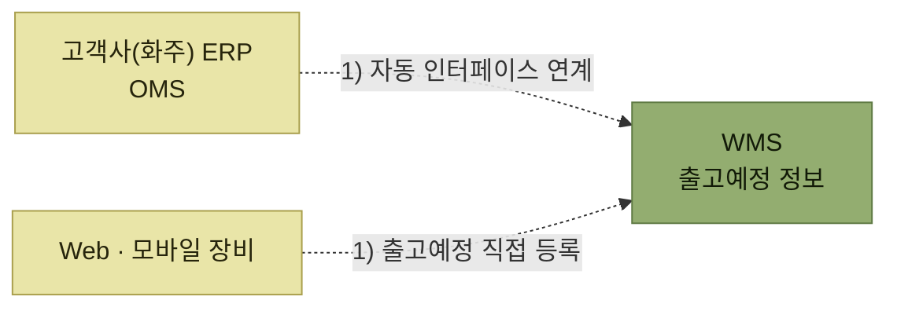

# 출고예정 수신

> [출고 프로세스](./README.md)

## 빠른 복습

- 출고예정 정보는 고객사(화주)의 **ERP나 OMS에서 인터페이스**로 받거나, **웹·모바일로 직접 입력**받는다.
- 최근에는 물류업체가 **화주의 거래처로부터 오더를 접수받는 OMS 영역까지 대행**하는 경우가 많다.
- 담기는 항목은 **요청일자, 출고처, 제품코드, 수량** 등이고, **헤더 영역과 디테일(상세) 영역으로 구분**되어 전송된다.
- WMS는 출고예정정보를 한 건씩 처리하면 효율이 떨어지므로 **여러 건을 묶어 한 번에 처리**한다. 이 묶음을 **웨이브(Wave), 배치(Batch), 차수**라 부른다.

## 어떻게 받는가



*입고의 ASN 수신과 같은 두 경로 구조다*

물류 업무의 영역이 넓어지면서 물류 고유의 업무뿐 아니라 **화주의 거래처로부터 오더를 접수받는 OMS 영역의 업무까지 대행**하는 경우가 많아졌다.

## 출고예정정보의 구조

출고예정정보는 요청일자, 출고처, 제품코드, 수량 등의 정보를 포함하며, WMS는 이를 기반으로 출고 작업을 진행한다.

전송 단위는 두 층으로 나뉜다. **전표의 헤더 영역**과 **상세 영역인 디테일 영역**이다.

**전표 헤더영역** — 전표 한 장에 하나

<div class="tbl" style="overflow-x:auto">
<table>
<thead>
<tr>
<th style="text-align:center; white-space:nowrap">고객사(화주)</th>
<th style="text-align:center; white-space:nowrap">전표번호</th>
<th style="text-align:center; white-space:nowrap">주문일자</th>
<th style="text-align:center; white-space:nowrap">출고일자</th>
<th style="text-align:center; white-space:nowrap">출고처</th>
<th style="text-align:center; white-space:nowrap">창고코드</th>
<th style="text-align:center; white-space:nowrap">전표비고사항</th>
</tr>
</thead>
<tbody>
<tr>
<td style="text-align:center; white-space:nowrap">1001 (삼성)</td>
<td style="text-align:center; white-space:nowrap">DA-0001</td>
<td style="text-align:center; white-space:nowrap">2023-11-15</td>
<td style="text-align:center; white-space:nowrap">2023-11-16</td>
<td style="text-align:center; white-space:nowrap">30001 (하나마트)</td>
<td style="text-align:center; white-space:nowrap">90001 (서울창고)</td>
<td style="text-align:center; white-space:nowrap">오전에 필히 배송요망</td>
</tr>
<tr>
<td style="text-align:center; white-space:nowrap">Z001 (엘지)</td>
<td style="text-align:center; white-space:nowrap">AK-90001</td>
<td style="text-align:center; white-space:nowrap">2023-11-15</td>
<td style="text-align:center; white-space:nowrap">2023-11-16</td>
<td style="text-align:center; white-space:nowrap">K001 (하나 마트)</td>
<td style="text-align:center; white-space:nowrap">90001 (서울창고)</td>
<td style="text-align:center; white-space:nowrap">14시까지 배송요망</td>
</tr>
</tbody>
</table>
</div>

**디테일 (전표상세)** — 전표 한 장에 여러 줄

<div class="tbl" style="overflow-x:auto">
<table>
<thead>
<tr>
<th style="text-align:center; white-space:nowrap">고객사(화주)</th>
<th style="text-align:center; white-space:nowrap">전표번호</th>
<th style="text-align:center; white-space:nowrap">제품코드</th>
<th style="text-align:center; white-space:nowrap">제품명</th>
<th style="text-align:center; white-space:nowrap">수량</th>
<th style="text-align:center; white-space:nowrap">단가</th>
<th style="text-align:center; white-space:nowrap">금액</th>
<th style="text-align:center; white-space:nowrap">제품비고사항</th>
</tr>
</thead>
<tbody>
<tr>
<td style="text-align:center; white-space:nowrap">1001</td>
<td style="text-align:center; white-space:nowrap">DA-0001</td>
<td style="text-align:center; white-space:nowrap">2001</td>
<td style="text-align:center; white-space:nowrap">사과</td>
<td style="text-align:center; white-space:nowrap">10</td>
<td style="text-align:center; white-space:nowrap">1,000</td>
<td style="text-align:center; white-space:nowrap">10,000</td>
<td style="text-align:center; white-space:nowrap"></td>
</tr>
<tr>
<td style="text-align:center; white-space:nowrap">1001</td>
<td style="text-align:center; white-space:nowrap">DA-0001</td>
<td style="text-align:center; white-space:nowrap">2002</td>
<td style="text-align:center; white-space:nowrap">포도</td>
<td style="text-align:center; white-space:nowrap">10</td>
<td style="text-align:center; white-space:nowrap">2,000</td>
<td style="text-align:center; white-space:nowrap">20,000</td>
<td style="text-align:center; white-space:nowrap">취급주의</td>
</tr>
<tr>
<td style="text-align:center; white-space:nowrap">Z001</td>
<td style="text-align:center; white-space:nowrap">AK-90001</td>
<td style="text-align:center; white-space:nowrap">7007</td>
<td style="text-align:center; white-space:nowrap">양파</td>
<td style="text-align:center; white-space:nowrap">5</td>
<td style="text-align:center; white-space:nowrap">2,000</td>
<td style="text-align:center; white-space:nowrap">10,000</td>
<td style="text-align:center; white-space:nowrap"></td>
</tr>
<tr>
<td style="text-align:center; white-space:nowrap">Z001</td>
<td style="text-align:center; white-space:nowrap">AK-90001</td>
<td style="text-align:center; white-space:nowrap">7100</td>
<td style="text-align:center; white-space:nowrap">당근</td>
<td style="text-align:center; white-space:nowrap">3</td>
<td style="text-align:center; white-space:nowrap">1,000</td>
<td style="text-align:center; white-space:nowrap">3,000</td>
<td style="text-align:center; white-space:nowrap"></td>
</tr>
<tr>
<td style="text-align:center; white-space:nowrap">Z001</td>
<td style="text-align:center; white-space:nowrap">AK-90001</td>
<td style="text-align:center; white-space:nowrap">7902</td>
<td style="text-align:center; white-space:nowrap">호박</td>
<td style="text-align:center; white-space:nowrap">10</td>
<td style="text-align:center; white-space:nowrap">5,000</td>
<td style="text-align:center; white-space:nowrap">50,000</td>
<td style="text-align:center; white-space:nowrap"></td>
</tr>
</tbody>
</table>
</div>

*원서 [그림 5-5] 출고예정정보 예시*

**전표번호가 두 층을 잇는 열쇠**다. 헤더에는 "언제, 어디로, 어떤 조건으로"가 들어가고, 디테일에는 "무엇을 몇 개"가 들어간다. 배송 요청시간 같은 조건은 제품이 아니라 전표에 붙는다.

## 웨이브 — 여러 건을 묶어 처리한다

WMS가 출고예정정보를 **한 건씩 처리하면 효율이 떨어진다.** 그래서 여러 건씩 묶어 한 번에 출고처리하는 것이 일반적이고, 이 묶음을 **웨이브(Wave)**, **배치(Batch)**, **차수** 등으로 부른다.

### 묶지 않으면 무엇이 문제인가

웨이브 개념 없이 한 건씩 출고작업을 처리하면, **동일한 제품의 로케이션을 작업자가 반복적으로 피킹**해야 한다. 작업자의 이동 거리와 작업 시간이 길어질 수밖에 없다.

```text
[웨이브 없음]  주문1 사과 → A101 다녀옴
               주문2 사과 → A101 또 다녀옴
               주문3 사과 → A101 또 다녀옴

[웨이브]       주문1·2·3 사과 합계 → A101 한 번에 집어와서 주문별로 나눔
```

### 웨이브로 가능해지는 피킹 방식

- **제품별**로 출고될 물량을 집계 후 일괄 피킹하고 이를 **출고처별로 배분**할 수 있다.
- **차량별**로 출고될 물량을 집계 후 일괄 피킹 후 **차량에 바로 상차**할 수 있다.
- **동일한 출고처(배송처)** 로 묶어서 일괄 피킹이 가능하다.

이 세 가지가 [주요 피킹 방법](./6-피킹.md#주요-피킹-방법)의 뼈대가 된다.

## 함께 읽기

- 받은 출고예정 물량이 가용재고를 넘을 때의 처리는 [출고가능 체크](./2-출고가능-체크.md)로 이어진다.
- 입고 쪽 대응 단계는 [입고예정수신 (ASN)](../04-입고-프로세스/1-입고예정수신.md)이다.
