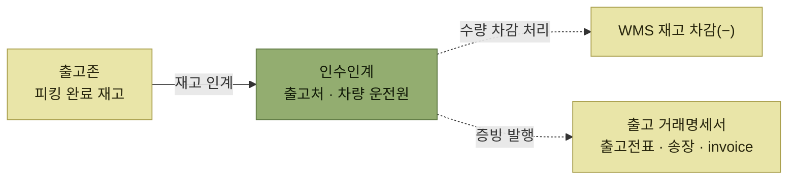

# 출고

> [출고 프로세스](./README.md)

## 빠른 복습

- 출고존으로 이동된 재고를 **최종 출고처나 차량 운전원에게 인수인계**하는 단계다.
- 인수인계를 통해 **WMS 재고 수량이 차감**되고, 증빙으로 **출고 거래명세서(출고전표, 송장, invoice)** 를 발행한다.
- 다만 시점은 고정이 아니다. **배송 중인 재고를 계속 재고로 인식하고, 최종 출고처에 완전히 인계한 시점에 출고확정**하는 경우도 있다.
- 거래명세서 발행 시점도 **할당이나 피킹 작업 전후로 옮겨질 수 있다.**
- 출고가 단순하거나 거래 건수가 적으면 WMS 프로세스가 오히려 번거롭게 느껴질 수 있다. 반대로 **다품종 소량 다빈도의 일정 규모 이상 물류센터에서는 WMS 없이는 정확하고 효율적인 운영이 어렵다.**

## 무엇을 하는가

피킹 작업을 통해 출고존으로 이동된 재고를 **최종 출고처나 차량 운전원에게 인수인계**한다.

WMS에서 관리한 재고는 인수인계를 통해 **재고 수량이 차감**되며, 상호 거래의 증빙 자료인 **출고 거래명세서(출고전표, 송장, invoice)** 를 발행한다.

*인수인계 한 번에 재고 차감과 증빙 발행이 함께 일어난다*

[입고확정](../04-입고-프로세스/3-입고확정.md)과 구조가 대칭이다. 입고확정에서 재고가 늘고 책임이 넘어오면서 입고전표가 나왔고, 출고에서 재고가 줄고 책임이 넘어가면서 출고전표가 나온다.

## 출고전표에는 무엇이 담기는가

원서가 든 예시는 **매출전표** 양식이다.

- **머리 부분** — 매출번호, 매출처, 매출일자, 출력순번
- **줄 부분** — 순번, 제품, 제품명, 매출수량, 매출단가, 매출금액, 상태, 비고
- **맨 아래** — 건수와 금액 합계

*원서 [그림 5-20] 출고전표 예시*

[출고예정정보](./1-출고예정-수신.md#출고예정정보의-구조)와 마찬가지로 **머리(전표 단위)와 줄(제품 단위)** 두 층 구조다. 다른 점은 여기에 **단가와 금액이 들어간다**는 것이다. 출고는 거래의 확정이기 때문이다.

## 시점은 고정이 아니다

여기가 이 절에서 가장 실무적인 부분이다.

**재고 차감 시점** — 상황에 따라 배송 차량을 통해 **배송 중인 재고를 WMS 시스템에서 계속 재고로 인식**하고, **최종 출고처에 완전히 인계한 시점에 최종 출고확정 처리**가 되는 경우도 있다.

**전표 발행 시점** — 출고 거래명세서 발행도 상황에 따라 **할당이나 피킹 작업 전후에 이루어지는 경우**도 있다.

즉 "출고확정에서 재고가 빠진다"는 원칙은 맞지만, **어디까지를 우리 재고로 볼 것인가는 창고와 화주의 합의**에 달려 있다. 차량에 실린 재고를 아직 우리 것으로 볼지, 넘긴 것으로 볼지가 갈린다.

## WMS가 과하게 느껴질 때와 없으면 안 될 때

원서는 이 절을 균형 있게 닫는다.

- 출고의 형태가 단순하거나 거래 건수가 많지 않은 경우에는 **WMS의 출고 프로세스들이 복잡하고 불편하게 느껴질 수 있다.**
- 다품종 소량 다빈도를 취급하는 **어느 정도 규모 이상의 물류센터**에서는 수많은 작업자와 자료들이 실시간으로 움직이기 때문에 **WMS 없이는 정확하고 효율적인 창고 운영이 어렵다.**

## 함께 읽기

- 출고존에 재고를 모으는 단계는 [피킹](./6-피킹.md)이다.
- 대칭 구조인 입고 쪽은 [입고확정](../04-입고-프로세스/3-입고확정.md)에서 확인한다.
- 이 단계를 점검하는 항목은 [출고 체크리스트와 KPI](./8-출고-체크리스트와-KPI.md)에 있다.
