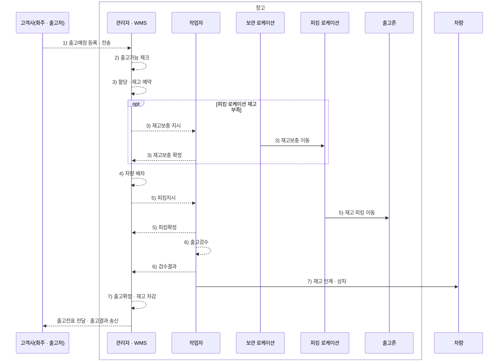
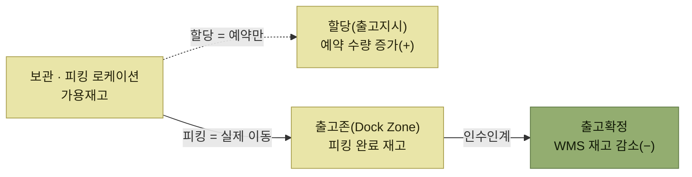

# 출고 프로세스

> [WMS 원리와 이해](../README.md)

## 출고란

**출고(Outbound, Shipping)** 의 사전적 의미는 "창고에서 꺼내다"다. 프로세스로서는 이렇게 정의된다.

> 입고 확정 및 적치를 완료한 후 보관되어 있는 재고를 **고객사(화주)의 요청으로 피킹하여 창고 외부로 이동시키는** 일련의 과정

출고업무가 완료되면 **WMS 시스템에서 재고가 감소**한다. 입고가 재고를 늘리는 과정이었다면 출고는 줄이는 과정이다.

피킹 작업은 물류 현장 작업자가 **모바일 장비를 활용하여 실시간 확정**하는 것이 일반적이다.

## 누가 무엇을 하는가

원서는 출고 프로세스를 **고객사(화주·출고처), 물류 현장 작업자, WMS 관리자**라는 주요 참여자 기준으로 정리한다.

도식의 실선은 재고의 물리적 이동, 점선은 정보와 처리 결과의 흐름을 뜻한다. 번호는 아래 프로세스 표의 단계와 같다.

*[그림 5-2] 출고 주요 프로세스 — 참여자별로 나눠 본 흐름*

여기서 눈여겨볼 지점이 하나 있다. 우리가 발행한 **출고전표를 고객사는 `입고전표`로 확인**한다. 같은 문서가 보는 쪽에 따라 이름이 달라진다.

## 주요 출고 프로세스

작업 환경 등에 따라 달라질 수 있다.

<table>
<thead>
<tr>
<th style="text-align:center; white-space:nowrap">단계</th>
<th style="text-align:center; white-space:nowrap">프로세스</th>
<th style="text-align:center; white-space:nowrap">내용</th>
<th style="text-align:center; white-space:nowrap">모바일 장비</th>
<th style="text-align:center; white-space:nowrap">주요 출력물</th>
</tr>
</thead>
<tbody>
<tr>
<td style="text-align:center; white-space:nowrap">1</td>
<td style="text-align:center; white-space:nowrap">출고예정 수신</td>
<td style="text-align:left; white-space:nowrap">고객사(화주)로부터 출고예정 정보 수신</td>
<td style="text-align:center; white-space:nowrap"></td>
<td style="text-align:left; white-space:nowrap"></td>
</tr>
<tr>
<td style="text-align:center; white-space:nowrap">2</td>
<td style="text-align:center; white-space:nowrap">출고가능 체크</td>
<td style="text-align:left">재고 부족 시 정책에 따른 사전 수량 배분 처리</td>
<td style="text-align:center; white-space:nowrap"></td>
<td style="text-align:left; white-space:nowrap">재고부족분 오더할당 리스트</td>
</tr>
<tr>
<td style="text-align:center; white-space:nowrap">3</td>
<td style="text-align:center; white-space:nowrap">피킹로케이션보충</td>
<td style="text-align:left">피킹로케이션 재고부족 시 보관 LOC → 피킹 LOC 이동</td>
<td style="text-align:center; white-space:nowrap">O</td>
<td style="text-align:left; white-space:nowrap">피킹로케이션 보충지시서</td>
</tr>
<tr>
<td style="text-align:center; white-space:nowrap">3</td>
<td style="text-align:center; white-space:nowrap">할당(출고지시)</td>
<td style="text-align:left; white-space:nowrap">출고 오더별로 로케이션 할당 처리</td>
<td style="text-align:center; white-space:nowrap"></td>
<td style="text-align:left; white-space:nowrap"></td>
</tr>
<tr>
<td style="text-align:center; white-space:nowrap">4</td>
<td style="text-align:center; white-space:nowrap">차량배차</td>
<td style="text-align:left; white-space:nowrap">출고 오더별 차량 배차</td>
<td style="text-align:center; white-space:nowrap"></td>
<td style="text-align:left; white-space:nowrap">차량 배차 리스트</td>
</tr>
<tr>
<td style="text-align:center; white-space:nowrap">5</td>
<td style="text-align:center; white-space:nowrap">피킹</td>
<td style="text-align:left; white-space:nowrap">피킹 작업 수행 및 결과 등록</td>
<td style="text-align:center; white-space:nowrap">O</td>
<td style="text-align:left; white-space:nowrap">피킹 리스트</td>
</tr>
<tr>
<td style="text-align:center; white-space:nowrap">6</td>
<td style="text-align:center; white-space:nowrap">출고검수</td>
<td style="text-align:left; white-space:nowrap">피킹 이상여부 최종 확인</td>
<td style="text-align:center; white-space:nowrap">O</td>
<td style="text-align:left; white-space:nowrap">검수 리스트</td>
</tr>
<tr>
<td style="text-align:center; white-space:nowrap">7</td>
<td style="text-align:center; white-space:nowrap">출고 확정</td>
<td style="text-align:left; white-space:nowrap">최종 재고 인계 / WMS 재고 감소</td>
<td style="text-align:center; white-space:nowrap"></td>
<td style="text-align:left; white-space:nowrap">출고거래명세서</td>
</tr>
</tbody>
</table>

표에서 **3번이 두 개**인 것은 오기가 아니다. 피킹로케이션 보충과 할당은 **같은 단계에서 동시에 실행**된다. 원서 본문도 "순수한 할당 작업과 동시에 피킹 로케이션의 재고가 부족 시 보관 로케이션 → 피킹 로케이션으로 재고보충 작업이 동시에 실행된다"고 적고 있다.

> 원서에 없는 보충: **6번 출고검수는 위 표에만 있고 본문에 상세 절이 없다.** 표의 설명("피킹 이상여부 최종 확인")이 전부다. 이 요약도 그 이상 쓰지 않는다.

## 재고는 언제 줄어드는가

입고에서 "언제 팔 수 있게 되는가"가 핵심이었듯, 출고에서는 **언제 재고가 빠지는가**가 핵심이다.

*할당은 예약, 피킹은 이동, 출고확정에서 비로소 재고가 빠진다*

## 목차

- [출고예정 수신](./1-출고예정-수신.md)
- [출고가능 체크](./2-출고가능-체크.md)
- [피킹로케이션 운영 방식](./3-피킹로케이션-운영-방식.md)
- [할당(출고지시)](./4-할당-출고지시.md)
- [차량배차](./5-차량배차.md)
- [피킹](./6-피킹.md)
- [출고](./7-출고.md)
- [출고 체크리스트와 KPI](./8-출고-체크리스트와-KPI.md)

## 함께 읽기

- 출고의 전제인 가용재고는 [적치확정](../04-입고-프로세스/5-적치확정.md#여기서-비로소-팔-수-있게-된다)에서 만들어진다.
- 2장의 개관은 [할당과 피킹, 출고](../02-wms-주요-프로세스/4-할당과-피킹-출고.md)에 있다. 5장은 그것을 상세히 펼친 것이다.
- 출고예정부터 출고확정까지의 상태와 처리시간은 [가시성의 실시간 추적과 KPI](../11-가시성/3-Visibility-추진단계.md#나-2단계--데이터-분석--오류통보)를 만드는 원천 데이터다.
- [B마트 OMS 출고 최적화 사례](../../요즘-우아한-백엔드-개발/11-b마트-oms의-물류주문관리를-통한-출고-최적화/README.md)는 출고가능 체크와 차량배차 사이에서 피크 주문을 분산하고 출고 예정 시각을 동적으로 계산하는 방법을 보여준다.
