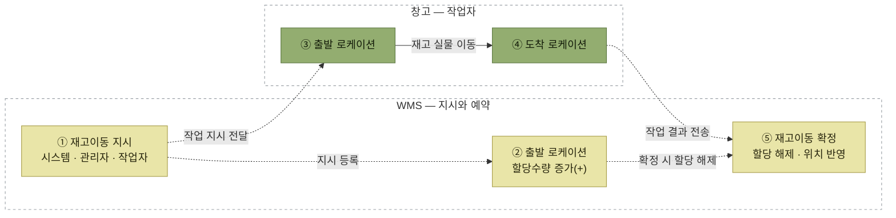

# 재고이동

> [재고관리](./README.md)

## 빠른 복습

- 입출고가 빈번하면 재고 분포가 **어지럽게 분산되어 보관 효율이 떨어진다.** 작업자의 이동 거리가 길어져 생산성이 낮아진다.
- 그래서 로케이션 간 재고를 **규칙이나 연관성을 고려해** 옮긴다.
- 프로세스는 두 단계다. **재고이동 지시(등록) → 재고이동 확정(실물 이동).**
- 지시된 수량은 다른 작업이 못 쓰도록 **할당수량이 증가**하고, 확정하면 **할당이 해제되면서** 재고가 이동 처리된다.
- **총 수량은 변하지 않는다.** 창고 내부의 위치만 바뀐다. 그리고 모든 변경 이력이 기록된다.

## 왜 필요한가

창고에서의 입출고 작업이 빈번하면 재고의 분포가 어지럽게 분산되어 **재고 보관 효율성이 떨어진다.** 이는 작업자가 입출고 시에 이동해야 할 거리가 길어지는 등 **작업 생산성 저하를 초래**한다.

그래서 각 로케이션 간의 재고를 **규칙이나 연관성을 고려**하여 특정 로케이션에서 로케이션으로 이동(Move)한다.

## 재고 이동 시 고려 사항

- 자주 출고되는 재고는 가급적 **출고장에 가까운** 로케이션에 보관한다.
- 출고가 빈번한 재고는 **높은 단(층)보다는 낮은 단(층)** 에 배치한다.
- **무거운 제품이 먼저 피킹**될 수 있도록 피킹 순서를 고려하여 재고를 배치한다. 가벼운 제품을 먼저 피킹하면 파손 또는 품질에 문제가 발생될 가능성이 높다.
- 동일한 상품은 **비슷한 위치에 보관**하는 것이 좋다. 최근 추세는 출고패턴과 작업 동선을 고려하여 [랜덤 스토우](../05-출고-프로세스/3-피킹로케이션-운영-방식.md#랜덤-스토우-random-stow) 방식으로 보관하기도 한다.
- **동시에 출고되는 품목**은 가급적 가까운 위치에 배치한다.
- 피킹 시 혼선을 줄 수 있는 **유사한 제품은 가급적 비슷한 로케이션에 배치하지 않는다.**
- 제품의 성격, 수량, 출고추이 등을 고려하여 **적절한 보관 설비**에 보관한다.

### 보관 설비 선택

<table>
<thead>
<tr>
<th style="text-align:center; white-space:nowrap">제품 성격</th>
<th style="text-align:center; white-space:nowrap">설비</th>
</tr>
</thead>
<tbody>
<tr>
<td style="text-align:left; white-space:nowrap">중량물, 대량 입출고</td>
<td style="text-align:center; white-space:nowrap">평치, 드라이브인랙 등</td>
</tr>
<tr>
<td style="text-align:left; white-space:nowrap">박스 보관, 중간 입출고 추이</td>
<td style="text-align:center; white-space:nowrap">팔레트랙</td>
</tr>
<tr>
<td style="text-align:left; white-space:nowrap">소량 다빈도</td>
<td style="text-align:center; white-space:nowrap">선반랙, 플로어랙 등</td>
</tr>
</tbody>
</table>

고려사항들이 서로 부딪치는 것에 주의한다. **"동일 상품은 모아서"** 와 **"랜덤 스토우로 흩어서"** 는 반대 방향이고, **"유사 제품은 떨어뜨려서"** 와 **"동시 출고 품목은 가까이"** 도 충돌할 수 있다. 정답이 하나가 아니라 창고 상황에 따라 저울질하는 항목들이다.

위의 고려사항 외에도 과거 입출고 및 작업이력 데이터, 창고의 공간 데이터, 작업자와 설비 등의 투입계획을 **종합 분석하여 재고이동을 권고**하거나, 관리자 등이 필요에 의해 재고 이동을 지시할 수 있다.

## 프로세스

<table>
<thead>
<tr>
<th style="text-align:center; white-space:nowrap">구분</th>
<th style="text-align:center; white-space:nowrap">프로세스</th>
<th style="text-align:center; white-space:nowrap">내용</th>
<th style="text-align:center; white-space:nowrap">모바일 장비 활용</th>
<th style="text-align:center; white-space:nowrap">출력물</th>
</tr>
</thead>
<tbody>
<tr>
<td style="text-align:center; white-space:nowrap">1</td>
<td style="text-align:left; white-space:nowrap"><b>재고이동 지시(등록)</b></td>
<td style="text-align:left; white-space:nowrap">최적화를 위한 자동 재고이동 지시 관리자에 의한 임의 재고이동 지시 작업자의 판단에 의한 재고이동 생성</td>
<td style="text-align:center; white-space:nowrap">O</td>
<td style="text-align:center; white-space:nowrap">로케이션 이동 지시서</td>
</tr>
<tr>
<td style="text-align:center; white-space:nowrap">2</td>
<td style="text-align:left; white-space:nowrap"><b>재고이동 확정(실물 이동)</b></td>
<td style="text-align:left; white-space:nowrap">실물 이동 WMS 시스템에 결과 반영</td>
<td style="text-align:center; white-space:nowrap">O</td>
<td style="text-align:center; white-space:nowrap">로케이션 이동 LIST</td>
</tr>
</tbody>
</table>

*원서 [그림 6-10] 재고이동 프로세스*

지시를 만드는 주체가 **셋**이라는 점이 눈에 띈다. 시스템(자동 최적화), 관리자(임의), 그리고 **작업자 본인의 판단**까지 포함된다.

## 할당수량이 지시와 확정을 잇는다

> 선 의미: **실선은 재고 실물 이동**, **점선은 지시·예약·작업 결과 같은 정보 흐름**을 나타낸다.

*이동 지시가 걸리는 순간 그 수량은 잠기고, 실물 이동 결과를 확정하면 위치가 바뀌면서 잠금이 풀린다*

**이동 지시된 수량은 다른 작업에 사용될 수 없도록 할당수량이 증가**된다. 재고이동 지시는 작업자에게 출력물이나 모바일 장비를 통해 실시간으로 전달된다.

작업자가 지시된 내역에 따라 재고 이동을 하고 모바일 장비 등을 통해 확정 처리를 하면, **이동 전 로케이션의 할당수량이 해제되면서** WMS의 재고가 이동 처리된다.

## 재고이동 예시

원서 예시를 표로 옮기면 이렇다.

**이동지시 시점**

<table>
<thead>
<tr>
<th style="text-align:center; white-space:nowrap">로케이션</th>
<th style="text-align:center; white-space:nowrap">제품</th>
<th style="text-align:center; white-space:nowrap">수량</th>
<th style="text-align:center; white-space:nowrap">할당</th>
</tr>
</thead>
<tbody>
<tr>
<td style="text-align:center; white-space:nowrap">A301</td>
<td style="text-align:center; white-space:nowrap">사과</td>
<td style="text-align:center; white-space:nowrap">60개</td>
<td style="text-align:center; white-space:nowrap"><b>10개</b></td>
</tr>
<tr>
<td style="text-align:center; white-space:nowrap">A302</td>
<td style="text-align:center; white-space:nowrap">사과</td>
<td style="text-align:center; white-space:nowrap">60개</td>
<td style="text-align:center; white-space:nowrap"></td>
</tr>
<tr>
<td style="text-align:center; white-space:nowrap">A304</td>
<td style="text-align:center; white-space:nowrap">포도</td>
<td style="text-align:center; white-space:nowrap">30개</td>
<td style="text-align:center; white-space:nowrap"></td>
</tr>
<tr>
<td style="text-align:center; white-space:nowrap">A202</td>
<td style="text-align:center; white-space:nowrap">포도</td>
<td style="text-align:center; white-space:nowrap">30개</td>
<td style="text-align:center; white-space:nowrap"></td>
</tr>
<tr>
<td style="text-align:center; white-space:nowrap">A203</td>
<td style="text-align:center; white-space:nowrap">포도</td>
<td style="text-align:center; white-space:nowrap">30개</td>
<td style="text-align:center; white-space:nowrap"></td>
</tr>
<tr>
<td style="text-align:center; white-space:nowrap">A101</td>
<td style="text-align:center; white-space:nowrap">사과</td>
<td style="text-align:center; white-space:nowrap">30개</td>
<td style="text-align:center; white-space:nowrap"></td>
</tr>
<tr>
<td style="text-align:center; white-space:nowrap">A102</td>
<td style="text-align:center; white-space:nowrap">포도</td>
<td style="text-align:center; white-space:nowrap">10개</td>
<td style="text-align:center; white-space:nowrap"></td>
</tr>
<tr>
<td style="text-align:center; white-space:nowrap">A104</td>
<td style="text-align:center; white-space:nowrap">(빈)</td>
<td style="text-align:center; white-space:nowrap"></td>
<td style="text-align:center; white-space:nowrap"></td>
</tr>
</tbody>
</table>

> **이동지시**
> [A301] LOC "사과" 10개 → [A104] 이동지시 (사유: 착오)
> (다른 작업이 10개를 사용할 수 없도록 할당 처리)

**이동확정 이후**

<table>
<thead>
<tr>
<th style="text-align:center; white-space:nowrap">로케이션</th>
<th style="text-align:center; white-space:nowrap">제품</th>
<th style="text-align:center; white-space:nowrap">수량</th>
<th style="text-align:center; white-space:nowrap">할당</th>
</tr>
</thead>
<tbody>
<tr>
<td style="text-align:center; white-space:nowrap">A301</td>
<td style="text-align:center; white-space:nowrap">사과</td>
<td style="text-align:center; white-space:nowrap">60개 → <b>50개</b></td>
<td style="text-align:center; white-space:nowrap">10개 → <b>0개</b></td>
</tr>
<tr>
<td style="text-align:center; white-space:nowrap">A104</td>
<td style="text-align:center; white-space:nowrap">사과</td>
<td style="text-align:center; white-space:nowrap"><b>10개</b></td>
<td style="text-align:center; white-space:nowrap"></td>
</tr>
</tbody>
</table>

> **이동확정**
> [A301] LOC "사과" 10개 → [A104] LOC 이동확정
> (작업자: 홍길동, 작업시간 14:05 ~ 14:10)

*원서 [그림 6-11] 재고이동 예시*

**할당 10개가 0개로 풀리는 것**과 **작업자·작업시간이 남는 것**이 이 예시의 두 포인트다.

## 총 수량은 그대로, 이력은 전부 남는다

재고 이동은 **WMS의 전체 재고 총 수량에는 아무런 변동이 없고** 창고 내부 로케이션의 재고 위치만 변경된다.

시스템 내부에서는 재고에 대한 **모든 변경 이력을 기록·관리**하기 때문에, 언제 어느 작업자가 어느 제품을 어떤 로케이션에서 몇 개를 이동했고 그 사유가 무엇이었는지 언제든지 확인할 수 있다.

## 함께 읽기

- 2장의 개관은 [재고이동](../02-wms-주요-프로세스/3-재고이동과-재고보충.md#③-재고이동)에 있다.
- 적치 단계에서 로케이션을 고르는 기준은 [적치방법](../04-입고-프로세스/4-적치지시.md#적치방법-여섯-가지)과 겹친다.
- 센터 간 재고 이관에서 할당과 취소가 경쟁하는 문제는 [WMS 재고 이관 분산 락 사용기](../../요즘-우아한-백엔드-개발/13-wms-재고-이관을-위한-분산-락-사용기/README.md)에서 다룬다.
