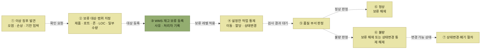

# 재고 보류

> [재고관리](./README.md)

## 빠른 복습

- 보관 기간이 지나면 제품 외관이 **오염·손상**되어, 정상적으로 출고해도 되는지 **별도 품질 부서의 확인**이 필요한 경우가 있다.
- 확인 없이 출고되면 **고객 클레임 등 중대한 문제**로 이어질 가능성이 높다.
- 그래서 WMS는 특정 제품·로케이션·로트의 재고에 대해 **할당(출고지시)이나 재고 이동을 할 수 없도록 강제로 통제**한다. 이것이 재고 보류다.
- **범위**(어디에 걸 것인가)와 **기능**(무엇을 막을 것인가)이 따로 정해진다.
- 보류 등록·해제 시에는 **사유와 처리자 이력을 반드시 기록**하는 것이 일반적이다.

## 왜 필요한가

창고에 보관된 재고가 기간이 경과함에 따라 제품의 외관이 오염, 손상 등으로 **제품을 정상적으로 출고해야 할지를 별도의 품질 관련 부서에 확인이 필요한 경우**가 있다.

별도 확인 없이 재고가 출고된다면 **고객 클레임 등 중대한 문제가 발생될 가능성이 높다.** 이에 WMS는 특정 제품이나 특정 로케이션, 특정 로트의 재고에 대해 할당(출고지시), 재고 이동 등을 할 수 없도록 **강제로 통제**할 수 있다.

## 어디에 걸 것인가 — 보류 범위

- **제품 그룹** 단위로 보류 처리
- **제품코드** 보류
- 제품 코드의 **특정 로트(LOT)** 보류
- **존(Zone) 또는 로케이션(LOC)**
- 특정 로케이션에 보관되어 있는 **일부 재고**

범위가 **넓은 것에서 좁은 것으로** 내려온다. 제품 그룹 전체를 한 번에 막을 수도 있고, 한 로케이션의 일부 수량만 콕 집어 막을 수도 있다.

## 무엇을 막을 것인가 — 보류 기능

- **이동금지** 처리
- **할당(출고지시) 금지**
- **상태 변경 금지**

> 이 흐름은 **보류 지시·판정·상태 정보**를 나타내므로 점선으로 표시했다. 재고를 별도 장소로 옮기는 경우에는 [재고이동](./2-재고이동.md)이 추가로 필요하다.

*어디에 걸지(범위)와 무엇을 막을지(기능)를 정하고, 품질 판정에 따라 해제하거나 상태를 바꾼다*

보류된 재고는 **재고보류 레벨에 해당하는 작업은 수행하지 못한다.** 즉 이동금지만 걸었다면 할당은 여전히 가능하다. 무엇을 막았는지가 그대로 통제 범위가 된다.

## 이력은 반드시 남긴다

보류 등록이나 해제 시에는 **사유와 누가 처리했는지 등의 이력정보를 반드시 기록·관리**하는 것이 일반적이다.

보류는 정상 재고를 인위적으로 묶어두는 조치다. 왜 묶였고 누가 풀었는지가 남지 않으면 **재고가 왜 안 나가는지 아무도 설명할 수 없게** 된다.

## 상태변경과 무엇이 다른가

<table>
<thead>
<tr>
<th style="text-align:center; white-space:nowrap"></th>
<th style="text-align:center; white-space:nowrap">재고 보류</th>
<th style="text-align:center; white-space:nowrap">재고 상태변경</th>
</tr>
</thead>
<tbody>
<tr>
<td style="text-align:center; white-space:nowrap">재고의 상태</td>
<td style="text-align:left; white-space:nowrap"><b>변경하지 않는다</b></td>
<td style="text-align:left; white-space:nowrap">등급을 <b>완전히 바꾼다</b></td>
</tr>
<tr>
<td style="text-align:center; white-space:nowrap">성격</td>
<td style="text-align:left; white-space:nowrap"><b>일시적</b>으로 할당·이동을 막는다</td>
<td style="text-align:left; white-space:nowrap">전혀 다른 제품으로 취급한다</td>
</tr>
<tr>
<td style="text-align:center; white-space:nowrap">되돌리기</td>
<td style="text-align:left; white-space:nowrap">해제하면 원래대로</td>
<td style="text-align:left; white-space:nowrap">다시 등급을 바꿔야 한다</td>
</tr>
</tbody>
</table>

오른쪽 열의 자세한 내용은 [재고 상태변경](./4-재고-상태변경.md)에 있다.

## 함께 읽기

- 조회 화면에서 보류가 어떻게 보이는지는 [로케이션별 재고 현황](./1-재고-조회.md#로케이션별-재고-현황)에 있다. **재고 보류**와 **셀 보류**가 나뉘어 있다.
- 재고조정 로케이션에도 보류가 걸려 있다. [재고조정](./6-재고조정.md) 참고.
- 보류한 재고를 물리적으로 어디에 두는가에 대한 보충은 [여기](../02-wms-주요-프로세스/5-재고관리.md#보류한-재고는-어디에-두는가)에 있다.
