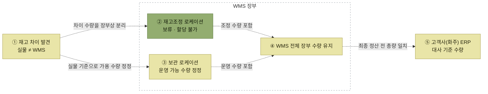
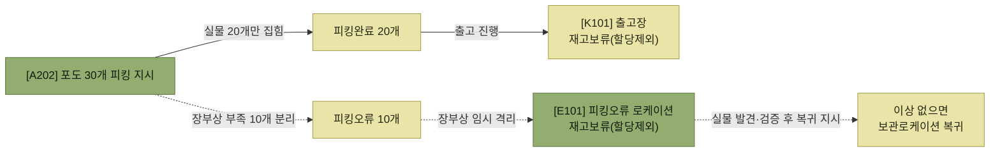

# 재고조정

> [재고관리](./README.md)

## 빠른 복습

- 실물재고와 WMS 재고가 어긋나면 출고 작업에서 혼선이 생기므로 **바로 일치시키는 것이 좋다.**
- 그런데 WMS에서 수량을 그냥 바꾸면 **화주 ERP와 차이가 생겨 또 다른 혼선**이 된다.
- 그래서 차이 수량을 **재고조정 로케이션으로 임시 이동**시킨다. 원인 규명에 시간이 걸리므로, 우선 **실제 운영 가능한 재고를 빠르게 반영**하는 것이 목적이다.
- 재고조정 로케이션에는 **재고보류가 설정**되어 있어 입출고 작업에서 제외된다. 그래서 실물과 맞추면서도 **화주 ERP와 전체 수량 차이 없이** 운영할 수 있다.
- 재고조정은 **피킹 확정 시에도 자동으로** 일어난다. 지시한 수량을 다 못 집으면 차이분이 자동으로 임시 로케이션으로 빠진다.
- 마지막에는 화주에게서 **출고오더(증가분은 출고반품오더)** 를 받아 임시 재고를 정리하고 ERP와 일치시킨다.

## 왜 바로 수량을 고치지 않는가

실물재고와 WMS 시스템 재고가 일치하지 않으면 출고 작업 등에서 혼선이 발생할 수밖에 없어, 바로 재고를 일치시키기 위한 재고 조정 작업을 수행하는 것이 좋다.

**그러나** WMS에서 바로 재고수량을 일반적으로 변경하면 **고객사(화주) ERP 시스템과 재고 차이가 발생되어 또 다른 혼선**이 발생할 수 있다.

그래서 WMS에서는 **차이 수량(재고 조정을 해야 할 수량)을 재고 조정 로케이션에 임시로 이동 처리**한다. 원인을 규명하는 데 시간이 많이 소요될 수 있기 때문에, 먼저 정확한 업무 처리를 위해 **실제 운영 가능한 재고를 빠르게 반영**하기 위한 목적이 크다.

**재고조정 로케이션은 입출고 작업 시 제외되도록 "재고보류"가 설정**되어 있으며, 실물과 재고를 일치시키면서도 고객사(화주) ERP 시스템과도 **전체적인 수량 차이 없이 운영 가능**하다.



> 이 그림은 **실물 이동이 아니라 WMS·ERP의 장부상 정보 흐름**을 나타내므로 모든 연결을 점선으로 표시했다. 분실된 실물이 조정 로케이션으로 이동한다는 뜻이 아니다.

*차이를 지우지 않고 장부상 조정 로케이션으로 분리한다 — 그래서 최종 정산 전까지 전체 수량이 흔들리지 않는다*

## 재고조정(감소) 예시

**재고차이 발생**

> [A302] 로케이션 "사과" **재고손실 (−)20개** 발생 (사유: 분실)

**재고조정 처리** — 재고조정 등록 (모바일 또는 PC)

<div class="tbl" style="overflow-x:auto">
<table>
<thead>
<tr>
<th style="text-align:center; white-space:nowrap">항목</th>
<th style="text-align:center; white-space:nowrap">값</th>
</tr>
</thead>
<tbody>
<tr><td style="text-align:center; white-space:nowrap">대상로케이션</td><td style="text-align:center; white-space:nowrap">A302</td></tr>
<tr><td style="text-align:center; white-space:nowrap">대상제품코드</td><td style="text-align:center; white-space:nowrap">사과</td></tr>
<tr><td style="text-align:center; white-space:nowrap">대상수량</td><td style="text-align:center; white-space:nowrap">(−)20</td></tr>
<tr><td style="text-align:center; white-space:nowrap">사유</td><td style="text-align:center; white-space:nowrap">분실</td></tr>
<tr><td style="text-align:center; white-space:nowrap">재고조정로케이션</td><td style="text-align:center; white-space:nowrap">E301</td></tr>
</tbody>
</table>
</div>

**결과** — 보관존 A302 사과 60개 → **40개**, 재고조정존 E301 사과 **20개**

*원서 [그림 6-19] 재고조정(감소) 예시*
※ 재고조정존(E301, E201, E101)은 **할당불가 로케이션**임

보관 로케이션에서 20개가 빠지고 재고조정존으로 20개가 들어갔다. **창고 전체 총량은 그대로**다. 다만 그 20개는 할당불가라 출고에 쓰이지 않는다.

## 재고조정(증가) 예시

**재고차이 발생**

> [A203] 로케이션 "포도" **재고잉여 (+)10개** 발생
> (사유: 출고혼선으로 전산상재고보다 실물이 많음)

**결과** — 보관존 A203 포도 30개 → **40개**, 재고조정존 E201 포도 0 → **(−)10개**

*원서 [그림 6-20] 재조조정(증가) 예시*
※ 재고조정존(E301, E201, E101)은 **할당불가하며 예외적으로 마이너스(−) 수량 가능**(재고증가 감안)

여기서 **재고조정존이 마이너스가 되는 것**이 핵심이다. 실물이 10개 더 있으면 보관존은 +10, 조정존은 −10이 되어 **총량은 여전히 변하지 않는다.** 그래서 화주 ERP와 어긋나지 않는다.

> 원서 표기 확인: 이 그림의 재고조정 등록 내용에 **불일치 두 곳**이 있다. 차이가 발생한 로케이션은 본문에서 **[A203]** 인데 등록 항목의 대상로케이션은 **A202**로 적혀 있고, 재고조정로케이션은 **E301**로 적혀 있으나 그림에서 실제로 수량이 변한 곳은 **E201**(포도)이다. E301에는 앞 그림의 사과 20개가 들어 있다. 원서 표기를 그대로 옮기지 않고, **그림의 수량 변화와 맞는 A203 · E201 기준**으로 정리했다.

## 피킹 확정 시 자동 재고조정

재고조정은 **"피킹확정" 시에도 자동으로 처리**될 수 있다.

작업자가 피킹을 위해 지시된 로케이션에서 해당 수량을 피킹하지 못했을 경우, WMS는 자동으로 **차이수량(피킹하지 못한 수량)을 재고조정 관련 특정 임시 로케이션으로 이동 처리**한다.

**왜냐하면 해당 수량이 그대로 남아 있을 경우 다른 출고오더로 다시 할당(출고지시)되면서 작업에 혼선이 생기기 때문이다.**

**예시**

> **피킹작업**
> [A202] 로케이션 "포도" **30개 피킹 지시**
> 작업자 피킹 시 실물이 10개 부족하여 **20개만 피킹** (20개 피킹, 10개 실물부족)

> **재고조정처리**
> 피킹오류 **10개 → [E101] 피킹오류 로케이션** 이동
> 피킹완료 **20개 → [K101] 출고장 로케이션** 이동

*원서 [그림 6-22] 피킹확정시 재고조정 발생 예시*
※ [E101], [K101]은 **재고보류(할당제외) 로케이션**
※ [E101] 피킹오류 로케이션의 재고는 **이상여부 확인 후 필요시 보관로케이션으로 이동 처리**할 수 있다



> 선 의미: **실선은 확인된 재고 실물 이동**, **점선은 지시·장부 처리 같은 정보 흐름**을 나타낸다.

*못 집은 10개를 장부에 그대로 두면 다른 오더가 또 가져간다 — 그래서 조정 로케이션에 장부상 격리한다*

## 임시재고 최종 정리

최종적으로 재고조정 관련 **임시로케이션에 보관된 재고를 정리**해야 한다. 고객사에서는 재고조정(차이분)에 대한 **회계 반영이 필요**하고, WMS 시스템과 ERP 시스템의 수량을 일치시키는 작업이다.

고객사(화주)에 따라 그 절차와 방법은 다를 수 있는데, 고객사에서 **재고조정과 관련된 출고오더(증가 시 출고반품오더)를 전달받아 이를 처리하는 방식**으로 처리한다.

**고객사 ERP와 WMS 재고 일치화**

> 고객사(화주)에서 재고조정을 위한 **출고 오더를 수신 받아 출고 처리**
> - 감소분(사과 20개) : **출고처리**
> - 증가분(포도 10개) : **출고반품처리**

*원서 [그림 6-23] 재고조정 임시재고 최종 정리 예시*

결과적으로 재고조정존 E301 사과 20개 → **0개**, E201 포도 (−)10개 → **0개**가 되어 임시 재고가 비워진다.

전체 흐름을 한 줄로 요약하면 이렇다.

```text
차이 발견 → 조정존으로 임시 격리(총량 유지) → 원인 규명 → 화주 오더로 정리(총량 확정)
```

## 함께 읽기

- 차이를 발견하는 단계는 [재고조사](./5-재고조사.md)다.
- 재고조정 로케이션에 걸리는 통제는 [재고 보류](./3-재고-보류.md)와 같은 장치다.
- 피킹 확정이 정상적으로 끝났을 때의 동작은 [피킹](../05-출고-프로세스/6-피킹.md#피킹-확정이-하는-일)에 있다.
