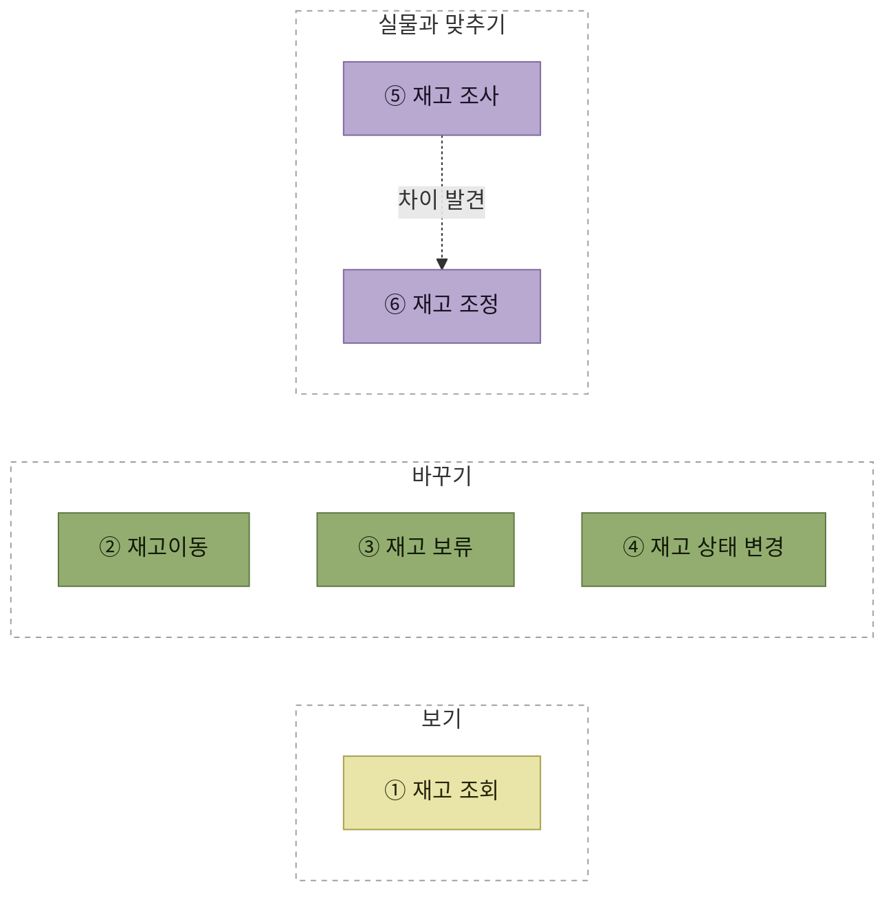

# 재고관리

> [WMS 원리와 이해](../README.md)

## 재고관리란

> 창고 내 재고를 **최적의 수준으로 유지**하고 이를 **효율적으로 관리**하기 위한 활동

기업의 경쟁력 강화를 위해 중요한 경영활동 중의 하나로 평가된다. **재고비용 절감, 매출 증대** 등의 효과를 기대할 수 있다.

## 주요 기능

<table>
<thead>
<tr>
<th style="text-align:center; white-space:nowrap">구분</th>
<th style="text-align:center; white-space:nowrap">기능</th>
<th style="text-align:center; white-space:nowrap">내용</th>
</tr>
</thead>
<tbody>
<tr>
<td style="text-align:center; white-space:nowrap">1</td>
<td style="text-align:left; white-space:nowrap"><b>재고 조회</b> (Inventory Report)</td>
<td style="text-align:left; white-space:nowrap">창고 내 재고를 여러 관점으로 실시간 조회</td>
</tr>
<tr>
<td style="text-align:center; white-space:nowrap">2</td>
<td style="text-align:left; white-space:nowrap"><b>재고이동</b> (Move)</td>
<td style="text-align:left">로케이션에서 다른 로케이션으로 재고를 이동시킴</td>
</tr>
<tr>
<td style="text-align:center; white-space:nowrap">3</td>
<td style="text-align:left; white-space:nowrap"><b>재고 보류</b> (Hold)</td>
<td style="text-align:left">특정 제품 또는 로케이션의 재고를 이동이나 할당하지 못하도록 함</td>
</tr>
<tr>
<td style="text-align:center; white-space:nowrap">4</td>
<td style="text-align:left; white-space:nowrap"><b>재고 상태 변경</b> (Status change)</td>
<td style="text-align:left">특정 로케이션의 재고 상태를 변경함 (예: 정상 → 불량, 불량 → 정상)</td>
</tr>
<tr>
<td style="text-align:center; white-space:nowrap">5</td>
<td style="text-align:left"><b>재고 조사</b> (Taking, Cycle count)</td>
<td style="text-align:left; white-space:nowrap">주기적으로 재고가 일치하는지를 확인·관리</td>
</tr>
<tr>
<td style="text-align:center; white-space:nowrap">6</td>
<td style="text-align:left; white-space:nowrap"><b>재고 조정</b> (Adjustment)</td>
<td style="text-align:left">실제 재고와 전산상 재고를 일치시키기 위해 로케이션 재고를 조정함 (사유 관리)</td>
</tr>
</tbody>
</table>

### 여섯 기능은 세 부류다

*여섯 기능의 성격 — 보기 / 바꾸기 / 실물과 맞추기*

- **보기** — 재고를 건드리지 않는다. 어떤 관점으로 볼 것인가의 문제다.
- **바꾸기** — WMS 안에서 재고의 **위치·가용성·등급**을 바꾼다. 총 수량은 그대로다.
- **실물과 맞추기** — 실물과 전산의 차이를 **발견하고(조사) 메운다(조정)**. 조정 과정에서는 보관·조정 로케이션의 수량 구성이 바뀌고, WMS 전체 수량은 화주와 최종 정산하기 전까지 유지된다.

## 재고관리가 손대는 것

각 기능이 재고의 무엇을 건드리는지 정리하면 헷갈림이 줄어든다.

<table>
<thead>
<tr>
<th style="text-align:center; white-space:nowrap">기능</th>
<th style="text-align:center; white-space:nowrap">위치</th>
<th style="text-align:center; white-space:nowrap">가용성</th>
<th style="text-align:center; white-space:nowrap">등급</th>
<th style="text-align:center; white-space:nowrap">총 수량</th>
</tr>
</thead>
<tbody>
<tr>
<td style="text-align:center; white-space:nowrap">재고이동</td>
<td style="text-align:center; white-space:nowrap"><b>바뀜</b></td>
<td style="text-align:center; white-space:nowrap"></td>
<td style="text-align:center; white-space:nowrap"></td>
<td style="text-align:center; white-space:nowrap">그대로</td>
</tr>
<tr>
<td style="text-align:center; white-space:nowrap">재고 보류</td>
<td style="text-align:center; white-space:nowrap"></td>
<td style="text-align:center; white-space:nowrap"><b>막힘</b></td>
<td style="text-align:center; white-space:nowrap"></td>
<td style="text-align:center; white-space:nowrap">그대로</td>
</tr>
<tr>
<td style="text-align:center; white-space:nowrap">재고 상태 변경</td>
<td style="text-align:center; white-space:nowrap"></td>
<td style="text-align:center; white-space:nowrap"></td>
<td style="text-align:center; white-space:nowrap"><b>바뀜</b></td>
<td style="text-align:center; white-space:nowrap">그대로</td>
</tr>
<tr>
<td style="text-align:center; white-space:nowrap">재고 조정</td>
<td style="text-align:center; white-space:nowrap"></td>
<td style="text-align:center; white-space:nowrap"></td>
<td style="text-align:center; white-space:nowrap"></td>
<td style="text-align:center; white-space:nowrap"><b>최종 정산 시 바뀜</b></td>
</tr>
</tbody>
</table>

재고조정은 두 시점을 구분해야 한다. **차이를 조정 로케이션으로 분리하는 동안에는 WMS 전체 수량을 유지**하고, 화주의 출고·반품 오더로 임시 재고를 정리하는 **최종 정산 시점에 전체 수량을 확정**한다.

## 상황별로 어떤 기능을 선택할까

비슷해 보이는 기능도 해결하려는 문제가 다르다.

<table>
<thead>
<tr>
<th style="text-align:center; white-space:nowrap">상황</th>
<th style="text-align:center; white-space:nowrap">선택할 기능</th>
<th style="text-align:center; white-space:nowrap">판단 기준</th>
</tr>
</thead>
<tbody>
<tr>
<td style="text-align:left">재고는 맞지만 보관 위치가 비효율적이다</td>
<td style="text-align:center; white-space:nowrap"><b>재고이동</b></td>
<td style="text-align:left; white-space:nowrap">수량·등급은 그대로 두고 위치만 변경</td>
</tr>
<tr>
<td style="text-align:left">품질 판정 전까지 출고나 이동을 막아야 한다</td>
<td style="text-align:center; white-space:nowrap"><b>재고 보류</b></td>
<td style="text-align:left; white-space:nowrap">상태는 유지하고 작업만 일시 통제</td>
</tr>
<tr>
<td style="text-align:left">파손·유통기한 경과로 정상 재고와 구분해야 한다</td>
<td style="text-align:center; white-space:nowrap"><b>재고 상태변경</b></td>
<td style="text-align:left; white-space:nowrap">A등급을 B·C등급 등으로 전환</td>
</tr>
<tr>
<td style="text-align:left">실물 수량과 WMS 수량이 맞는지 확인해야 한다</td>
<td style="text-align:center; white-space:nowrap"><b>재고조사</b></td>
<td style="text-align:left; white-space:nowrap">차이를 발견하되 아직 수량은 수정하지 않음</td>
</tr>
<tr>
<td style="text-align:left">재확인 후에도 실물과 WMS의 차이가 남는다</td>
<td style="text-align:center; white-space:nowrap"><b>재고조정</b></td>
<td style="text-align:left">조정 로케이션으로 차이를 분리하고 화주와 최종 정산</td>
</tr>
</tbody>
</table>

### 작업관리는 여섯 기능을 가로지른다

[작업관리](./7-작업관리.md)는 재고의 위치·가용성·등급·수량을 직접 바꾸는 기능이 아니다. 이동·조사 같은 작업의 **지시, 진행 상태, 작업자, 처리시간과 결과 이력**을 관리하는 공통 계층이므로 위 여섯 기능과 별도로 다룬다.

## 목차

- [재고 조회](./1-재고-조회.md)
- [재고이동](./2-재고이동.md)
- [재고 보류](./3-재고-보류.md)
- [재고 상태변경](./4-재고-상태변경.md)
- [재고조사](./5-재고조사.md)
- [재고조정](./6-재고조정.md)
- [작업관리](./7-작업관리.md)
- [재고관리 체크리스트와 KPI](./8-재고관리-체크리스트와-KPI.md)

## 함께 읽기

- 2장의 개관은 [재고관리](../02-wms-주요-프로세스/5-재고관리.md)에 있다. 6장은 그것을 상세히 펼친 것이다.
- 보류한 재고를 어디에 두는가에 대한 보충은 [여기](../02-wms-주요-프로세스/5-재고관리.md#보류한-재고는-어디에-두는가)에 정리해 두었다.
- 재고정확도·회전일·적재율 같은 결과 지표는 [가시성 대시보드](../11-가시성/2-WMS-주요-제공-항목.md#지표를-모아놓은-대시보드)에서 관리자가 판단할 수 있는 정보로 가공된다.
