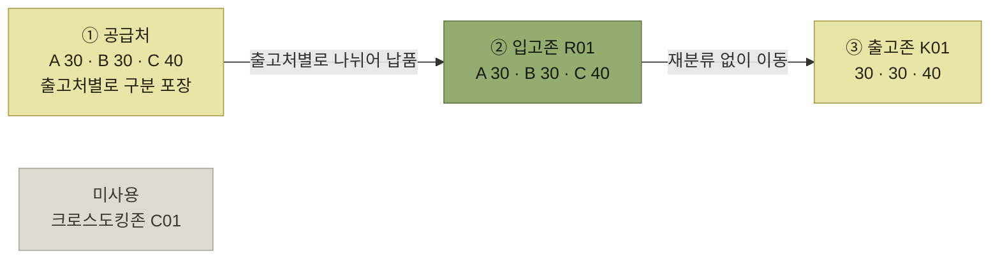

# 사전분류입고 (Trans shipment)

> [크로스도킹](./README.md)

## 빠른 복습

- 일반적인 크로스도킹과 달리 **필요한 총수량과 별도로 출고처별로 출고해야 할 수량정보를 함께 전달**한다.
- 공급처가 **미리 출고처별로 구분하여 포장 및 납품**한다.
- 창고는 **재고를 다시 분류할 필요가 없고 이상여부만 확인**하면 되어 훨씬 신속하다.
- 대신 **난이도는 더 높다.** 공급처의 납품 수량이 부족하면 출고처별로 물량을 재배분하고 그 결과를 다시 창고에 통보해야 한다.

## 무엇을 미리 넘기는가

일반적인 크로스도킹은 공급처에 **총수량**만 요청한다. 사전분류입고는 하나를 더 넘긴다.

- 필요한 **총수량**
- 그와 별도로 **출고처별로 출고해야 할 수량정보**

공급처에서는 이 정보로 **미리 출고처별로 구분하여 포장 및 납품**한다.

> [!NOTE]
> **선의 의미**
>
> **실선은 재고 실물 이동**, **점선은 출고처별 요청 정보 전달**을 나타낸다.

*분류를 공급처로 넘긴다 — 창고는 확인 후 출고존으로 바로 보낸다*

## 운영 예시

[기본 예시](./README.md#운영-예시로-보는-기본-흐름)와 같은 100개 상황이다. 달라지는 곳은 **입고 요청 때 무엇을 더 알려주는지**와 **크로스도킹존을 쓰는지**다.

**현상**

> A~C출고처에 **100개의 출고 요청** (크로스도킹)
> 공급처에 100개 입고요청처리 (**출고처별 출고내역 포함 통보**)

**결과**

> 공급처에서 100개를 납품 (입고존에 100개) — **미리 공급처에서 출고처별 분류**
> **크로스도킹존을 거치지 않고**, 출고존으로 이동
> 배분된 수량을 출고존으로 이동 (출고처리)

*원서 [그림 7-5] 사전분류입고 운영 예시 — 미사용 크로스도킹존은 물류 흐름과 연결하지 않았다*

**크로스도킹존이 비어 있는 것**이 이 예시의 핵심이다. 공급처 단계에서 이미 `A 30 · B 30 · C 40`으로 나뉘어 왔으므로, 분배존에 내려놓고 나눌 일이 없다. [총량입고](./2-총량입고-분류.md)에서는 이 칸에 배분 결과가 채워진다.

## 창고 입장에서는 가장 빠르다

창고에서는 **재고를 다시 분류할 필요가 없고 이상여부만 확인하면 되어 보다 신속히 처리 가능**하다.

[분배존](../02-wms-주요-프로세스/1-로케이션과-존.md#주요-존의-종류)에서의 분류 작업 자체가 없어지므로, 세 방식 중 창고 작업이 가장 적다.

## 그런데 난이도는 가장 높다

여기가 이 방식의 함정이다.

> 공급처에서 납품해야 할 수량이 부족한 경우 **출고처별로 물량을 재배분해야 하고 그 결과를 다시 창고에 통보**해야 하기 때문에, 일반적인 크로스도킹보다 **까다롭고 난이도가 비교적 높다.**

왜 그런지 [총량입고 방식](./2-총량입고-분류.md)과 비교하면 분명해진다.

<table>
<thead>
<tr>
<th style="text-align:center; white-space:nowrap"></th>
<th style="text-align:center; white-space:nowrap">총량입고 / 분류</th>
<th style="text-align:center; white-space:nowrap">사전분류입고</th>
</tr>
</thead>
<tbody>
<tr>
<td style="text-align:center; white-space:nowrap">물량 부족 시</td>
<td style="text-align:left; white-space:nowrap">창고가 분배장에서 <b>그 자리에서 조정</b></td>
<td style="text-align:left; white-space:nowrap">공급처가 <b>재배분하고 창고에 다시 통보</b></td>
</tr>
<tr>
<td style="text-align:center; white-space:nowrap">조정 주체</td>
<td style="text-align:left; white-space:nowrap">창고 단독</td>
<td style="text-align:left; white-space:nowrap"><b>공급처와 창고 사이의 협업</b></td>
</tr>
<tr>
<td style="text-align:center; white-space:nowrap">왕복</td>
<td style="text-align:left; white-space:nowrap">없음</td>
<td style="text-align:left; white-space:nowrap"><b>정보가 한 번 더 오간다</b></td>
</tr>
</tbody>
</table>

총량으로 받았다면 창고가 알아서 나누면 끝이다. 그런데 이미 출고처별로 포장되어 온 물량이 모자라면, 출고처별 포장과 라벨을 창고에서 임의로 풀어 재구성하면 식별·추적 정보를 다시 맞춰야 하므로, **공급처가 재배분 결과를 계산해 창고에 다시 알려줘야 한다.**

즉 **평상시에는 가장 빠르지만, 어긋났을 때 가장 번거롭다.**

## 함께 읽기

- 창고가 분류를 맡는 방식은 [총량입고 / 분류](./2-총량입고-분류.md)다.
- 부족 물량을 우선순위로 배분하는 정책은 [배분 정책](../05-출고-프로세스/2-출고가능-체크.md#배분-정책-여섯-가지)을 참고한다.
