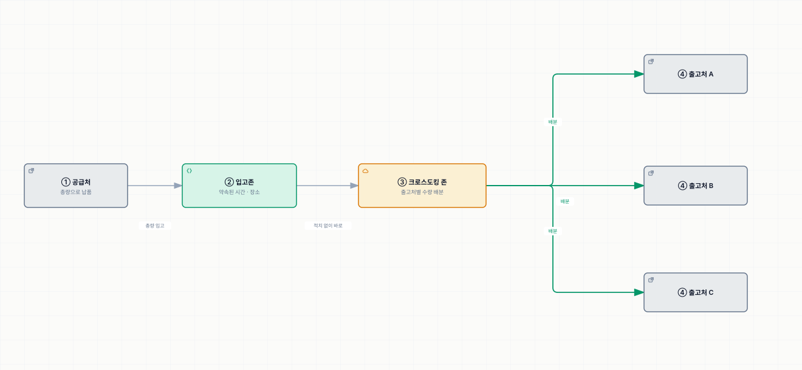
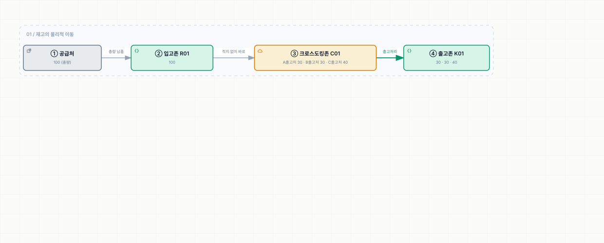

# 총량입고 / 분류 (Flow-thru)

> [크로스도킹](./README.md)

## 빠른 복습

- **가장 일반적인 방식**이다.
- 공급처는 요청한 수량을 **약속된 시간, 장소에 총량으로 입고**한다.
- 창고의 **크로스도킹 존에서 실제 출고처별로 수량을 배분**하여 출고 처리한다.
- 분배는 수작업보다 **DAS(Digital Assorting System)나 자동분류기(Auto Sorter)** 를 도입해 **작업 생산성과 정확도**를 높인다.

## 어떻게 돌아가는가

공급처에서는 요청한 수량을 **약속된 시간, 장소에 입고**하면, **크로스도킹 존에서 실제 출고처별로 수량을 배분하여 출고 처리**한다.

> 이 도식의 실선은 공급처부터 출고처까지 이어지는 **재고 실물 이동**을 나타낸다.

*총량으로 받아 창고에서 나눈다 — 나누는 부담이 창고에 있다*

[사전분류입고](./1-사전분류입고.md)와 정확히 반대다. 분류 부담을 **창고가 지는 대신**, 물량이 부족해도 **그 자리에서 배분을 조정**할 수 있다.

## 운영 예시

[기본 예시](./README.md#운영-예시로-보는-기본-흐름)가 곧 이 방식의 예시다. 가장 일반적인 방식이기 때문이다.

**현상**

> A~C출고처에 **100개의 출고 요청** (크로스도킹)
> 공급처에 100개 입고요청처리

**결과**

> 공급처에서 100개를 납품 (입고존에 100개)
> **크로스도킹존에서 출고처별 배분**
> 배분된 수량을 출고존으로 이동 (출고처리)

*원서 [그림 7-6] 총량입고분류 운영 예시*

[사전분류입고](./1-사전분류입고.md#운영-예시)와 비교하면 **총량 100이 크로스도킹존에서 30·30·40으로 갈라지는 것**이 유일한 차이다. 그 갈라짐이 창고의 작업량이다.

## 분배는 장비로 한다

입고된 크로스도킹 물량은 **작업자에 의해 수작업으로 분배하기보다** 다음 장비를 도입한다.

<table>
<thead>
<tr>
<th style="text-align:center; white-space:nowrap">장비</th>
<th style="text-align:center; white-space:nowrap">풀 네임</th>
</tr>
</thead>
<tbody>
<tr>
<td style="text-align:center; white-space:nowrap"><b>DAS</b></td>
<td style="text-align:left; white-space:nowrap">Digital Assorting System</td>
</tr>
<tr>
<td style="text-align:center; white-space:nowrap"><b>자동분류기</b></td>
<td style="text-align:left; white-space:nowrap">Auto Sorter</td>
</tr>
</tbody>
</table>

목적은 두 가지다. **작업 생산성**과 **정확도** 향상.

왜 장비가 필요한지는 이 방식의 성격에서 나온다. 크로스도킹은 **당일 입고·당일 출고**라 분배에 쓸 시간이 짧고, 여러 출고처로 동시에 나눠야 한다. 수작업으로는 속도도 정확도도 버티기 어렵다.

> DAS는 [피킹 자동화](../05-출고-프로세스/6-피킹.md#자동화)에서도 같은 이름으로 등장한다. 나눠 담는 작업이라는 성격이 같기 때문이다.

## 함께 읽기

- 분류를 공급처가 맡는 방식은 [사전분류입고](./1-사전분류입고.md)다.
- 여기에 보관재고를 더한 방식은 [부족분 재고배분](./3-부족분-재고배분.md)이다.
- 크로스도킹 물동량이 대기·작업하는 공간은 [분배존](../02-wms-주요-프로세스/1-로케이션과-존.md#주요-존의-종류)이다.
