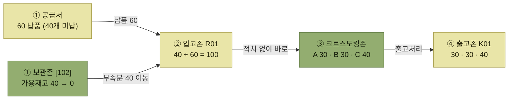

# 부족분 재고배분 (Merge-in-transit)

> [크로스도킹](./README.md)

> [!WARNING]
> **용어 주의**
>
> `Merge-in-transit`은 이 장의 원서 표기다. 일반적인 물류 용례에서는 [2장의 설명](../02-wms-주요-프로세스/8-크로스도킹.md)처럼 **서로 다른 공급처의 구성품을 운송 중 합류 지점에서 주문 단위로 병합하는 방식**을 뜻한다. 이 문서에서는 그 개념과 구분하기 위해 **부족분 재고배분**이라는 본문 명칭을 사용한다.

## 빠른 복습

- **총량입고분류 방식에 보관재고를 일부 활용**하는 방식이다.
- 두 상황에서 보관존 재고를 꺼내 쓴다. **공급처가 부족하게 입고**했거나, **긴급한 출고 요청**이 발생한 경우.
- 대부분이 크로스도킹으로 나가는 창고에서도, **보관 재고를 따로 출고하지 않고 크로스도킹 작업 때 함께 배분**하면 더 효율적이다.
- 기존 크로스도킹에서 어려운 **긴급 대응이 용이**하다는 것이 이 방식의 장점이다.
- 분배는 [총량입고분류](./2-총량입고-분류.md)와 마찬가지로 **DAS·자동분류기**를 쓴다.

## 어떤 방식인가

**"총량입고분류" 방식에 보관재고를 일부 활용**하는 방식이다.

공급처에서 크로스도킹 물량이 **부족하게 입고되거나**, **긴급한 출고 요청 건이 발생한 경우** 보관 존에 있는 재고를 사용하여 배분 작업을 한다.

## 크로스도킹 작업 때 보관 재고도 함께 배분한다

원서가 짚는 실무 포인트가 하나 있다.

> 대부분의 제품이 크로스도킹 방식으로 출고되는 경우에도, 보관 로케이션을 일반적인 방법으로 출고 처리하지 않고 **크로스도킹 작업 시에 보관 제품들도 함께 배분하여 출고 처리하면 더 효율적**이다.

즉 보관 재고를 **별도의 출고 프로세스([할당](../05-출고-프로세스/4-할당-출고지시.md) → [피킹](../05-출고-프로세스/6-피킹.md))** 로 빼지 말고, 크로스도킹 분배 작업에 얹어서 한 번에 처리하라는 뜻이다. 같은 출고처로 갈 물건을 두 경로로 나눠 처리하면 작업과 배송이 이중이 된다.

## 운영 예시

[앞의 예시들](./README.md#운영-예시로-보는-기본-흐름)과 같은 상황인데, **공급처가 60개만 납품한 경우**다.

**현상**

> A~C출고처에 **100개의 출고 요청** (크로스도킹)
> 공급처에 **100개 입고요청처리**

**결과**

> 공급처에서 **60개를 납품** (**40개 미납**)
> **보관존 [102]로케이션에서 40개를 이동**
> 크로스도킹존에서 출고처별 배분
> 배분된 수량을 출고존으로 이동 (출고처리)



> 이 도식의 실선은 공급처·보관존에서 출고존까지 이어지는 **재고 실물 이동**을 나타낸다.

*원서 [그림 7-7] 부족분 재고배분 운영 예시*

계산이 딱 맞는다. **납품 60 + 보관재고 40 = 요청 100.** 보관존 102 로케이션이 40에서 0이 되면서 그 40개가 크로스도킹 물량에 합류한다.

앞의 두 방식이라면 40개가 비었으니 **출고처별 우선순위로 깎아야** 했다. 이 예시에서는 **가용 보관재고 40개로 메워서 요청 전량을 채운다.**

## 보관재고로도 부족하면

보관존에 수량이 표시되어 있어도 보류·할당·작업 중인 재고는 사용할 수 없다. 부족분을 채울 때는 **가용재고만** 계산한다.

```text
보충수량 = min(입고 부족수량, 가용 보관재고)
배분 가능 수량 = 실제 입고수량 + 보충수량
미충족 수량 = max(0, 출고 요청수량 − 배분 가능 수량)
```

1. 실제 입고수량을 출고 요청수량과 비교한다.
2. 부족분과 가용 보관재고 중 작은 수량만 크로스도킹 물량에 합친다.
3. 미충족 수량이 0이면 전량을 배분한다.
4. 미충족 수량이 남으면 [출고가능 체크의 배분 정책](../05-출고-프로세스/2-출고가능-체크.md#배분-정책-여섯-가지)에 따라 출고처별 수량을 줄인다.

따라서 부족분 재고배분은 **항상 요청 전량을 보장하는 방식이 아니다.** 공급처 실입고와 가용 보관재고의 합이 요청량 이상일 때만 전량을 채울 수 있다.

## 그래서 긴급 대응이 된다

부족분 재고배분 방식은 **기존 크로스도킹 방식에서 다소 어려울 수 있는 긴급 대응이 용이**하다는 장점이 있다.

[크로스도킹의 약점](./README.md#크로스도킹과-재고보관-비교)이 "긴급대응 어려움"이었다는 점을 떠올리면, 이 방식이 왜 존재하는지가 분명해진다. **재고를 조금 쥐고 있는 대가로 그 약점을 산다.**

<div class="tbl" style="overflow-x:auto">
<table>
<thead>
<tr>
<th style="text-align:center; white-space:nowrap"></th>
<th style="text-align:center; white-space:nowrap">순수 크로스도킹</th>
<th style="text-align:center; white-space:nowrap">부족분 재고배분</th>
<th style="text-align:center; white-space:nowrap">재고보관</th>
</tr>
</thead>
<tbody>
<tr>
<td style="text-align:center; white-space:nowrap">보관 재고</td>
<td style="text-align:center; white-space:nowrap">없음</td>
<td style="text-align:center; white-space:nowrap"><b>일정 수준</b></td>
<td style="text-align:center; white-space:nowrap">많음</td>
</tr>
<tr>
<td style="text-align:center; white-space:nowrap">긴급 대응</td>
<td style="text-align:center; white-space:nowrap">어려움</td>
<td style="text-align:center; white-space:nowrap"><b>용이</b></td>
<td style="text-align:center; white-space:nowrap">가능</td>
</tr>
<tr>
<td style="text-align:center; white-space:nowrap">재고비용</td>
<td style="text-align:center; white-space:nowrap">낮음</td>
<td style="text-align:center; white-space:nowrap"><b>중간</b></td>
<td style="text-align:center; white-space:nowrap">높음</td>
</tr>
</tbody>
</table>
</div>

**세 방식 중 유일하게 중간 지점**에 있다. 순수한 무재고 방식과 달리 가용 보관재고를 완충재로 활용한다.

## 분배는 장비로 한다

총량입고분류와 마찬가지로 작업자에 의해 수작업으로 분배하기보다 **DAS 장비(Digital Assorting System)** 나 **자동분류기(Auto Sorter)** 장비를 도입하여, **작업 생산성과 정확도 향상**을 꾀할 수 있다.

## 함께 읽기

- 이 방식의 바탕이 되는 방식은 [총량입고 / 분류](./2-총량입고-분류.md)다.
- 보관 재고를 정규 경로로 출고하는 흐름은 [출고 프로세스](../05-출고-프로세스/README.md)에 있다.
- 부족할 때 깎아서 배분하는 정책은 [배분 정책](../05-출고-프로세스/2-출고가능-체크.md#배분-정책-여섯-가지)을 참고한다.
