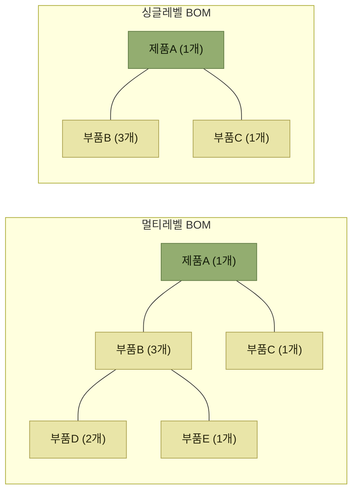

# 부가서비스와 BOM

> [부가서비스](./README.md)

## 빠른 복습
- 창고는 **코스트센터**로 인식되었으나, **유통가공을 통해 부가가치를 창출하고 SCM 전체를 최적화**하는 역할로 옮겨왔다.
- 부가서비스는 **11가지**로 정리되며, 재고를 직접 바꾸는 것은 **조립 · 해체**다.
- **BOM**은 **Bill of Materials**의 약자로 **"부품목록"** 이다. **제품을 구성하는 모든 부품의 종류와 수량, 품질, 위치 등의 정보를 포함**한다.
- BOM은 **싱글레벨**과 **멀티레벨**로 구성할 수 있다. 싱글레벨은 **단순하고 관리가 쉽고**, 멀티레벨은 **세부적이고 명확하지만 관리와 구현이 어렵다.**
- **BOM은 조립이나 해체 작업 시 필수적으로 활용되는 기준정보 항목**이다.

## 주요 부가서비스 11가지

<table>
<thead>
<tr>
<th style="text-align:center; white-space:nowrap">순서</th>
<th style="text-align:center; white-space:nowrap">프로세스</th>
<th style="text-align:center; white-space:nowrap">내용</th>
</tr>
</thead>
<tbody>
<tr>
<td style="text-align:center; white-space:nowrap"><b>1</b></td>
<td style="text-align:center; white-space:nowrap"><b>조립</b> (Kitting, Assemble)</td>
<td style="text-align:left">부품을 조립하여 <b>완제품 또는 세트 형태의 제품 생산</b></td>
</tr>
<tr>
<td style="text-align:center; white-space:nowrap"><b>2</b></td>
<td style="text-align:center; white-space:nowrap"><b>해체</b> (Unkitting, Disassemble)</td>
<td style="text-align:left">완제품 또는 세트제품을 해체하여 <b>단위 부분품으로 전환</b></td>
</tr>
<tr>
<td style="text-align:center; white-space:nowrap">3</td>
<td style="text-align:center; white-space:nowrap">라벨링 (Labeling)</td>
<td style="text-align:left">제품 또는 박스 등에 라벨을 제작 부착</td>
</tr>
<tr>
<td style="text-align:center; white-space:nowrap">4</td>
<td style="text-align:center; white-space:nowrap">포장 (Packing)</td>
<td style="text-align:left">고객이 요구하는 형태의 재포장 작업</td>
</tr>
<tr>
<td style="text-align:center; white-space:nowrap">5</td>
<td style="text-align:center; white-space:nowrap">품질검사 (Quality inspection)</td>
<td style="text-align:left">입출고 또는 보관된 외관, 성분 등 품질 검사 수행</td>
</tr>
<tr>
<td style="text-align:center; white-space:nowrap">6</td>
<td style="text-align:center; white-space:nowrap">테스트 (Functional Testing)</td>
<td style="text-align:left">입출고 또는 보관된 제품의 기능 테스트 수행</td>
</tr>
<tr>
<td style="text-align:center; white-space:nowrap">7</td>
<td style="text-align:center; white-space:nowrap">설치 (Installation)</td>
<td style="text-align:left">가전제품, 가구 등의 설치 서비스 관리</td>
</tr>
<tr>
<td style="text-align:center; white-space:nowrap">8</td>
<td style="text-align:center; white-space:nowrap">회수, 재활용</td>
<td style="text-align:left">폐제품 회수, 재활용 관리, 기존제품 재가공 등</td>
</tr>
<tr>
<td style="text-align:center; white-space:nowrap">9</td>
<td style="text-align:center; white-space:nowrap">주문접수</td>
<td style="text-align:left">고객사(화주)를 대신하여 주문 접수 입력 대행</td>
</tr>
<tr>
<td style="text-align:center; white-space:nowrap">10</td>
<td style="text-align:center; white-space:nowrap">콜센터</td>
<td style="text-align:left">고객의 문의사항, AS 접수 등을 대행하고 관리</td>
</tr>
<tr>
<td style="text-align:center; white-space:nowrap">11</td>
<td style="text-align:center; white-space:nowrap">수금관리</td>
<td style="text-align:left">물류업무 외에 대금을 수납하거나 청구</td>
</tr>
</tbody>
</table>

*원서 [그림 8-2] 주요 부가 서비스 — 굵게 표시한 1·2번이 원서가 색으로 강조한 두 항목이다*

표를 읽는 법. 11가지가 성격상 세 묶음으로 갈린다.

- **재고 자체를 바꾸는 작업** (1~2) — 조립·해체. 재고가 **생성되고 소멸**하므로 BOM과 전표가 필요하다.
- **재고에 손을 대지만 수량은 그대로인 작업** (3~8) — 라벨링, 포장, 검사, 테스트, 설치, 회수·재활용.
- **재고를 다루지 않는 대행 업무** (9~11) — 주문접수, 콜센터, 수금관리.

[2장에서 "재고를 직접 다루는 것과 다루지 않는 것"으로 갈랐던 구분](../02-wms-주요-프로세스/6-부가서비스.md)이 여기서 11가지로 세분화된다.

## BOM — 부품목록

> **부가서비스(유통가공)에 있어 BOM의 개념을 이해하는 것이 중요하다.** BOM은 **"Bill of Materials"** 의 약자로 **"부품목록"** 을 뜻한다. **제품을 구성하는 모든 부품의 종류와 수량, 품질, 위치 등의 정보를 포함**한다.

BOM은 두 가지 형태로 구성할 수 있다.

*[그림 8-3] BOM 구성 예시 — 멀티레벨은 부품B가 다시 부품D·E로 쪼개진다*

| | 싱글레벨 BOM | 멀티레벨 BOM |
| --- | --- | --- |
| **구성** | 제품A 1개 = 부품B 3개 + 부품C 1개 | **1단계**: 제품A 1개 = 부품B 3개 + 부품C 1개 **2단계**: 부품B 1개 = 부품D 2개 + 부품E 1개 |
| **특징** | **구성이 단순하고 관리 용이** | **제품의 구성 형태를 세부적이고 명확히 표현** · **다소 관리와 구현이 어려움** |

*원서 [그림 8-3]의 아래 두 칸을 표로 옮겼다*

표를 읽는 법. 멀티레벨의 특징 칸에 **장점과 단점이 함께** 적혀 있는 것이 요점이다. **세부적으로 표현할 수 있다는 것과 관리가 어렵다는 것은 같은 성질**이며, 단계가 늘어날수록 조립·해체 작업 지시도 단계별로 갈라진다.

> **BOM은 조립이나 해체 작업 시 필수적으로 활용되는 기준정보 항목**이다.

기준정보라는 점을 눈여겨본다. [제품 기준정보](../03-기준정보/4-제품관련-기준정보.md)가 "무엇을 관리할 것인가"를 정했다면, BOM은 **"그 제품이 무엇으로 이루어졌는가"** 를 정한다. 그래서 조립·해체 프로세스의 **1단계가 언제나 BOM 등록**이다.

## 함께 읽기

- [조립 — BOM을 기준으로 완성품을 만드는 7단계](./2-조립.md)
- [해체 — 같은 BOM을 거꾸로 읽는 작업](./3-해체.md)
- [제품관련 기준정보 — BOM이 얹히는 바탕](../03-기준정보/4-제품관련-기준정보.md)
