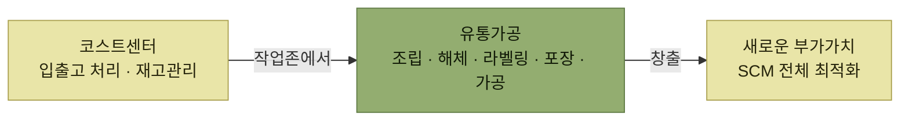

# 부가서비스

> [WMS 원리와 이해](../README.md)

## 창고는 왜 비용만 쓰는 곳이 아닌가

**창고는 빠른 입출고 처리, 정확한 재고관리를 수행하며 비용을 지출하는 코스트센터로 인식되었다.** 그런데 최근의 창고는 다른 일도 한다.

> 점차 창고 내에서 **유통가공(조립, 해체, 라벨링, 포장, 가공 등)의 업무를 통해 새로운 부가가치를 창출**하고 **SCM 관점에서 전체적으로 최적화하는 데 많은 역할**을 하고 있다.

*부가서비스가 창고의 성격을 바꾼다. 비용을 쓰는 곳에서 가치를 만드는 곳으로*

원서 [그림 8-1] 창고 입출고 연관도는 [1장](../01-wms-개요/README.md)·[2장](../02-wms-주요-프로세스/1-로케이션과-존.md)에서 본 그 그림인데, 8장에서는 **작업존(Work Zone)에 붉은 점선이 둘러쳐져** 있다. 이 장이 다루는 곳이 **입고존과 출고존 사이, 보관존 아래에 있는 작업존**이라는 표시다. 그림 아래 표의 **Advanced 칸에 `VAS`(부가서비스)** 가 적혀 있는 것도 같은 이야기다.

## 이 장에서 확인할 것

- 부가서비스에는 어떤 것들이 있는가 (11가지)
- **BOM**이 무엇이고 왜 조립·해체의 필수 기준정보인가
- 조립하면 재고가 어떻게 움직이는가 — **완성품 생성(+), 부품 감소(−)**
- 해체는 그 반대로 어떻게 움직이는가

원서는 **이 책에서는 주로 조립과 해체와 관련되어 집중적으로 설명할 것**이라고 밝히고 있어, 이 장의 두 절도 그 둘이다.

## 목차

- [부가서비스와 BOM](./1-부가서비스와-BOM.md)
- [조립 (Kitting, Assemble)](./2-조립.md)
- [해체 (Unkitting, Disassemble)](./3-해체.md)

## 함께 읽기

- [2장의 부가서비스](../02-wms-주요-프로세스/6-부가서비스.md) — 전체 프로세스 안에서의 위치를 먼저 정리했다. 8장은 조립·해체를 **작업 단위와 재고 증감까지** 펼친다.
- 작업존의 정의는 [주요 존의 종류](../02-wms-주요-프로세스/1-로케이션과-존.md#주요-존의-종류)에 있다.
- 조립·해체는 결국 **재고를 만들고 없애는 일**이므로 [6장 재고관리](../06-재고관리/README.md)와 함께 읽으면 좋다.
