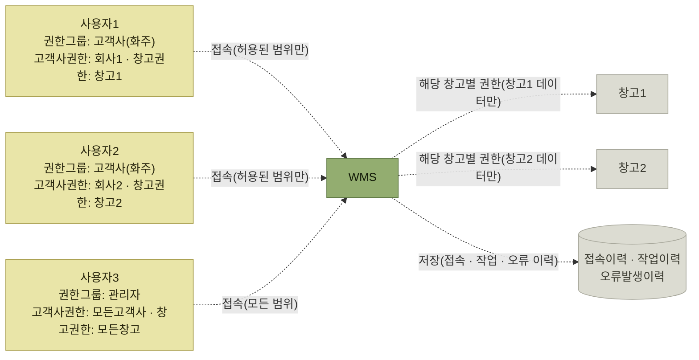

# 권한보안관리

> [WMS 원리와 이해](../README.md)

## 왜 창고 시스템에 보안이 문제가 되는가

**관리자, 작업자, 고객사(화주) 등 다양한 이해 관계자들이 WMS 시스템에 접속하여 필요한 작업을 수행**한다. 여러 사람이 하나의 시스템을 함께 쓴다는 것이 이 장의 출발점이다.

> WMS에는 창고에서 일어나는 **제품과 출고처(배송처)별 수량과 금액, 공급사별 입고현황** 등 **기업 입장에서 매우 중요도가 높은 자료들이 많이 포함**되어 있기 때문에 **데이터에 대한 보안관리가 매우 중요**하다.

## 인증과 인가를 먼저 구분한다

- **인증(Authentication)**은 아이디·비밀번호·OTP 등으로 **접속자가 누구인지 확인**하는 과정이다.
- **인가(Authorization)**는 인증된 사용자가 **어느 창고·프로그램·고객사·제품에 어떤 작업을 할 수 있는지 검사**하는 과정이다.

이 장에서 말하는 사용자 아이디와 추가 인증은 인증에, 창고·프로그램·고객사별 권한은 인가에 해당한다. 사용자그룹은 비슷한 업무를 수행하는 사람에게 권한 묶음을 재사용하는 방식이다. 권한은 업무에 필요한 최소 범위만 부여하고, 명시적으로 허용되지 않은 요청은 기본적으로 거부하는 것이 안전하다. 이는 OWASP의 [최소 권한과 기본 거부 원칙](https://cheatsheetseries.owasp.org/cheatsheets/Authorization_Cheat_Sheet.html#enforce-least-privileges)과도 맞닿아 있다.

*[그림 9-1] 권한관리 개념도 — 같은 WMS에 접속해도 사용자1은 창고1만, 사용자2는 창고2만 볼 수 있다. 관리자만 전체를 본다*

권한관리의 요점이 이 그림에 다 있다. **누가 접속했는지가 아니라 "무엇까지 볼 수 있는지"를 시스템이 정해둔다**는 것, 그리고 **그 접속과 작업이 전부 이력으로 남는다**는 것이다.

그림은 차이를 설명하기 위해 관리자에게 모든 권한을 부여했지만, 실제 운영에서는 관리자도 업무에 필요한 범위로 제한한다. 전체 권한이 필요한 관리 작업은 일반 업무 계정과 분리한 별도 특권 계정으로 수행하고 그 사용 이력을 남기는 편이 안전하다.

## 이 장에서 확인할 것

- 권한은 **무엇에 대해**, **어디까지** 부여하는가
- 사용자마다 권한을 주는 것과 **사용자그룹**에 주는 것은 어떻게 다른가
- 남긴 이력을 **무엇에 쓰는가** — 접근 통제 검증 · 작업자별 실적분석 · 오류 원인 규명

## 목차

- [권한관리 개요](./1-권한관리-개요.md)
- [사용자 및 그룹관리](./2-사용자-및-그룹관리.md)
- [보안감사](./3-보안감사.md)

## 함께 읽기

- 권한의 대상이 되는 **창고 · 고객사(화주) · 제품**은 모두 [3장 기준정보](../03-기준정보/README.md)에서 정의한 코드들이다.
- **여러 고객사를 한 WMS에서 서비스한다**는 전제는 [고객사 기준정보](../03-기준정보/3-거래처관련-기준정보.md#가-고객사)에서 나왔다. 그 전제가 곧 이 장의 필요성이 된다.
- 여러 화주에게 정보를 공유하는 [가시성](../11-가시성/1-가시성-개요.md#왜-지금-더-중요해졌는가)은 각 사용자가 허용된 고객사·창고 데이터만 보도록 하는 이 장의 권한 통제를 전제로 한다.
