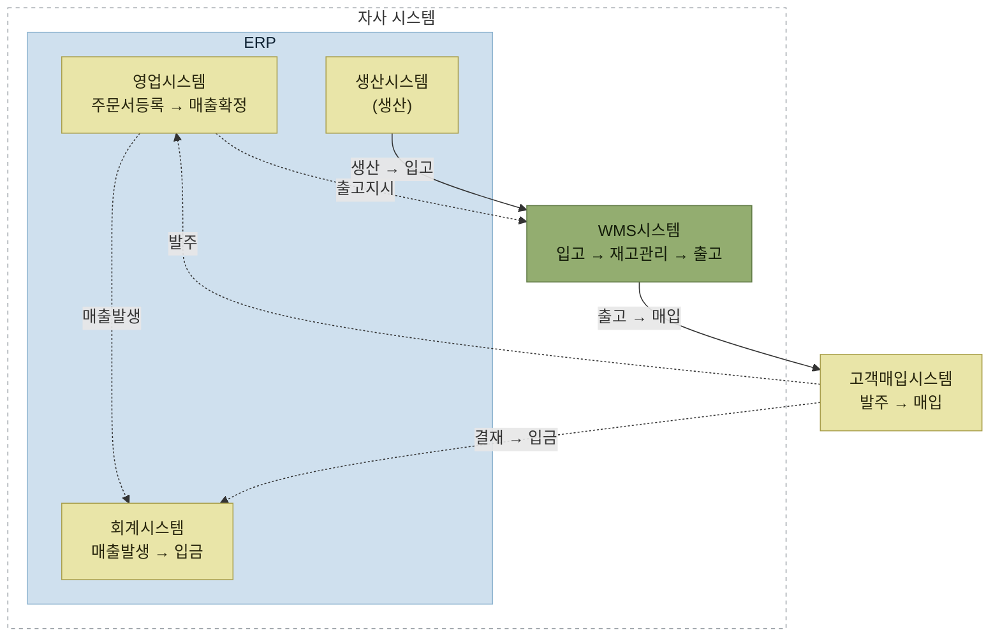

# WMS 시스템이란

## 빠른 복습

- WMS는 창고관리를 체계적이고 효율적으로 관리하기 위한 시스템이다.
- 넓은 의미로는 수배송관리·주문관리·실적관리까지 창고와 연관된 모든 물류기능을 포함하지만, **엄밀히는 창고 내에서 일어나는 재고의 흐름과 작업자의 업무를 지원하는 시스템**이다.
- 기본 목적은 하나로 압축된다. 입출고되는 재고를 **정확히** 관리하는 것.
- WMS는 재고 최적화와 맞물려 있어 독립적으로 운영되기보다 ERP·생산·영업·회계 시스템과 연관이 깊다.
- 정보와 재고 변동이 실시간으로 공유되어야 하므로 **시스템 간 인터페이스가 필수**다.

## 정의와 범위

WMS(Warehouse Management System)는 창고관리를 체계적이고 효율적으로 관리하기 위한 시스템이다.

같은 이름을 쓰면서도 범위가 두 가지로 나뉜다.

- **넓은 의미** — 수배송관리, 주문관리, 실적관리 등 창고와 연관된 모든 물류기능이 모두 포함된다.
- **엄밀한 의미** — 창고 내에서 일어나는 재고의 흐름과 작업자들의 업무를 지원하기 위한 시스템이다.

## 기본 목적

WMS의 기본적인 목적은 물류센터 또는 창고에서 근무하는 작업자, 또는 관리자가 입출고되는 재고에 대해 **정확히 관리**하는 데 있다.

이 목적을 시간 순서로 풀어 쓰면 세 단계다.

1. **입고** — 창고에 재고를 관리하고 출고하기 쉽도록 입고한다.
2. **보관** — 입고된 재고가 훼손·분실되거나 방치되지 않고, 출고가 원활하게 이루어질 수 있도록 최적의 상태로 관리한다.
3. **출고** — 원하는 시점에 원하는 재고를 빠르고 정확하게 출고시킨다.

WMS는 이 일련의 과정을 실행하고 관리할 수 있어야 한다.

## WMS는 혼자 돌지 않는다

WMS는 재고 최적화와 관련되어 있기 때문에 독립적으로 운영되기보다는 ERP 같은 타 시스템과 연관이 깊다. A기업이 제품을 제조하는 상황으로 따라가 보자.

**① 생산 → WMS**
공장에서 운영되고 있는 생산시스템에서 생산된 정보를 WMS가 **입고정보**로 받아야 한다.

**② WMS → 회계·영업**
입고된 정보는 재고로 관리되고, 회계정보시스템과 영업시스템에 **판매가 가능한 재고가 몇 개인지**가 공유되어야 한다.

**③ 영업 → WMS**
영업시스템에서 영업활동의 결과로 주문정보를 입력하면, 그 정보는 WMS의 **출고예정 정보**로 전송되어 WMS에서 출고처리 작업이 수행된다.

**④ WMS → 회계·영업·생산**
출고 완료된 결과는 회계·영업·생산시스템에 다시 **피드백**된다.

거래 관점까지 포함해 전체를 한 장에 놓으면 이렇게 된다. 실선은 재고가 실제로 움직이는 흐름이고, 점선은 정보만 오가는 흐름이다.

*[그림 1-4] ERP와 WMS 시스템 연계*

WMS는 생산·회계·영업시스템과 밀접한 관계를 가지고 정보와 재고의 변동이 실시간으로 공유되어야 한다. 그래서 시스템 간 **인터페이스가 필수**다.

## 함께 읽기

- ERP와 물류시스템의 역할 분담은 [ERP와 물류시스템](./1-ERP와-물류시스템.md)을 참고한다.
