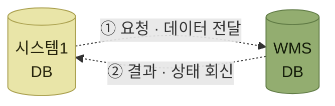
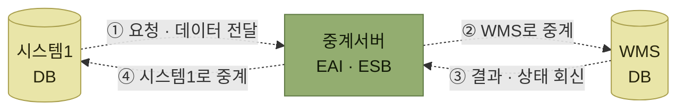

# 인터페이스 방식

> [인터페이스](./README.md)

## 빠른 복습
- 연결 방식은 **직접연결**과 **솔루션 활용(간접 중계)** 둘로 나뉜다.
- 고르는 기준은 **인터페이스할 데이터의 양과 처리 속도, 시스템의 종류, 구현비용이나 유지보수비용**을 종합적으로 고려하는 것이다.
- **직접연결**은 구현이 간단하고 저렴하고 빠르지만, **데이터 양·복잡도가 크거나 다수 시스템과 연결하면 복잡도가 급격히 올라간다.**
- **솔루션 활용**은 **EAI · ESB** 같은 전문 솔루션이 중계한다. 확장성과 신뢰성이 높지만 **구현이 복잡하고 비용이 높고 처리속도가 느릴 수 있다.**
- 실제 데이터 교환 방법은 **DB2DB · XML · EDI · FTP · WebService · File upload** 등 다양하다.

## 두 가지 연결 방식

> 시스템 인터페이스 연결에는 **다른 시스템과 직접 인터페이스 하는 방식**과 **전문솔루션을 활용한 방식**으로 구분할 수 있다. **인터페이스를 해야 할 데이터의 양과 처리 속도, 시스템의 종류, 구현비용이나 유지보수비용 등을 종합적으로 고려하여 적절한 인터페이스 방식을 결정**하면 된다.

<table>
<thead>
<tr>
<th style="text-align:center; white-space:nowrap">구분</th>
<th style="text-align:center; white-space:nowrap">직접연결</th>
<th style="text-align:center; white-space:nowrap">솔루션활용방식 (간접 중계 연결)</th>
</tr>
</thead>
<tbody>
<tr>
<td style="text-align:center; white-space:nowrap"><b>정의</b></td>
<td style="text-align:left">WMS와 다른 시스템을 <b>직접 연결하여 데이터를 교환</b>하는 방식</td>
<td style="text-align:left"><b>EAI</b>(Enterprise Application Integration) 등 <b>전문 솔루션을 사용하여</b> WMS와 다른 시스템 간의 데이터를 교환하는 방식</td>
</tr>
<tr>
<td style="text-align:center; white-space:nowrap"><b>특징 (장점)</b></td>
<td style="text-align:left">구현이 간단하다 비용이 저렴하다 데이터 처리속도가 빠르다</td>
<td style="text-align:left">데이터 양이나 복잡도가 높아도 처리가 용이함 시스템 확장이 쉽다 다수 시스템과 인터페이스 용이 데이터의 신뢰성이 높음</td>
</tr>
<tr>
<td style="text-align:center; white-space:nowrap"><b>단점</b></td>
<td style="text-align:left">데이터 양이나 복잡도가 높으면 어려움 시스템 확장이 어렵다 다수 시스템 인터페이스 시 복잡도 높음</td>
<td style="text-align:left">구현이 복잡하다 비용이 상대적으로 높다 데이터 처리속도가 상대적으로 느릴 수 있다</td>
</tr>
</tbody>
</table>

*원서 [그림 10-2] WMS 인터페이스 방식 비교*

표를 읽는 법. 두 열의 **장점과 단점이 서로 대비된다.** 직접연결은 연결 대상이 적을 때 단순하게 시작할 수 있고, 솔루션 방식은 연결 대상이 늘어날 때 통합 관리에 유리하다. 다만 표의 평가는 일반적인 경향이다. 실제 비용과 처리속도는 **데이터 양, 네트워크, 동기·비동기 처리, 변환 규칙, 재시도·기록 요건**에 따라 달라진다.

## 가. 직접연결

> **WMS 시스템과 인터페이스 해야 할 시스템이 중간 매개체 없이 직접적으로 연결하여 상호 데이터를 주고받는 방식**이다.

> 이 방식은 **연계해야 할 시스템만을 고려하면 되기 때문에 구현이 간단하고 비용이 저렴한 장점**이 있지만, **여러 시스템과 동시에 인터페이스할 경우에는 복잡도가 높아지는 단점**이 있다.

*[그림 10-4] 직접 연계 인터페이스 방식 — 원서는 양방향 점선 화살표로 그렸다*

## 나. 솔루션 연계 방식

> **WMS 시스템과 인터페이스 해야 할 시스템 중간에 EAI**(Enterprise Application Integration)**서버나 ESB**(Enterprise Service Bus)**와 같은 전문솔루션이 중계를 해 주는 방식**이다.

> 이 방식은 **비용이나 복잡도는 다소 높을 수 있으나 오류가 발생될 경우 대처가 비교적 용이하고 여러 시스템과의 인터페이스를 통합할 수 있는 확장성이 높은 장점**이 있다.

*[그림 10-5] 솔루션 연계 인터페이스 방식 — 원서는 양쪽 모두 양방향 점선이다. 가운데 중계서버가 이 방식의 전부다*

**"오류가 발생될 경우 대처가 비교적 용이하다"** 는 대목이 중계 방식의 실질적 이득이다. 중간에 서버가 하나 있으면 **주고받은 내용이 그 자리에 남고, 재전송도 그 자리에서 할 수 있다.** 반대로 직접연결에서는 **상대 시스템이 받았는지를 상대에게 물어봐야** 한다.

원서의 EAI·ESB 구분은 중앙 중계가 통합의 중심이던 시기의 설명이다. 현재는 요구사항에 따라 **REST API, API 게이트웨이, 메시지 브로커, iPaaS, ESB** 등을 조합한다. 이때 REST·SOAP은 시스템이 통신하는 방식이고, ESB는 라우팅·변환·오케스트레이션을 담당하는 기반이므로 같은 수준의 선택지는 아니다. 이러한 변화는 [SOA·ESB에서 REST API와 메시징으로 확장된 통합 방식](../../아키텍트-첫걸음/1-아키텍트가-하는-일/5-아키텍처-설계의-과거와-현재.md#선택지가-늘었다)과 함께 보면 이해하기 쉽다.

## 실제 데이터 교환 방법

> **실제 데이터를 교환하는 방식도 DB를 기반으로 상호 데이터를 교환하는 방식부터 XML, EDI, FTP, WebService 방식 그리고 수동으로 사용자가 직접 파일을 업로드 하는 방식까지 다양한 형태로 이루어진다.**

<table>
<thead>
<tr>
<th style="text-align:center; white-space:nowrap">방법</th>
<th style="text-align:center; white-space:nowrap">세부설명</th>
</tr>
</thead>
<tbody>
<tr>
<td style="text-align:center; white-space:nowrap"><b>DB2DB</b></td>
<td style="text-align:left">오픈 서버 상의 DB에 대한 <b>Link를 통한 Interface</b></td>
</tr>
<tr>
<td style="text-align:center; white-space:nowrap"><b>XML</b></td>
<td style="text-align:left">오픈 서버를 경유한 <b>XML 양식의 Interface</b></td>
</tr>
<tr>
<td style="text-align:center; white-space:nowrap"><b>EDI</b></td>
<td style="text-align:left"><b>상호 정의된 표준문서를 기반</b>으로 전자문서 교환</td>
</tr>
<tr>
<td style="text-align:center; white-space:nowrap"><b>FTP</b></td>
<td style="text-align:left">FTP를 통한 <b>Flat File Interface</b></td>
</tr>
<tr>
<td style="text-align:center; white-space:nowrap"><b>WebService</b></td>
<td style="text-align:left">웹 환경(SOAP, AJAX)에서의 정보 Interface</td>
</tr>
<tr>
<td style="text-align:center; white-space:nowrap"><b>File upload</b></td>
<td style="text-align:left">담당자가 <b>엑셀파일 또는 텍스트 파일을 업로드하여 정보를 전송</b></td>
</tr>
</tbody>
</table>

*원서 [그림 10-3] 인터페이스 데이터 교환 방법*

표를 읽는 법. 아래로 갈수록 **자동화 수준이 낮아진다.** 맨 아래 **File upload는 사람이 직접 파일을 올리는 방식**이라 엄밀히 말해 자동 인터페이스가 아니다. 그럼에도 목록에 들어 있는 이유는 **상대가 시스템을 갖추지 못한 경우에도 데이터는 오가야 하기 때문**이다. [4절의 "수기처리"](./4-인터페이스-검토사항.md#가-수정-및-취소에-대한-검토)와 같은 성격의 현실적 타협이다.

여기서 **XML은 전송 방식이 아니라 데이터 형식**이고, AJAX는 브라우저에서 비동기 요청을 보내는 구현 기법이다. 실제 연계는 HTTP 같은 전송 수단 위에서 JSON·XML을 교환하는 API, SOAP 기반 웹 서비스, 파일 전송 등을 조합해 구성한다. 따라서 표는 서로 같은 층위의 기술 목록이라기보다 당시 현장에서 사용하던 교환 수단을 묶어 놓은 것으로 읽는다.

## 함께 읽기

- [인터페이스 정보 — 이 방식으로 실제 무엇을 주고받는지](./3-인터페이스-정보.md)
- [확장성 — EAI·ESB를 도입하는 이유가 다시 나온다](./4-인터페이스-검토사항.md#다-다양한-인터페이스-확장성)
