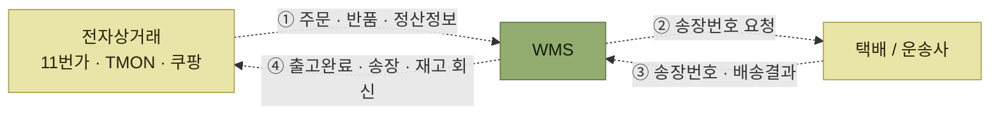
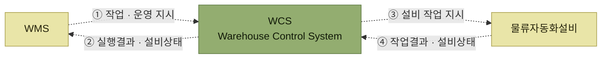

# 인터페이스 정보

> [인터페이스](./README.md)

## 빠른 복습
- **인터페이스하고자 하는 시스템의 특성이나 물류 환경에 따라 인터페이스 하는 대상이나 내용은 매우 다양**하다.
- **ERP·OMS**와는 **기준정보와 출고지시·입고지시 등 작업 요청정보를 수신받고, 처리 결과를 다시 송신**한다.
- **전자상거래**에서는 고객사를 대신해 **주문정보를 직접 접수**하고, 출고 후 **택배송장번호·재고정보 등을 회신**한다.
- **택배·운송사**와는 **송장번호를 요청해 받고, 배송결과를 회신**받는다.
- **물류자동화 설비**와의 인터페이스는 **데이터 형태는 단순하지만 빈번**해서 **실시간성과 정확성**이 필요하고, 그래서 **WCS**(Warehouse Control System)라는 전문 솔루션을 두는 경우가 많다.
- **WCS의 기능은 자원관리(모니터링·경로 추적)와 설비제어(직접 제어·작업 수행)** 둘이다.

## 가. ERP 및 OMS 인터페이스

> **ERP 시스템이나 OMS 시스템과의 인터페이스에서는 주로 기준정보와 출고지시, 입고지시 등의 작업을 수행하기 위한 요청정보를 수신받고, 이를 처리하고 그 결과를 다시 ERP 시스템이나 OMS 시스템으로 송신**한다.

| 방향 | 주고받는 데이터 |
| --- | --- |
| **ERP / OMS → WMS** | 1. **출고지시(주문)데이터** · 2. **회수(반품)요청 데이터** · 3. **입고예정 데이터** · 4. **기준정보**(거래처, 제품, BOM)**데이터** · 5. **크로스체크 정보** |
| **WMS → ERP / OMS** | 1. **입출고 실적 데이터** · 2. **재고정보 데이터** · 3. **작업 정보** · 4. **크로스체크 정보** |

*원서 [그림 10-6] ERP/OMS 인터페이스 예시*

표를 읽는 법. 양쪽 목록의 **마지막 항목이 똑같이 크로스체크 정보**라는 점이 요점이다(원서도 이 항목만 굵게 강조했다). **요청과 결과를 주고받는 것만으로는 두 시스템의 숫자가 맞는지 알 수 없으므로**, 서로 대조하기 위한 정보를 따로 교환한다. 이것이 [4절의 검증 체계](./4-인터페이스-검토사항.md#라-인터페이스-검증-체계)로 이어진다.

내용을 보면 **받는 것은 "무엇을 해달라"**(출고지시·입고예정·반품요청)**와 "무엇을 기준으로 하라"**(기준정보)이고, **주는 것은 "무엇을 했다"**(실적·작업 정보)**와 "지금 어떤 상태다"**(재고정보)다. 기준정보에 **BOM**이 들어 있는 것은 [8장의 조립·해체](../08-부가서비스/1-부가서비스와-BOM.md)를 WMS가 수행하기 때문이다.

## 나. 전자상거래 인터페이스

> **최근에는 고객사(화주)를 대신하여 수많은 전자상거래업체들과 직접 주문정보를 접수하고, 이를 기반으로 직접 출고처(배송처, 개인고객)에 직접 출고(택배) 후, 이와 관련된 각종 택배송장번호, 재고정보 등을 고객사(화주), 전자상거래 업체 등과 정보를 인터페이스 하는 경우가 많다.**

*[그림 10-7] 전자상거래, 운송사 인터페이스 예시 — WMS가 가운데에서 주문을 받아 배송까지 연결한다*

| 상대 | WMS가 받는 것 | WMS가 주는 것 |
| --- | --- | --- |
| **전자상거래** | 1. 출고지시(주문)데이터 · 2. 회수(반품)요청 데이터 · 3. **최종 정산정보** | 1. 출고 완료 · 2. **택배송장정보** · 3. 재고정보 |
| **택배 / 운송사** | 2. **송장번호** · 3. **배송결과** | 1. 출고지시(**송장번호**)요청 |

표를 읽는 법. **송장번호가 두 줄에 걸쳐 흐른다.** WMS가 **운송사에 송장번호를 요청해 받고**, 그것을 **전자상거래 업체에 택배송장정보로 전달**한다. 즉 WMS는 **주문과 배송 사이의 중개자** 역할을 한다. 여기에 **최종 정산정보**까지 오간다는 것은 인터페이스가 **물류 데이터에 그치지 않고 돈의 정산까지 닿는다**는 뜻이다.

## 다. 물류자동화 인터페이스

> **창고 내에 자동 창고, 소터, 로봇 등의 설비와 IOT**(Internet of Things) **등 다양한 설비와의 다양한 인터페이스를 진행**한다.

> **다른 인터페이스에 비해 물류자동화 설비와의 인터페이스는 주고받는 데이터의 형태는 단순하지만 빈번하게 데이터 처리를 해야 하기 때문에 실시간성, 정확성이 요구되기 때문에 WCS**(Warehouse Control System)**라는 별도의 전문화된 솔루션(모듈)을 도입 운영되는 경우가 많다.**

*[그림 10-8] 물류자동화 설비 인터페이스 예시 — WMS와 설비 사이에 WCS가 들어간다*

**형태는 단순한데 빈번하다**는 조건이 [앞 절의 방식 선택](./2-인터페이스-방식.md)에 그대로 대응한다. 단순·고빈도·실시간이 요구되면 **범용 중계 솔루션이 아니라 이 목적에 특화된 WCS**를 둔다는 것이다.

| 구분 | 내용 |
| --- | --- |
| **자원관리** | **창고 내 각종 물류설비**(자동창고, 컨베이어, 로봇, 지게차 등)**의 작업상태를 모니터링하고 이동경로 등을 추적 관리**한다 |
| **설비제어** | **창고 내 컨베이어, 로봇, 분류기 등 자동화 설비를 직접 제어하고 작업을 수행**한다. ※ **다양한 물류설비와의 인터페이스 표준 보유** |

*원서 [그림 10-9] WCS 주요 기능*

표를 읽는 법. 두 줄이 **보는 일과 시키는 일**로 갈린다. 그리고 아래 줄의 ※ 표시가 WCS를 도입하는 실질적 이유다 — **설비 제조사마다 다른 인터페이스를 WCS가 이미 표준으로 갖고 있기 때문**에, WMS는 설비 하나하나의 규격을 알 필요가 없어진다.

## 함께 읽기

- [인터페이스 검토사항 — 크로스체크 정보가 왜 필요한지](./4-인터페이스-검토사항.md)
- [물류자동화 및 설비 — WCS가 제어하는 현장 장비](../12-물류자동화-및-설비/README.md)
- [입고예정수신 — ERP에서 받은 입고예정 데이터가 쓰이는 자리](../04-입고-프로세스/1-입고예정수신.md)
