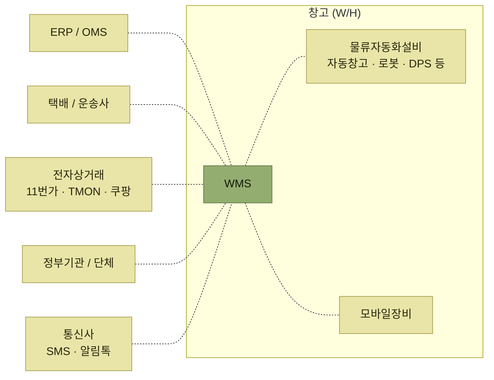

# 인터페이스

> [WMS 원리와 이해](../README.md)

## WMS는 혼자 일하지 않는다

> **인터페이스는 서로 다른 시스템 간의 정보교환**(데이터 공유, 작업요청, 결과회신 등)**을 말한다.** 인터페이스를 통해 **다른 시스템의 데이터를 받아들이고 자신의 데이터를 다른 시스템에 제공**할 수 있다.

WMS가 연결되는 상대는 시간이 지나며 늘어났다.

- **과거에는** ERP 시스템이나 OMS 시스템에서 주로 **입출고 관련 지시데이터를 인터페이스하거나**, **창고 내 자동화 설비들과의 인터페이스가 주를 이루었다.**
- **최근에는** **정부 기관이나 관련 단체와의 법률, 규정, 정책 등을 준수하기 위해 각종 물류실적들을 인터페이스**하고, **전자상거래(B2C)의 급속한 확산으로 전자상거래업체나 택배 운송사와의 인터페이스가 매우 필수적으로 자리 잡고 있다.**

*[그림 10-1] 인터페이스 개념도 — 점선은 모두 정보의 교환이다. 창고 경계 안쪽(설비·모바일장비)과 바깥쪽(타 시스템)이 함께 붙는다*

**창고 안과 바깥이 같은 그림에 있다는 점**이 이 장의 특징이다. 안쪽은 **실시간·고빈도**, 바깥쪽은 **업무 단위의 데이터 교환**이라는 성격 차이가 뒤에서 방식의 차이로 이어진다.

## 이 장에서 확인할 것

- 연결 방식은 **직접연결**과 **솔루션 중계** 둘 중 무엇을 고르는가
- 실제 데이터는 **어떤 방법으로** 주고받는가 (DB2DB · XML · EDI · FTP · WebService · File upload)
- 상대별로 **무엇을 주고 무엇을 받는가** — ERP/OMS · 전자상거래·운송사 · 물류자동화 설비
- 인터페이스를 만들 때 **미리 검토해야 할 것**은 무엇인가

## 목차

- [인터페이스 개요](./1-인터페이스-개요.md)
- [인터페이스 방식](./2-인터페이스-방식.md)
- [인터페이스 정보](./3-인터페이스-정보.md)
- [인터페이스 검토사항](./4-인터페이스-검토사항.md)

## 함께 읽기

- WMS와 ERP·OMS의 역할 구분은 [1장 ERP와 물류시스템](../1-wms-개요/1-ERP와-물류시스템.md)에서 정리했다. 10장은 그 시스템들과 **실제로 무엇을 주고받는지**를 다룬다.
- 인터페이스로 받은 **입고예정 데이터**가 쓰이는 곳은 [입고예정수신(ASN)](../4-입고-프로세스/1-입고예정수신.md)이다.
- 자동화 설비 자체는 **12장 물류자동화 및 설비(정리 예정)**에서 다룬다.
