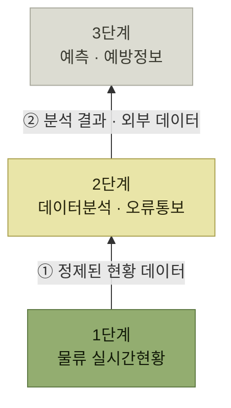

# Visibility 추진단계

> [가시성 (Visibility)](./README.md)

## 빠른 복습
- 가시성은 **다양하고 복잡한 시스템이 서로 얽혀서 관련 업무를 수행하고 있어 데이터를 통합하기 어렵고, 다양한 형태와 구조로 복잡하게 분산되어 있기 때문에 구현이 매우 까다롭고 어렵다.**
- 그래서 **성숙도 모델을 기반으로 단계적으로 접근하는 전략**이 필요하다.
- **1단계 물류 실시간현황** — WMS 내에서 실시간으로 움직이는 **작업자와 재고 정보를 수집·파악**하고 **현황 위주의 분석 데이터**를 제공한다.
- **2단계 데이터분석 · 오류통보** — **1단계에서 데이터가 정제되고 충분히 확보되어야** 가능하다. **대시보드나 KPI 형태로 정제된 데이터를 제공**하고, **중요한 오류 발생 시 즉시 관리자에게 통보**한다.
- **3단계 예측 · 예방정보** — **가장 진보된 형태**로, WMS 데이터와 **전사 상황·외부 환경(날씨, 마케팅, 영업, 재무)까지 종합**해 **예측과 예방** 정보를 제공한다. **빅데이터 분석이나 인공지능** 적용이 필요하다.

## 왜 단계로 나누는가

> 가시성(Visibility)는 **다양하고 복잡한 시스템이 서로 얽혀서 관련 업무를 수행하고 있어 데이터를 통합하기 어렵고, 다양한 형태와 구조로 복잡하게 분산되어 있기 때문에 구현이 매우 까다롭고 어려움이 따른다.** **최적의 가시성을 확보하기 위해서는 다음과 같은 성숙도 모델을 기반으로 단계적으로 접근하는 전략이 필요**하다.

*[그림 11-3] WMS 가시성 단계적 구축 방안 — 원서는 삼각형으로 그렸다. 아래가 넓다는 것은 이것이 토대라는 뜻이다*

**[앞 절의 현재·과거·미래](./2-WMS-주요-제공-항목.md#wms가-제공하는-것)** 가 이 세 층에 그대로 대응한다. 그리고 **아래 층이 위 층의 재료**이므로 순서를 건너뛸 수 없다.

## 가. 1단계 — 물류 실시간 현황

> **가시성을 확보하기 위한 가장 기본적인 단계**다. **WMS 시스템 내 실시간으로 움직이는 작업자와 재고 정보 등을 수집 파악하고 이를 기반으로 현황 위주의 분석 데이터를 제공하는 단계**다.

<table>
<thead>
<tr>
<th style="text-align:center; white-space:nowrap">구분</th>
<th style="text-align:center; white-space:nowrap">내용</th>
</tr>
</thead>
<tbody>
<tr>
<td style="text-align:center; white-space:nowrap"><b>현황정보</b></td>
<td style="text-align:left"><b>재고정보</b>: 현재고, 기간별 입출고, 로케이션별 재고현황 등 <b>입출고관련</b>: 입출고 작업건수, 입출고작업량, 오류발생량 등 <b>인원 및 장비현황</b>: 투입인원, 장비대수, 투입시간, 실작업시간 등</td>
</tr>
<tr>
<td style="text-align:center; white-space:nowrap"><b>추적정보</b></td>
<td style="text-align:left"><b>입고진행</b>: 입고예정 → 입고진행 → 입고확정 → 적치 → 최종완료 <b>출고진행</b>: 출고예정 → 출고지시(할당) → 피킹 → 검수 → 상차 → 출고확정 <b>제품 또는 로트별 입출고 이력 추적</b> <b>작업자, 지게차, 로봇 등 위치 및 상태 추적</b></td>
</tr>
</tbody>
</table>

*원서 [그림 11-4] 물류 실시간 주요항목 예시*

표를 읽는 법. 두 칸이 **정지 화면과 진행 상황**으로 갈린다. **현황정보는 "지금 몇 개인가"** 이고, **추적정보는 "어느 단계까지 왔는가"** 다. 추적정보의 두 줄이 [4장 입고 프로세스](../4-입고-프로세스/README.md)와 [5장 출고 프로세스](../5-출고-프로세스/README.md)의 단계 그대로라는 점을 눈여겨본다. **프로세스를 단계로 쪼개 두었기 때문에 그 단계가 가시성의 눈금이 된다.**

## 나. 2단계 — 데이터 분석 · 오류통보

> **데이터분석 / 오류통보를 하기 위해서는 1단계에서 데이터가 정제되고 충분히 확보되어야 한다.** 이를 기반으로 **데이터를 집계 분석하여 우리가 일반적으로 알고 있는 대쉬보드 또는 KPI 등의 형태로 정제된 데이터를 제공**한다. 또한 **제품 재고부족 등의 중요한 오류 사항이 발생 시에는 즉시 관리자 등에 통보하는 기능도 이에 포함**될 수 있을 것이다.

<table>
<thead>
<tr>
<th style="text-align:center; white-space:nowrap">구분</th>
<th style="text-align:center; white-space:nowrap">내용</th>
</tr>
</thead>
<tbody>
<tr>
<td style="text-align:center; white-space:nowrap"><b>실적정보</b></td>
<td style="text-align:left">입출고 충족률, 리드타임, 오류 및 미입고률 등 재고회전일, 적재률, 재고차이률 등 입고, 적치 생산성, 출고 생산성, 유통가공, 재고관리 생산성 측정</td>
</tr>
<tr>
<td style="text-align:center; white-space:nowrap"><b>예외정보</b></td>
<td style="text-align:left">미처리 및 누락오더 확인 재고보유량 과다 및 부족 정보 장비, 작업자 생산성 측정 및 효율 분석 정보 등</td>
</tr>
</tbody>
</table>

*원서 [그림 11-5] 데이터분석 / 오류통보 주요항목 예시*

표를 읽는 법. **실적정보는 "잘 하고 있는가"**, **예외정보는 "지금 무엇이 잘못되어 있는가"** 다. 1단계의 수치가 여기서 **비율(충족률·오류률·회전일·적재률)** 로 바뀐다는 점이 핵심이다. **집계와 비율은 기준 기간이 필요하므로, 데이터가 쌓여 있어야 가능**하다.

**오류통보**는 성격이 또 다르다. 사용자가 화면을 보러 오는 것이 아니라 **시스템이 사람을 찾아가는 기능**이다. [10장](../10-인터페이스/README.md)에서 통신사(SMS·알림톡)가 인터페이스 대상에 있던 이유가 여기서 드러난다.

## 다. 3단계 — 예측 · 예방정보

> **가장 진보된 형태의 단계**다. **WMS에서 발생되고 축적된 데이터와 향후 물동량이나 외부 환경인 날씨, 마케팅, 영업, 재무 등 전사적인 상황을 종합적으로 판단하여 보다 정확도 높은 데이터 분석하고, 향후 문제가 발생될 사항을 예측하고 예방을 할 수 있는 정보를 제공하는 단계**다. **복잡도가 높은 만큼 빅데이터 분석이나 인공지능 등의 최신 IT기술들의 적용이 필요한 단계**다.

<table>
<thead>
<tr>
<th style="text-align:center; white-space:nowrap">구분</th>
<th style="text-align:center; white-space:nowrap">내용</th>
</tr>
</thead>
<tbody>
<tr>
<td style="text-align:center; white-space:nowrap"><b>예측정보</b></td>
<td style="text-align:left">물동량 분석 및 향후 물동량 예측 작업자 생산성 측정 및 소요인력 예측 영업, 마케팅 데이터 기반 결품, 과잉재고 예측</td>
</tr>
<tr>
<td style="text-align:center; white-space:nowrap"><b>예방정보</b></td>
<td style="text-align:left">작업자 안전사고 위험지역 분석 통보 작업 오류 분석을 통해 제품 재배치를 통해 오류 예방 작업자 맥박, 체온, 이동거리 분석을 통해 안전사고 발생 우려 통보</td>
</tr>
</tbody>
</table>

*원서 [그림 11-6] 예측 / 예방정보 주요항목 예시*

표를 읽는 법. 두 칸의 차이는 **무엇을 미리 아는가**다. **예측정보는 물량과 인력**, **예방정보는 사고와 오류**를 앞당겨 본다.

3단계라고 해서 반드시 복잡한 AI부터 도입해야 하는 것은 아니다. 먼저 1·2단계에서 데이터 품질과 기준을 확보하고, 임계치 규칙이나 통계적 예측으로 해결 가능한지 검증한다. 그보다 복잡한 패턴과 규모가 실제로 필요할 때 빅데이터·AI 적용을 검토한다.

이 표에서 가장 눈에 걸리는 항목은 **예방정보의 마지막 줄** — **작업자의 맥박, 체온, 이동거리**다. 가시성의 대상이 **재고에서 사람의 몸 상태까지** 넓어진다는 뜻이며, [IOT 설비와의 인터페이스](../10-인터페이스/3-인터페이스-정보.md#다-물류자동화-인터페이스)가 필요해지는 자리다. 실제 도입 시에는 안전 목적과 필요한 수집 범위를 먼저 정하고, 접근권한·보유기간·법무 및 보안 요건을 별도로 검토해야 한다. 또한 **영업·마케팅 데이터로 결품과 과잉재고를 예측**한다는 것은 **WMS 안의 데이터만으로는 3단계가 불가능**하다는 뜻이기도 하다.

## 핵심 정리

- 가시성은 **데이터가 여러 시스템에 흩어져 있어 구현이 까다롭다.** 그래서 **성숙도 모델로 단계를 나눈다.**
- **1단계는 현황과 추적** — 프로세스의 단계가 그대로 가시성의 눈금이 된다.
- **2단계는 집계와 비율, 그리고 통보** — 1단계 데이터가 정제되어 있어야 성립한다.
- **3단계는 예측과 예방** — WMS 밖의 데이터(날씨·영업·마케팅)와 **빅데이터·AI**가 필요하고, 대상이 **사람의 상태**까지 넓어진다.

## 함께 읽기

- [고려사항 — 단계를 밟아도 걸리는 문제들](./4-가시성-관련-고려사항.md)
- [입고 프로세스](../4-입고-프로세스/README.md) · [출고 프로세스](../5-출고-프로세스/README.md) — 1단계 추적정보의 단계 정의
- [재고관리 — 재고회전일·적재률·재고차이률의 원본](../6-재고관리/README.md)
