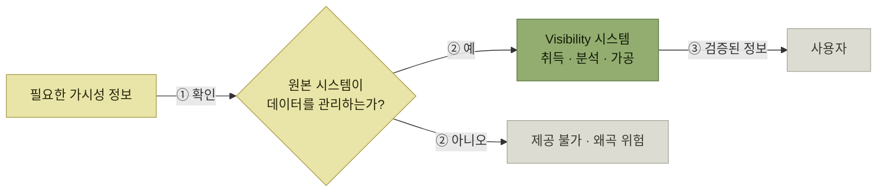

# 가시성 관련 고려사항

> [가시성 (Visibility)](./README.md)

## 빠른 복습
- 가시성 개발에서는 **데이터의 정확도가 떨어져 신뢰할 수 없는 정보를 제공하거나, 불필요한 정보를 수집하여 구축 시 어려움을 겪는 경우가 많다.**
- **가시성 정보는 관련 시스템에서 정보를 취득해 분석·가공하는 구조이므로 그 시스템들의 한계에 매우 종속적**이다. **원본 시스템이 관리하지 않는 데이터는 가시성도 보여줄 수 없다.**
- 그래서 **실현 가능한 항목부터 선정하고 점차적으로 개선·확대**해야 한다.
- **WMS만으로 가시성을 제공하기에는 제약이 많다.** 연결된 여러 시스템과 **실시간 정보취합 및 분석**이 필수이며, 이기종 간 연계라 **상호 데이터 검증과 오류 대응체제**가 필요하다.
- **부서마다 필요한 정보가 다르고 같은 정보도 해석이 달라질 수 있다.** 그래서 **무엇을 어떻게 수집하고 해석할지에 대한 객관적이고 명확한 정의와 관리**가 필요하다.
- 성공적인 구축에는 **전담 추진조직**과 **명확한 책임·역할 부여**, **관련 부서의 적극적인 협조**가 필요하다.

## 무엇이 발목을 잡는가

> **가시성 관련 개발을 하다 보면 데이터의 정확도가 떨어져 신뢰할 수 없는 정보를 제공하거나 불필요한 정보를 수집하여 구축 시 어려움을 겪는 경우가 많이 있다.**

두 가지 실패가 나란히 적혀 있다는 점을 눈여겨본다 — **틀린 정보를 보여주는 것**과 **쓸데없는 정보를 모으는 것**이다. 뒤의 세 항목이 각각 이 문제에 대한 답이다.

## 가. 실현 가능한 영역부터 적용

> **모든 정보시스템의 기능은 저마다 한계를 가지고 있다.** 특히나 **Visibility 정보는 관련 시스템에서 정보를 취득하여 분석, 가공하는 구조이다 보니 관련된 정보시스템의 한계에 매우 종속적**이다.

> 즉 **아무리 다양하고 필요한 Visibility 정보를 제공하기 위해 시스템을 설계하고 구축한다고 하더라도, 시스템에서 그 데이터를 관리하지 않거나 제공할 수 없는 상황이라면 Visibility 시스템은 해당 정보를 제공할 수 없다.** 결국 **원하는 정보를 볼 수 없거나 왜곡된 정보를 제공함으로 인해 사용자로부터 외면을 받을 수밖에 없다.**

*가시성은 원본 시스템의 한계를 넘을 수 없다. 넘으려 하면 왜곡된 정보가 되어 사용자가 떠난다*

> **WMS 시스템은 가시성의 확보를 위해 물류 현장에서 다양하게 발생되는 현장정보를 실시간으로 데이터베이스화할 수 있는 현실 가능한 항목을 선정하고, 이를 기반으로 점차적으로 개선하고 확대하려는 노력이 필요**하다.

[3장에서 "중량을 관리하지 않으면 중량별 출고량 분석이 불가능하다"](../3-기준정보/1-기준정보-개요.md#관리하지-않는-것은-분석할-수-없다)고 했던 그 이야기가, 여기서는 **가시성 전체의 제약 조건**으로 다시 나온다. **기준정보 설계가 곧 가시성의 상한선**이다.

## 나. 관련 시스템 데이터 연계 및 검증

> **WMS 시스템만으로 Visibility를 제공하기에는 제약이 많이 따를 수밖에 없다.** 따라서 **Visibility 시스템을 구축 시에는 WMS 시스템에 연결된 여러 부가적인 시스템들과 연결하여 실시간의 정보취합 및 분석이 필수적**이다.

> **Visibility 정보를 제공하기 위해 접근이 필요한 관련 시스템은 각기 다른 이기종의 시스템, 각기 다른 운영체계와 데이터베이스, 프로그램으로 운영되고 있는 경우가 많아 문제가 발생될 가능성이 높다.** **시스템 간에 인터페이스 시 얘기치 못한 오류들이 발생할 수 있어 이에 대한 상호 데이터의 검증 및 오류에 대해 체계적인 대응체제 구축이 필요**하다.

[10장의 인터페이스 검증 체계](../10-인터페이스/4-인터페이스-검토사항.md#라-인터페이스-검증-체계)와 같은 요구가 여기서 반복된다. 차이는 **목적**이다. 10장에서는 **재고와 실적이 틀어지지 않게** 하려는 것이었고, 여기서는 **보여주는 숫자가 틀리지 않게** 하려는 것이다. 가시성은 **여러 시스템의 숫자를 한 화면에 모으는 일**이라, 어느 한쪽이 틀리면 **화면 전체의 신뢰가 무너진다.**

모든 정보를 무조건 실시간으로 모을 필요는 없다. 의사결정에 필요한 최신성에 따라 **이벤트 즉시, 수분 단위, 시간 단위, 일 배치**처럼 갱신 주기와 허용 지연을 정하고, 화면에는 데이터의 기준시각을 표시한다. 그래야 오래된 숫자를 현재 상태로 오해하지 않는다.

## 다. 책임과 역할 명확화

> **Visibility 정보는 각 해당 부서의 업무영역 및 역할에 따라 필요로 하는 정보가 다를 수 있다.** **동일한 결과의 정보 역시 해석의 방법이나 이해의 정도가 따라 그 의미가 달라질 수도 있기 때문에**, **각 조직에서 필요로 하는 정보가 무엇이고 어떻게 수집하고 해석해야 하는지에 대한 객관적이고 명확한 정의 및 관리가 필요**하다.

> **성공적인 Visibility 시스템을 구축하기 위해서는 각 조직에서 필요로 하는 정보를 발굴하고 그 정보를 실시간으로 정보를 수집 및 가공작업을 원활하게 추진할 수 있도록 전담 추진조직이 필요**하다. **추진조직은 시스템 구축 및 운영을 효과적으로 할 수 있도록 명확한 책임과 역할을 부여가 필요하며, 관련된 부서의 적극적인 협조가 무엇보다도 필요**하다.

| 무엇이 필요한가 | 왜 |
| --- | --- |
| **정보의 객관적·명확한 정의** | 부서마다 필요한 정보가 다르고, **같은 숫자도 해석이 달라진다** |
| **전담 추진조직** | 정보를 **발굴하고 수집·가공을 원활히 추진**할 주체가 있어야 한다 |
| **명확한 책임과 역할** | 추진조직이 **구축과 운영을 효과적으로** 할 수 있게 |
| **관련 부서의 적극적인 협조** | 데이터는 **다른 부서의 시스템에 있다** |

표를 읽는 법. 네 항목 중 **기술적인 것이 하나도 없다.** 앞의 두 절이 데이터와 시스템의 문제였다면, 이 절은 **조직의 문제**다. **같은 숫자를 두고 부서마다 다르게 읽는 상황**은 도구로 해결되지 않기 때문이다.

그래서 지표 이름만 합의해서는 부족하다. **정의, 계산식, 단위, 집계 기간·마감시각, 데이터 원천, 책임자**를 지표 사전으로 관리해야 같은 숫자를 같은 의미로 읽을 수 있다.

## 핵심 정리

- 가시성의 두 가지 실패는 **정확도가 낮은 정보를 보여주는 것**과 **불필요한 정보를 모으는 것**이다.
- 가시성은 **원본 시스템의 한계에 종속적**이다. **실현 가능한 항목부터 시작해 점차 확대**한다.
- WMS 하나로는 부족하므로 **여러 시스템과 실시간으로 연계**하고, 이기종 연계인 만큼 **검증과 오류 대응체제**를 갖춘다.
- 마지막 관문은 조직이다. **정보의 정의 · 전담 조직 · 책임과 역할 · 부서 협조**가 필요하다.

## 함께 읽기

- [추진단계 — "실현 가능한 것부터"의 구체적인 순서](./3-Visibility-추진단계.md)
- [기준정보 개요 — 관리하지 않는 것은 볼 수 없다는 원칙의 출발점](../3-기준정보/1-기준정보-개요.md)
- [인터페이스 검토사항 — 데이터 검증 체계가 필요한 같은 이유](../10-인터페이스/4-인터페이스-검토사항.md)
