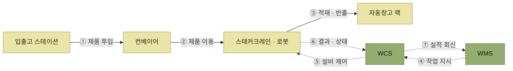

# 보관과 이동 자동화

> [물류자동화 및 설비](./README.md)

## 빠른 복습
- **자동 창고(AS/RS)** 는 **컨베이어와 스태커크레인을 시스템으로 제어해 무인으로 입고·출고·재고관리**를 수행한다.
- 원서가 설명한 스태커크레인 방식의 장점은 **10단 이상의 고단력 운영으로 적재효율과 인력 운영을 개선**하는 것이고, 처리속도는 장비 대수·병렬성·입출고 스테이션에 따라 달라진다.
- 과거에는 **B2B 대응을 위한 팔레트 단위의 대형 자동창고**가 주류였으나, **B2C 인터넷 비즈니스가 활성화되며 박스 단위 이하의 소형 경량화된 자동창고**로 변화하고 있다. **다수의 로봇을 병렬로 투입해 속도 문제를 극복**한다.
- **물류 로봇**은 초기에는 **단순 구간 반복 이동이나 특정 작업만 수행**했으나, 최근에는 **자율주행·인공지능·첨단 센싱 기술로 로봇이 자율적으로 판단하고 작업**한다.
- **보관 설비**는 제품 특성과 입출고 유형에 따라 **팔레트랙 · 암랙 · 플로어랙 · 선반랙** 등을 쓴다.
- **입출고 장비**(지게차 등)는 **제품의 특성과 물류창고의 구조·환경**에 따라 다양한 형태가 활용된다.
- **보관 및 적재 도구**는 **제품을 안전하게 보관하고 모듈화하여 신속하게 입출고**하기 위한 것이다. **플라스틱은 반복 사용, 종이는 1회성 사용**에 많이 쓰인다.

## 자동 창고 (Automated warehouse, AS/RS)

> **일반적인 창고의 입출고는 지게차 등의 장비와 인력에 의존하여 입출고를 수행하는데 반해, 자동 창고시스템은 컨베이어 및 스태커크레인을 시스템으로 제어하여 무인으로 재고를 입고, 출고 및 재고관리를 수행**한다.

| | 내용 |
| --- | --- |
| **장점** | 스태커크레인에 의해 자동 운영되므로 **10단 이상의 고단력 운영이 가능**하여 일반창고에 비해 **적재효율을 극대화**하고 **입출고 인력을 줄일 수 있다** |
| **단점** | 스태커크레인의 대수와 속도에 따라 다르지만, **일반적으로 입출고 속도가 일반창고에 비해 떨어지기 때문에 입출고 빈도가 높은 제품에는 적용하기 어려울 수 있다** |

표를 읽는 법. 이 트레이드오프가 **어떤 재고를 자동창고에 넣을지**를 정한다. 원서가 설명한 스태커크레인 방식처럼 처리속도가 제한되는 구성에서는 [회전이 느린 재고](../06-재고관리/README.md)가 우선 후보가 될 수 있다.

다만 **자동창고는 저회전 재고용**이라고 일반화할 수는 없다. 실제 적합성은 스태커크레인·셔틀·로봇의 대수와 병렬성, 입출고 스테이션 수, 피크 처리량, 제품 규격에 따라 달라진다. 대상 재고의 회전율과 주문 패턴을 설비의 시간당 처리능력으로 검증해 배치한다.

*실선은 제품의 물리적 이동, 점선은 작업 지시와 결과의 정보 흐름이다. WCS는 WMS와 설비 사이에서 제어를 중계한다.*

원서는 관련 사진을 세 장 싣는다 — **[그림 12-8] 자동 창고에 재고가 적재되는 모습**, **[그림 12-9] 입출고된 재고가 무인운반차(AGV)에 의해 이동되는 모습**(현대엘리베이터 장비), **[그림 12-10] 경량화 및 로봇 기반의 자동 창고**(AutoStore).

### B2C가 자동창고의 모양을 바꿨다

> **과거에는 B2B 비즈니스에 대응하기 위해 주로 자동 창고의 형태가 팔레트 단위로 입출고되는 규모가 큰 형태의 자동 창고가 주를 이루고 있었으나**, **점차 B2C 인터넷 비즈니스가 활성화되면서 박스 단위 이하의 소형 경량화된 자동 창고 시스템으로 변화**하고 있다.

> 그리고 **다수의 로봇을 투입하여 병렬로 작업을 수행함으로써 단점으로 지적되었던 입출고 속도가 떨어지는 문제점을 극복**하고 있다.

**속도 문제를 장비 하나의 성능이 아니라 대수로 푼다**는 점이 요점이다. 원서 [그림 12-11]은 **박스단위 입출고가 가능한 자동 창고**(SSI SCHÄFER) 사례다. [B2C 전환](../11-가시성/1-가시성-개요.md#왜-지금-더-중요해졌는가)이 창고 설비의 형태까지 바꾼 셈이다.

## 물류 로봇 (Robot)

> **급변하는 물류 환경의 변화에 대응하고 인력 부족, 작업 안전성, 효율성을 높이기 위해 물류 현장에서도 로봇을 도입하는 사례가 늘어나고 있다.**

> **초기에는 단순한 구간을 반복 이동하거나 특정 작업만을 수행하는 단편적인 로봇의 도입이었다면, 최근에는 자율주행기술, 인공지능기술, 첨단 센싱기술 등을 활용하여 로봇이 자율적으로 판단하고 작업을 할 수 있어 물류의 전반적인 비용 절감과 효율적 운영에 많은 기여를 하고 있다.**

원서는 **[그림 12-12] 피킹 로봇 작업 예시**(쿠팡)와 **분류 로봇**(Tompkins Robotics) 사례 사진을 싣는다. 도입 이유로 **인력 부족과 작업 안전성**이 효율성과 나란히 적혀 있다는 점을 눈여겨본다. [가시성 3단계의 예방정보가 작업자 안전을 다루던 것](../11-가시성/3-Visibility-추진단계.md#다-3단계--예측--예방정보)과 같은 문제의식이다.

## 보관 설비

> **제품의 특성 및 입출고 유형에 따라 팔레트랙, 암랙, 플로어랙, 선반랙 등 다양한 형태의 보관설비를 이용**한다.

| 보관 설비 | 어떤 재고에 쓰는가 |
| --- | --- |
| **팔레트랙** | 팔레트 단위로 보관하는 일반적인 형태 |
| **암랙** | 파이프·목재처럼 **길이가 긴 자재** |
| **플로어랙** | 바닥에 흐르게 두어 **선입선출**이 자연스러운 형태 |
| **선반랙** | 박스·낱개 단위의 **소형 제품** |

표를 읽는 법. 이 표의 용도 구분은 원서가 사진으로 보여주는 부분을 정리한 것이다. 어떤 설비를 쓰는지가 [로케이션 기준정보의 최대 높이·중량·혼재 여부](../03-기준정보/2-창고관련-기준정보.md#로케이션의-주요-항목)와 직결된다. **설비가 로케이션의 속성을 결정한다.**

## 입출고를 위한 장비

> **창고 내에서 제품을 이동, 입출고를 하기 위한 장비로서 제품의 특성, 물류창고의 구조화 환경 등에 따라 다양한 형태의 장비가 활용**된다.

원서는 지게차 계열 장비 사진을 여러 장 싣는다. **일반 지게차, 리치형 지게차, 전동 파렛트 트럭** 등이며, 창고의 **통로 폭과 랙 높이**가 장비 선택을 좌우한다.

## 보관 및 적재 도구

> **제품을 안전하게 보관하고 제품을 모듈화하여 신속하게 입출고 처리를 할 수 있는 포장 및 적재와 관련된 장비들**이다.

> **재질이 플라스틱일 경우 주로 여러 번의 회전이나 사용이 필요한 경우에 많이 활용되고 있으며, 종이는 1회성 사용의 경우 일반적으로 많이 활용**되고 있다.

**"모듈화"** 라는 표현이 핵심이다. 낱개를 그대로 다루지 않고 **박스·토트·팔레트라는 단위로 묶어** 취급 횟수를 줄이는 것이며, 그 단위가 [제품 기준정보의 박스입수](../03-기준정보/4-제품관련-기준정보.md)로 관리된다.

## 함께 읽기
- [데이터 수집 장비와 신기술](./3-데이터-수집-장비와-신기술.md)
- [창고관련 기준정보 — 설비가 정하는 로케이션 속성](../03-기준정보/2-창고관련-기준정보.md)
- [WCS — 이 설비들을 제어하는 계층](../10-인터페이스/3-인터페이스-정보.md#다-물류자동화-인터페이스)
