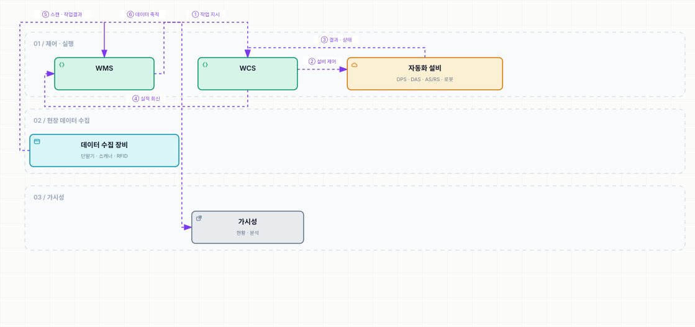

# 물류자동화 및 설비

> [WMS 원리와 이해](../README.md)

## 이 장은 무엇을 다루는가

> 이번 장에서는 **주요 물류자동화 시스템에 대해 소개하고 물류 현장에서 활용되고 있는 각종 장비 및 IT 관련 인프라** 등에 대해 살펴보고자 한다.

원서는 16개 항목을 사진과 함께 나열한다. 사진 중심의 장이므로 여기서는 **각 설비가 무엇을 해결하는지와 선택 기준**을 중심으로 정리했다.

| 묶음 | 항목 |
| --- | --- |
| **피킹·분류 자동화** | DPS · DAS · 자동 분류시스템 |
| **보관·이동 자동화** | 자동 창고(AS/RS) · 물류 로봇 · 보관 설비 · 입출고 장비 · 보관 및 적재 도구 |
| **데이터를 넣고 읽는 장비** | 보이스 피킹과 스마트 글라스 · 전표 이미지 스캐닝 · 모바일 단말기 · 바코드 스캐너 · 바코드 프린터 · RFID · 바코드 및 RFID 태그 · 생성형 AI |

표를 읽는 법. 세 묶음이 각각 **사람의 손을 돕는 것 · 물건을 옮기는 것 · 데이터를 오가게 하는 것**이다. 앞의 둘은 [WCS를 통해 WMS와 연결](../10-인터페이스/3-인터페이스-정보.md#다-물류자동화-인터페이스)되고, 마지막 묶음은 [가시성의 재료](../11-가시성/1-가시성-개요.md)가 된다.

*점선은 정보 흐름이다. 제품의 물리적 이동은 각 설비 내부에서 일어나며, WMS는 WCS와 현장 장비를 통해 지시와 결과를 주고받는다.*

## 목차

- [피킹과 분류 자동화 (DPS · DAS · 자동 분류시스템)](./1-피킹과-분류-자동화.md)
- [보관과 이동 자동화 (자동 창고 · 로봇 · 설비)](./2-보관과-이동-자동화.md)
- [데이터 수집 장비와 신기술](./3-데이터-수집-장비와-신기술.md)

## 함께 읽기

- 설비를 제어하는 **WCS**는 [10장](../10-인터페이스/3-인터페이스-정보.md#다-물류자동화-인터페이스)에서 다뤘다.
- 피킹 자체의 업무 흐름은 [2장 할당과 피킹](../02-wms-주요-프로세스/4-할당과-피킹-출고.md), [5장 출고 프로세스](../05-출고-프로세스/README.md)에 있다.
