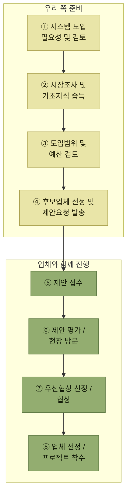

# WMS 솔루션 도입

> [WMS 원리와 이해](../README.md)

## 왜 직접 만들지 않는가

> 각 기업의 **다양하고 복잡한 물류 환경을 수용하고 확장성과 유연성 있는 시스템을 자체적으로 개발하기에는 기술적, 시간적, 비용적인 부담이 매우 크다.** **국내외 우수한 WMS 개발업체들이 활동하고 있어 검증된 WMS 솔루션을 도입하여 활용하는 경우가 많다.** 이번 장에서는 **WMS 솔루션을 도입 시 검토사항 및 절차** 등에 대해 알아본다.

## 도입은 여덟 단계다

*[그림 13-1] WMS 솔루션 도입 절차 — ①~④는 우리 쪽 준비, ⑤~⑧은 업체와 함께 진행하는 단계다*

> **WMS 도입을 위해서는 도입검토, 시장조사, 예산확보, 제안요청 발송, 제안접수, 평가를 거쳐 우선협상 업체를 선정하고 최종 계약 후 프로젝트를 착수**한다.

## 목차

- [도입 준비 — 필요성 · 시장조사 · 예산](./1-도입-준비.md)
- [업체 선정 — 제안요청부터 착수까지](./2-업체-선정.md)

## 함께 읽기

- 체크리스트의 항목들은 이 책 앞부분 전체를 되짚는다 — [기준정보](../03-기준정보/README.md), [입고](../04-입고-프로세스/README.md), [출고](../05-출고-프로세스/README.md), [재고관리](../06-재고관리/README.md), [부가서비스](../08-부가서비스/README.md), [인터페이스](../10-인터페이스/README.md).
- 구축 단계 자체는 [14장 WMS 구축](../14-wms-구축/README.md)에서 다룬다.
