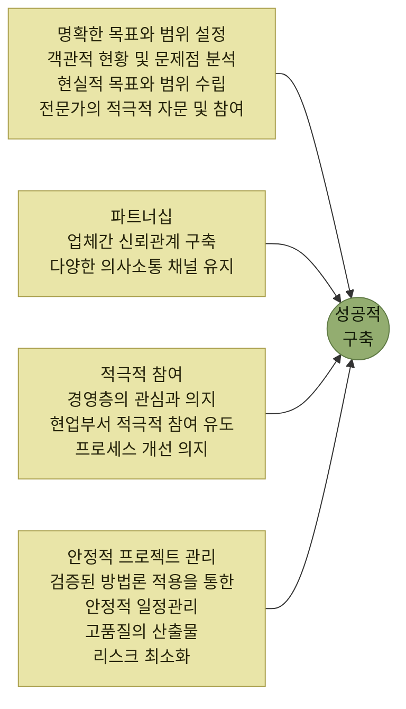

# 구축 전략

> [WMS 구축](./README.md)

## 빠른 복습
- **기업의 현실에 맞지 않는 과도한 프로젝트를 수행하면 과도한 비용이 투자될 수 있고, 실제 물류 현장에 맞지 않는 WMS 시스템이 개발될 가능성이 매우 높다.**
- 첫 단계인 **"현실적이고 명확한 목표와 범위"** 수립에는 **경영진·실무자와의 충분한 의사소통**이 무엇보다 중요하다. **면담과 워크숍**으로 의견을 반영하고, **리서치나 전문가 자문**으로 검증한다.
- WMS는 물류 프로세스를 지원하는 시스템이라 **실무자들의 참여가 매우 중요**하다. **현업 참여를 통해 현재 프로세스를 이해하고 개선해야 할 사항을 파악**할 수 있다.
- 경영자는 현업이 **적극 참여하도록 독려**하고, **워크숍·설문조사·시스템 시연**으로 **제대로 개발되고 있는지 검증**하며 요구사항과 개선사항을 계속 반영해야 한다.
- **도입기업과 개발업체 간 신뢰가 무너지면** 구축이 중단되거나, 구축은 되었지만 **요구되는 성능을 내지 못하는 경우**가 생긴다. **누구의 문제든 양사 모두에게 이득이 될 수 없다.**
- **검증되고 효과적인 프로젝트 추진 방법론**이 필요하다. 추진 조직·역할·책임, 일정계획, 단계별 절차와 산출물, 그리고 **리스크를 사전에 파악해 조기 대응할 방안**까지 준비한다.

## 왜 전략이 필요한가

> **WMS 시스템을 구축하려면 최소 수 개월 이상의 장기적인 프로젝트 기간이 소요되며, 다양한 이해 관계자들이 프로젝트에 참여하는 만큼 다양한 위험과 문제들에 노출되어 있다.**

> **성공적인 WMS 시스템을 구축하기 위해서는 도입기업의 적극적 참여, 경험 인력의 투입, 파트너쉽 그리고 안정적 프로젝트 관리가 필요하다.**

*[그림 14-1] WMS 구축 전략 — 네 갈래가 모두 갖춰져야 성공적 구축이 된다. 원서 그림의 박스 제목 "안정정 프로젝트 관리"는 오기로 보여 "안정적"으로 적었다*

네 항목의 성격이 갈린다. **명확한 목표와 범위**는 프로젝트 시작 전의 준비이고, **적극적 참여**와 **파트너십**은 사람 사이의 문제이며, **안정적 프로젝트 관리**는 방법론의 문제다. 아래에서 하나씩 본다.

## 가. 명확한 목표와 범위 설정

> **기업의 현실에 맞지 않는 과도한 프로젝트를 수행하면 과도한 비용이 투자될 수 있고 실제 물류 현장에 맞지 않는 WMS 시스템이 개발될 가능성이 매우 높다.**

> 프로젝트의 첫 단계인 **"현실적이고 명확한 목표와 범위"를 수립하기 위해서는 경영진, 실무자들과의 충분한 의사소통이 무엇보다 중요**하다. **다소 시간이 소요되더라도 여러 부문의 이해 관계자들과의 면담과 워크숍 개최를 통해 적극적으로 의견을 반영하는 노력이 필요**하다.

> **기업의 물류 전략, IT 전략, 재무 상황, 대내외 다양한 고객의 의견을 반영하고 검증을 위해 리서치나 전문가의 자문을 받는 것도 좋은 방법**이다.

**"현실적이고"** 가 앞에 붙어 있는 것이 요점이다. [13장에서 도입범위를 먼저 정하고 예산을 뒤에 산출한 것](../13-wms-솔루션-도입/1-도입-준비.md#다-도입범위-및-예산검토)과 같은 순서이며, 그 범위가 **회사의 재무 상황과 IT 전략 안에 들어와야** 한다는 조건이 여기서 추가된다.

## 나. 적극적 참여

> **WMS는 물류 프로세스를 지원하는 시스템으로 특히, 실무자들의 참여가 매우 중요**하다. **현업의 참여를 통해 기업의 현재 프로세스를 이해하고 개선해야 할 사항을 파악할 수 있기 때문**이다.

> **적극적인 참여를 지원하기 위해 경영자들이 현업부서들이 적극적으로 참여할 수 있도록 독려**하고, **지속적으로 워크숍을 개최하거나 설문조사, 시스템 시연 등을 통해 시스템이 제대로 개발되고 있는지 검증하고 요구사항, 개선 사항을 지속적으로 반영하려는 노력이 필요**하다.

**참여가 두 방향**이라는 점을 눈여겨본다. **현업이 알려주는 것**(현재 프로세스와 개선점)과 **현업이 확인하는 것**(제대로 개발되고 있는지)이다. 뒤쪽은 [13장의 시연(DEMO) 검증](../13-wms-솔루션-도입/2-업체-선정.md#사-제안평가-및-우선협상업체-선정)이 프로젝트 기간 내내 반복되는 형태라고 볼 수 있다.

## 다. 파트너십

> 시스템을 구축하다 보면 **도입기업과 개발업체 간 신뢰가 무너져 시스템 구축이 중단되거나, 시스템 구축은 되었지만 요구되는 성능을 제대로 발휘하지 못하는 경우가 종종 발생**되곤 한다.

> **누구의 문제인지는 상황에 따라 다르겠지만 양사 모두에게 이득이 될 수 없는 것은 틀림없다.** 따라서 **업체 간 신뢰 관계는 성공적인 시스템 구축을 위해 필수적이라는 인식을 같이하고, 이를 위해 다양한 의사소통을 유지해야 한다.**

**"누구의 문제인지는 상황에 따라 다르겠지만"** 이라는 유보가 이 절의 태도다. 책임 소재를 가리는 것보다 **양쪽 다 손해라는 사실**을 공유하는 것이 먼저라는 뜻이다.

## 라. 안정적인 프로젝트 관리

> 프로젝트를 성공적이고 정해진 기간 내에 수행하기 위해서는 **검증되고 효과적인 프로젝트 추진 방법론이 필요**하다.

준비할 것은 이렇다.

- **구체적이고 명확한 프로젝트 추진 조직과 역할, 책임**
- **프로젝트 일정계획 및 관리**
- **단계별 추진 절차와 그에 따르는 산출물**
- **프로젝트 수행 시 발생할 수 있는 위험을 최소화하기 위해 리스크 요인을 사전에 파악하고 조기에 대응할 수 있는 방안**

> 이러한 **면밀한 준비와 관리가 필요**하다.

마지막 항목이 나머지 셋과 성격이 다르다. 앞의 셋은 **정상 진행을 위한 준비**이고, 리스크 대응은 **어긋났을 때를 위한 준비**다. [인터페이스에서 수정·취소가 정상 처리보다 어렵다](../10-인터페이스/4-인터페이스-검토사항.md#가-수정-및-취소에-대한-검토)고 했던 것과 같은 구조다 — **예외를 미리 설계해두는 쪽이 어렵고 중요하다.**

## 함께 읽기
- [구축 절차 — 단계별 작업과 산출물](./2-구축-절차.md)
- [13장 — 이 프로젝트가 시작되기까지의 절차](../13-wms-솔루션-도입/README.md)
