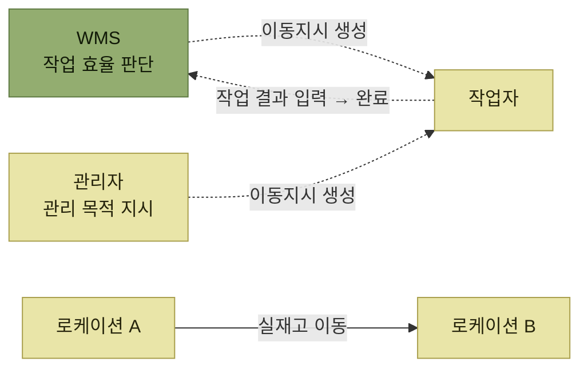

# 재고이동과 재고보충

> [WMS 주요 프로세스](./README.md)

## 빠른 복습

- **재고이동**은 로케이션에 보관된 재고를 다른 로케이션으로 옮기는 작업이다. 주로 **창고 최적화 관점에서 미리** 시행한다.
- 이동지시는 WMS가 작업 효율을 위해 생성하거나, 관리자가 관리를 위해 지시한다. 지시 → 작업자 전달 → 실재고 이동 → 결과 입력으로 확정된다.
- **재고보충(Replacement)** 은 출고할 물량을 **사전에 보관존에서 피킹존으로 옮기는** 작업이다.
- 필요한 이유는 입고와 출고의 작업 방식이 다르기 때문이다. 입고·적치는 지게차로 높은 층을 쓸 수 있지만, 출고는 다품종 소량으로 빈번해 **인력**이 주로 한다.
- 그래서 보관존은 보관을 전담하고, 피킹존은 **인력이나 물류장비가 접근하기 쉬운 곳**(1단 또는 손이 닿는 로케이션)으로 운영한다.

## ③ 재고이동

재고이동은 로케이션에 보관되어 있는 재고를 **다른 로케이션으로 이동하는 작업**이다.

주로 창고의 효율성을 고려하여, **창고 최적화 관점에서 미리 재고를 이동해야 할 경우**에 많이 시행한다.

### 이동지시 생성

두 가지 경로가 있다.

- WMS가 창고 작업 효율을 위해 로케이션 이동을 지시한다.
- 관리자가 관리를 위해 로케이션 이동 작업을 지시한다.

### 이동지시 확정

1. 지시된 내역을 작업자에게 유·무선으로 전달한다.
2. 작업자는 이동 지시에 따라 실재고를 이동한다.
3. 작업 결과를 시스템에 입력하여 완료 처리한다.

*재고이동 — 지시 생성은 시스템과 관리자 양쪽에서 나온다*

## ④ 재고보충 (Replacement)

### 왜 필요한가

공급처로부터 입고된 재고는 적치를 거쳐 WMS 재고관리가 용이하도록 **로케이션 단위로 분할되어** 관리된다. 보통 파레트랙을 이용한다.

문제는 입고와 출고의 작업 방식이 다르다는 데서 생긴다.

- **입고나 적치** 작업 때는 지게차를 이용해 높은 층의 랙에 재고를 옮길 수 있다.
- **출고**는 다품종 소량으로 빈번히 이루어져 지게차보다는 **인력**을 이용한다.
- 많은 사람이 동시에 출고 작업을 하는 경우 지게차를 이용하기 어려운 경우가 많다.
- 지게차로 높은 층의 재고를 출고하려면 **작업 시간이 오래 걸리는** 문제가 발생한다.

### 어떻게 해결하는가

보관존과 피킹존을 구분해서 해결한다.

- **보관존** — 보관 기능을 전담한다.
- **피킹존** — 인력 또는 물류장비가 접근하기 쉬운 장소로 운영한다. 1단 또는 작업자의 손이 닿는 로케이션을 지정한다.

**재고보충은 출고해야 할 물량을 사전에 보관존에서 피킹존으로 이동하는 작업**을 의미한다.

*재고보충 — 출고 전에 미리 손 닿는 곳으로 내려둔다*

### 얼마나 보충하는가

두 가지 방식이 있다.

- 출고 지시된 물량만큼만 사전에 보충 지시를 한다.
- 시스템에 의해 예측된 물량을 미리 보충 처리한다.

## 함께 읽기

- 보충된 재고를 실제로 꺼내는 단계는 [할당과 피킹, 출고](./4-할당과-피킹-출고.md)에서 이어진다.
- 보관존과 피킹존의 정의는 [주요 존의 종류](./1-로케이션과-존.md#주요-존의-종류)를 참고한다.
