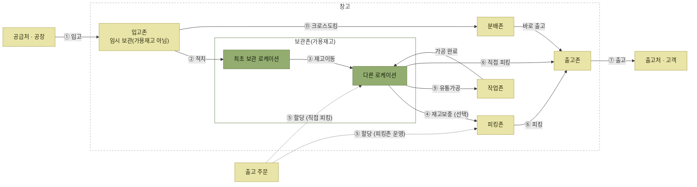

# WMS 주요 프로세스

> [WMS 원리와 이해](../README.md)

## 모든 업무는 로케이션에서 로케이션으로

공급처에서 재고를 공급받아 최종 출고처에 배송하기까지, 입고·출고·재고관리 등 주요 프로세스는 **모두 로케이션에서 로케이션으로 재고가 이동하는 흐름을 관리하면서** 처리된다. 그래서 프로세스를 보기 전에 로케이션과 존을 먼저 알아야 한다.

*창고의 존과 주요 프로세스 — 번호는 원서의 프로세스 순서다*

도식을 읽을 때 주의할 점을 짚어둔다.

- **① 입고 직후의 재고는 아직 팔 수 없다.** 입고가 끝나면 WMS가 관리하는 재고는 늘지만, 품질 검사 등이 남아 있어 보관존으로 바로 가지 않고 입고존에 임시로 머문다. 이 재고는 **가용재고에 반영되지 않는다.** ② 적치를 거쳐 보관존에 들어가야 비로소 가용재고가 된다. 자세한 내용은 [입고](./2-입고와-적치.md#①-입고--입하)에 있다.
	- 다만 보관존에 있다고 전부 가용한 것은 아니다. [재고관리](./5-재고관리.md)의 **재고보류**로 정상 출고 대상에서 빠진 재고는 제외된다.
- **③ 재고이동**은 로케이션과 로케이션 사이를 옮기는 작업이다. 위 도식은 보관존 안에서 이동하는 예시를 그렸지만, 운영 목적에 따라 보류존처럼 다른 존으로 이동할 수도 있다.
- **재고이동이 모든 재고에 항상 일어나는 것은 아니다.** 창고 최적화가 필요할 때 시행된다. 도식에서 ④ 재고보충과 ⑨ 유통가공이 `다른 로케이션`에서 출발하는 것은 이동이 있었던 경우를 이어 그린 것이고, 이동이 없었다면 최초 보관 로케이션에서 그대로 진행된다.
- **④ 재고보충은 선택 경로다.** 피킹존을 운영하면 출고 전에 재고를 보충한 뒤 ⑥ 피킹하고, 프리로케이션 방식처럼 보관 로케이션에서 직접 피킹하면 ④를 거치지 않고 출고존으로 이동한다.
- **⑤ 할당**은 유일하게 점선이다. 재고를 옮기지 않고 **예약만** 걸기 때문이다.
- **⑨ 부가서비스 중 도식에 표시한 것은 재고를 작업존으로 옮기는 유통가공이다.** 주문접수·콜센터·수금관리처럼 재고를 다루지 않는 대행 업무에는 물리적 이동이 없다.

⑧ 재고관리와 ⑩ 재고조사는 특정 구간의 이동이 아니라 **보관 중인 재고 전체를 대상으로** 수행하므로 위 도식에 화살표로 나타내지 않았다. 다만 ⑧의 **재고보류**는 창고에 따라 보류존을 두고 실물을 옮기기도 한다. [보류한 재고는 어디에 두는가](./5-재고관리.md#보류한-재고는-어디에-두는가)에서 다룬다.

## 프로세스 한눈에 보기

<table>
<thead>
<tr>
<th style="text-align:center; white-space:nowrap">#</th>
<th style="text-align:center; white-space:nowrap">프로세스</th>
<th style="text-align:center; white-space:nowrap">한 줄 요약</th>
<th style="text-align:center; white-space:nowrap">재고 이동</th>
</tr>
</thead>
<tbody>
<tr>
<td style="text-align:center; white-space:nowrap">1</td>
<td style="text-align:left; white-space:nowrap">입고(입하)</td>
<td style="text-align:left">공급처 도착 → 검수 → 영구 인수. <b>입고존에 임시로 머물며 아직 가용재고가 아니다</b></td>
<td style="text-align:left; white-space:nowrap">공급처 → 입고존</td>
</tr>
<tr>
<td style="text-align:center; white-space:nowrap">2</td>
<td style="text-align:left; white-space:nowrap">적치(Putaway)</td>
<td style="text-align:left; white-space:nowrap">최적 보관 로케이션을 선정해 이동</td>
<td style="text-align:left; white-space:nowrap">입고존 → 보관존</td>
</tr>
<tr>
<td style="text-align:center; white-space:nowrap">3</td>
<td style="text-align:left; white-space:nowrap">재고이동</td>
<td style="text-align:left; white-space:nowrap">창고 최적화를 위한 로케이션 간 이동</td>
<td style="text-align:left; white-space:nowrap">로케이션 → 로케이션 (존 내부 또는 존 간)</td>
</tr>
<tr>
<td style="text-align:center; white-space:nowrap">4</td>
<td style="text-align:left; white-space:nowrap">재고보충(Replenishment)</td>
<td style="text-align:left; white-space:nowrap">출고할 물량을 미리 피킹존으로</td>
<td style="text-align:left; white-space:nowrap">보관존 → 피킹존</td>
</tr>
<tr>
<td style="text-align:center; white-space:nowrap">5</td>
<td style="text-align:left; white-space:nowrap">할당(Allocation)</td>
<td style="text-align:left; white-space:nowrap">어느 로케이션에서 출고할지 예약</td>
<td style="text-align:left; white-space:nowrap">이동 없음 (예약)</td>
</tr>
<tr>
<td style="text-align:center; white-space:nowrap">6</td>
<td style="text-align:left; white-space:nowrap">피킹(Picking)</td>
<td style="text-align:left; white-space:nowrap">할당을 기반으로 실제 재고 이동</td>
<td style="text-align:left; white-space:nowrap">피킹존 또는 보관존 → 출고존</td>
</tr>
<tr>
<td style="text-align:center; white-space:nowrap">7</td>
<td style="text-align:left; white-space:nowrap">출고(Shipping)</td>
<td style="text-align:left; white-space:nowrap">상차·인수인계, 재고 차감</td>
<td style="text-align:left; white-space:nowrap">출고존 → 고객</td>
</tr>
<tr>
<td style="text-align:center; white-space:nowrap">8</td>
<td style="text-align:left; white-space:nowrap">재고관리</td>
<td style="text-align:left; white-space:nowrap">보류·등급변경·로트변경·재고조정</td>
<td style="text-align:left; white-space:nowrap">보통 이동 없음 (보류존 운영 시 이동)</td>
</tr>
<tr>
<td style="text-align:center; white-space:nowrap">9</td>
<td style="text-align:left; white-space:nowrap">부가서비스</td>
<td style="text-align:left; white-space:nowrap">유통가공 또는 주문·고객 응대 대행</td>
<td style="text-align:left; white-space:nowrap">유통가공: 보관존 ↔ 작업존 비재고 대행: 이동 없음</td>
</tr>
<tr>
<td style="text-align:center; white-space:nowrap">10</td>
<td style="text-align:left; white-space:nowrap">재고조사</td>
<td style="text-align:left; white-space:nowrap">실물과 시스템 재고의 차이 확인</td>
<td style="text-align:left; white-space:nowrap">이동 없음</td>
</tr>
<tr>
<td style="text-align:center; white-space:nowrap">11</td>
<td style="text-align:left; white-space:nowrap">크로스도킹</td>
<td style="text-align:left; white-space:nowrap">재고 보유 없이 당일 입고 → 바로 출고</td>
<td style="text-align:left; white-space:nowrap">입고존 → 분배존 → 출고존</td>
</tr>
</tbody>
</table>

## 목차

- [로케이션과 존](./1-로케이션과-존.md)
- [입고와 적치](./2-입고와-적치.md)
- [재고이동과 재고보충](./3-재고이동과-재고보충.md)
- [할당과 피킹, 출고](./4-할당과-피킹-출고.md)
- [재고관리](./5-재고관리.md)
- [부가서비스](./6-부가서비스.md)
- [재고조사](./7-재고조사.md)
- [크로스도킹](./8-크로스도킹.md)
