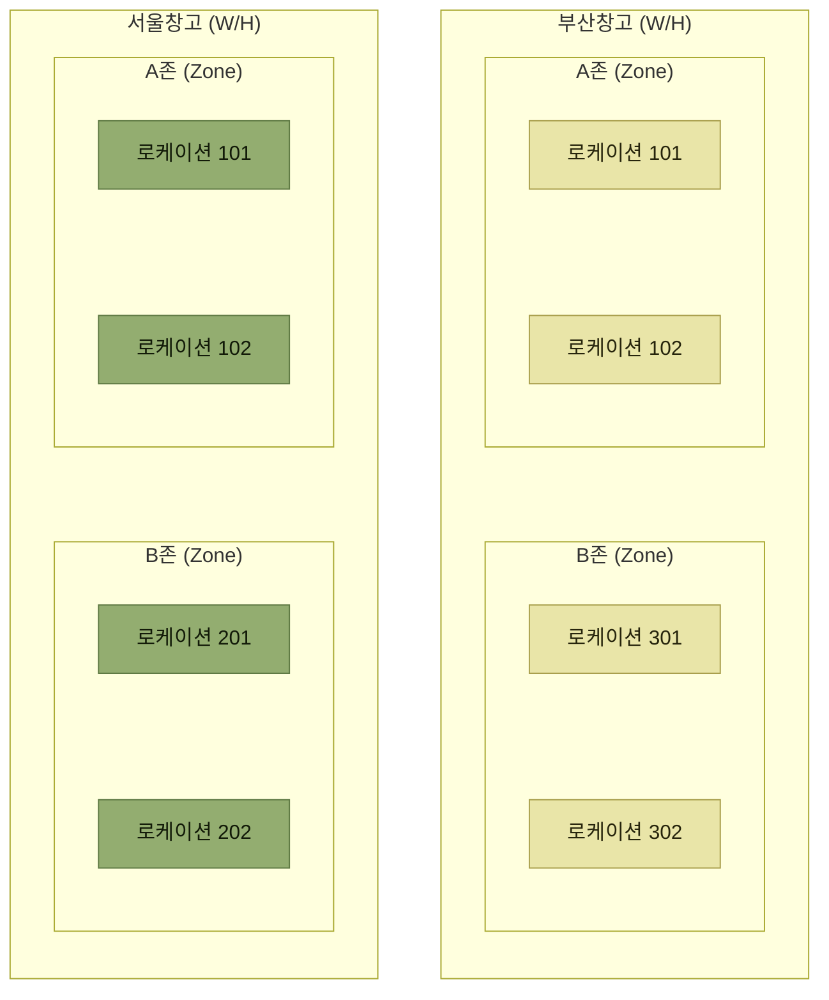

# 창고관련 기준정보

> [기준정보](./README.md)

## 빠른 복습
- **WMS는 하나의 창고를 로케이션이라는 개념으로 공간을 쪼개어 주소를 지정하고 재고를 상세하게 구분 관리한다.** 이것이 **ERP 시스템과 가장 큰 차이점**이다.
- 아파트에 비유하면 **창고 = 단지, 존 = 동, 로케이션 = 호**다.
- WMS에서 **"[서울창고]에 [제품1]을 100개 보관한다"는 성립하지 않는다.** 반드시 **로케이션 코드**가 필요하다.
- **로케이션 코드는 하나의 창고 안에서만 유일**하다. 창고코드가 다르면 **같은 이름의 로케이션 코드를 쓸 수 있다.**
- 로케이션 항목 중 **할당 여부**가 특히 중요하다 — 해당 로케이션의 재고를 **출고 할당 후보로 볼지 판단하는 조건 중 하나**다.
- **존 코드는 로케이션 코드의 상위 개념**이며, 로케이션이 실제 위치라면 **존은 개념적인 성격이 강하다.**

## 로케이션이 ERP와 WMS를 가른다

> **WMS는 하나의 창고를 로케이션(Location)이라는 개념으로 공간을 쪼개어 주소를 지정하고 재고를 보다 상세하게 구분 관리하는 것이 ERP 시스템과 가장 큰 차이점**이라 할 수 있다. 로케이션은 용도에 맞게 **존(Zone)으로 묶어서 관리**할 수 있다.

원서의 비유가 이 계층을 가장 빠르게 설명한다.

| 아파트 | 창고 |
| --- | --- |
| **1단지** | **창고**(Warehouse) |
| **101동** | **존**(Zone) |
| **201호** | **로케이션**(Location) |

표를 읽는 법. **"1단지"에는 111동, 112동, 113동 등의 하나 이상의 "동"으로 이루어져 있고, 다시 하나의 "동"은 101호, 102호 등의 여러 "호"로 구성**되어 있다. **존은 여러 로케이션을 활용 용도에 따라 그룹으로 묶어서 관리하기 위한 용도로 활용**된다.

*[그림 3-2] 창고관련 기준정보 구성 예시 — 서울창고와 부산창고가 같은 "로케이션 101"을 각각 가질 수 있다*

## 가. 창고(Warehouse)

**창고(W/H)는 기준정보의 최상위 개념**이다. **WMS 시스템에서는 보통 여러 개의 창고를 관리할 수 있고, 하나의 창고에는 다시 여러 개의 존과 여러 개의 로케이션으로 구성**된다.

창고관련 기준정보에는 **창고의 이름, 크기, 형태, 주소 등의 기본적인 항목**과, **입고·출고·반품 등을 위해 기본적으로 작업이 이루어지는 로케이션 코드** 등의 데이터를 관리한다.

<table>
<thead>
<tr>
<th style="text-align:center; white-space:nowrap">창고코드</th>
<th style="text-align:center; white-space:nowrap">창고명</th>
<th style="text-align:center; white-space:nowrap">지역</th>
<th style="text-align:center; white-space:nowrap">전화번호</th>
<th style="text-align:center; white-space:nowrap">주소</th>
<th style="text-align:center; white-space:nowrap">입고 로케이션</th>
<th style="text-align:center; white-space:nowrap">출고 로케이션</th>
<th style="text-align:center; white-space:nowrap">반품 로케이션</th>
<th style="text-align:center; white-space:nowrap">등록일자</th>
<th style="text-align:center; white-space:nowrap">수정일시</th>
</tr>
</thead>
<tbody>
<tr>
<td style="text-align:center; white-space:nowrap">WH1</td>
<td style="text-align:center; white-space:nowrap">서울창고</td>
<td style="text-align:center; white-space:nowrap">서울</td>
<td style="text-align:center; white-space:nowrap">02-312-1123</td>
<td style="text-align:center; white-space:nowrap">서울 서초 양재</td>
<td style="text-align:center; white-space:nowrap">LOC91</td>
<td style="text-align:center; white-space:nowrap">LOC92</td>
<td style="text-align:center; white-space:nowrap">LOC99</td>
<td style="text-align:center; white-space:nowrap">2023-10-01</td>
<td style="text-align:center; white-space:nowrap">2023-10-02</td>
</tr>
<tr>
<td style="text-align:center; white-space:nowrap">WH2</td>
<td style="text-align:center; white-space:nowrap">대전창고</td>
<td style="text-align:center; white-space:nowrap">대전</td>
<td style="text-align:center; white-space:nowrap">041-332-1123</td>
<td style="text-align:center; white-space:nowrap">대전 서구 둔산</td>
<td style="text-align:center; white-space:nowrap">LOC81</td>
<td style="text-align:center; white-space:nowrap">LOC82</td>
<td style="text-align:center; white-space:nowrap">LOC89</td>
<td style="text-align:center; white-space:nowrap">2023-08-01</td>
<td style="text-align:center; white-space:nowrap">2023-08-01</td>
</tr>
<tr>
<td style="text-align:center; white-space:nowrap">WH3</td>
<td style="text-align:center; white-space:nowrap">부산창고</td>
<td style="text-align:center; white-space:nowrap">부산</td>
<td style="text-align:center; white-space:nowrap">051-421-6412</td>
<td style="text-align:center; white-space:nowrap">부산 동래 안락</td>
<td style="text-align:center; white-space:nowrap">LOC91</td>
<td style="text-align:center; white-space:nowrap">LOC92</td>
<td style="text-align:center; white-space:nowrap">LOC99</td>
<td style="text-align:center; white-space:nowrap">2023-09-02</td>
<td style="text-align:center; white-space:nowrap">2023-09-05</td>
</tr>
</tbody>
</table>

*원서 [그림 3-3] 창고 기준정보 구성 예시*

표를 읽는 법. **서울창고와 부산창고의 입고 로케이션이 똑같이 `LOC91`** 이다. 이것이 오류가 아니라는 점이 다음 절의 핵심이다.

## 나. 로케이션(Location)

> WMS 시스템에서는 **"[서울창고]에 [제품1]을 100개 보관한다"는 될 수 없다.** 왜냐하면 **WMS에서는 반드시 로케이션 코드가 필요**하기 때문이다. **"[서울창고]에 [제품1]을 [로케이션101]에 50개, [로케이션102]에 50개 각각 보관한다"** 가 정확한 표현이다.

**로케이션은 재고가 보관되거나 이동되는 위치**이며, 시스템에 따라 **"로케이션", "LOC", "CELL", "BIN", "저장위치"** 등의 용어로도 불린다.

### 로케이션 코드는 창고별로 유일하다

**하나의 창고에서는 로케이션 코드는 유일하고 고유한 값을 가진다.** 만약 **창고코드가 다르다면 같은 이름의 로케이션 코드를 사용할 수 있다.**

> **"서울의 중동 101번지"가 있다면 "부산의 중동 101번지"가 있는 것과 같은 상황**이다.

### 로케이션의 주요 항목

| 항목 | 무엇을 관리하는가 |
| --- | --- |
| **유형** | 로케이션의 주요 용도 (예: 보관, 입고, 출고, 반품, 유통가공 등). 여러 개의 로케이션을 묶어서 관리할 때 부여한다 |
| **존(구역, Zone)** | 통로나 용도 등으로 여러 개의 로케이션을 묶어서 관리한다 |
| **단수(층)** | 해당 로케이션이 **랙이나 층의 위치**를 관리한다 (예: 1단, 2단, 3단에 위치) |
| **할당 여부** | 해당 로케이션의 재고를 **출고 할당 후보로 볼지** 관리한다. `Y`인 로케이션의 재고라도 보류·재고 상태·LOT 같은 다른 조건을 함께 확인한다 |
| **이동 가능 여부** | 해당 재고가 **다른 로케이션으로 이동 가능한지** 여부를 관리한다 |
| **혼재 여부** | **다른 제품이나 로트와 혼합하여 보관 가능한지**를 관리한다 |
| **적재 높이 · 중량 · 체적** | 해당 로케이션이 **최대한 보관 가능한 높이나 중량, 체적** |

표를 읽는 법. **할당 여부** 한 줄이 [입고](../2-wms-주요-프로세스/2-입고와-적치.md)와 [재고관리](../6-재고관리/README.md) 전체와 연결된다. 적치 전 입고존의 재고를 가용재고에서 제외하는 데 이 플래그를 활용할 수 있다. 다만 가용재고는 로케이션 설정 하나로 확정되지 않고 **재고 보류·상태·LOT 조건과 수량**까지 함께 판단한다.

<table>
<thead>
<tr>
<th style="text-align:center; white-space:nowrap">창고코드</th>
<th style="text-align:center; white-space:nowrap">LOC코드</th>
<th style="text-align:center; white-space:nowrap">로케이션명</th>
<th style="text-align:center; white-space:nowrap">유형</th>
<th style="text-align:center; white-space:nowrap">존(Zone)</th>
<th style="text-align:center; white-space:nowrap">단수(층)</th>
<th style="text-align:center; white-space:nowrap">할당여부</th>
<th style="text-align:center; white-space:nowrap">이동가능 여부</th>
<th style="text-align:center; white-space:nowrap">혼재여부</th>
<th style="text-align:center; white-space:nowrap">최대높이</th>
</tr>
</thead>
<tbody>
<tr>
<td style="text-align:center; white-space:nowrap">WH1</td>
<td style="text-align:center; white-space:nowrap">LOC101</td>
<td style="text-align:center; white-space:nowrap">LOC-101</td>
<td style="text-align:center; white-space:nowrap">보관</td>
<td style="text-align:center; white-space:nowrap">1구역</td>
<td style="text-align:center; white-space:nowrap">1</td>
<td style="text-align:center; white-space:nowrap">Y</td>
<td style="text-align:center; white-space:nowrap">Y</td>
<td style="text-align:center; white-space:nowrap">Y</td>
<td style="text-align:center; white-space:nowrap">1800</td>
</tr>
<tr>
<td style="text-align:center; white-space:nowrap">WH1</td>
<td style="text-align:center; white-space:nowrap">LOC102</td>
<td style="text-align:center; white-space:nowrap">LOC-102</td>
<td style="text-align:center; white-space:nowrap">보관</td>
<td style="text-align:center; white-space:nowrap">1구역</td>
<td style="text-align:center; white-space:nowrap">2</td>
<td style="text-align:center; white-space:nowrap">Y</td>
<td style="text-align:center; white-space:nowrap">Y</td>
<td style="text-align:center; white-space:nowrap">N</td>
<td style="text-align:center; white-space:nowrap">1800</td>
</tr>
<tr>
<td style="text-align:center; white-space:nowrap">WH1</td>
<td style="text-align:center; white-space:nowrap">LOC801</td>
<td style="text-align:center; white-space:nowrap">LOC-801</td>
<td style="text-align:center; white-space:nowrap">출고장</td>
<td style="text-align:center; white-space:nowrap">8구역</td>
<td style="text-align:center; white-space:nowrap">1</td>
<td style="text-align:center; white-space:nowrap">N</td>
<td style="text-align:center; white-space:nowrap">N</td>
<td style="text-align:center; white-space:nowrap">Y</td>
<td style="text-align:center; white-space:nowrap">9000</td>
</tr>
<tr>
<td style="text-align:center; white-space:nowrap">WH2</td>
<td style="text-align:center; white-space:nowrap">LOC101</td>
<td style="text-align:center; white-space:nowrap">LOC-101</td>
<td style="text-align:center; white-space:nowrap">보관</td>
<td style="text-align:center; white-space:nowrap">1구역</td>
<td style="text-align:center; white-space:nowrap">1</td>
<td style="text-align:center; white-space:nowrap">Y</td>
<td style="text-align:center; white-space:nowrap">Y</td>
<td style="text-align:center; white-space:nowrap">Y</td>
<td style="text-align:center; white-space:nowrap">1800</td>
</tr>
<tr>
<td style="text-align:center; white-space:nowrap">WH2</td>
<td style="text-align:center; white-space:nowrap">LOC801</td>
<td style="text-align:center; white-space:nowrap">LOC-801</td>
<td style="text-align:center; white-space:nowrap">출고장</td>
<td style="text-align:center; white-space:nowrap">8구역</td>
<td style="text-align:center; white-space:nowrap">1</td>
<td style="text-align:center; white-space:nowrap">N</td>
<td style="text-align:center; white-space:nowrap">N</td>
<td style="text-align:center; white-space:nowrap">Y</td>
<td style="text-align:center; white-space:nowrap">9000</td>
</tr>
</tbody>
</table>

*원서 [그림 3-4] 로케이션 기준정보 구성 예시 — 원서 주석: **LOC101, LOC801은 창고코드가 다르면 각각 존재할 수 있다.** (로케이션코드는 창고별 관리)*

표를 읽는 법. **출고장 로케이션의 할당여부가 `N`** 이라는 점을 눈여겨본다. 출고장에 내려온 재고는 이미 나갈 몫이므로 **다시 할당되어서는 안 된다.**

**로케이션 코드는 창고 안에 실물로 붙는다.** 원서 [그림 3-5]는 랙에 매달린 로케이션 라벨 사진이며, `01-09-03-04`처럼 **구역-열-단-칸** 형태의 코드와 바코드가 함께 인쇄되어 있다.

## 다. 존(Zone)

**존 코드는 "구역", "지역", "섹터" 등의 용어로도 불리며 로케이션 코드의 상위 개념**이다. 원서는 **구성 상 로케이션보다 먼저 설명해야 하지만 독자의 이해를 돕기 위해 로케이션을 먼저 설명**했다고 밝힌다.

> **로케이션 코드는 창고 내에서 재고의 실제적인 위치를 관리하기 위한 코드**라면, **존 코드는 특정 구역을 지정하거나 관리하는 데 필요한 코드로서 개념적인 성격이 강하다.**

- **존 코드를 미리 등록한 후 각각의 로케이션 코드를 등록할 때 존 코드를 입력하는 경우가 많다.**
- **보통 로케이션 코드는 1개의 존 코드를 가질 수 있는 것이 일반적**이다.
- **존 코드의 이름, 담당자, 우선순위 등 구역의 특징이나 운영에 필요한 항목들을 선정하여 관리**한다.

<table>
<thead>
<tr>
<th style="text-align:center; white-space:nowrap">창고코드</th>
<th style="text-align:center; white-space:nowrap">존코드(Zone)</th>
<th style="text-align:center; white-space:nowrap">존명칭</th>
<th style="text-align:center; white-space:nowrap">담당자</th>
<th style="text-align:center; white-space:nowrap">출고우선순위</th>
<th style="text-align:center; white-space:nowrap">등록일자</th>
<th style="text-align:center; white-space:nowrap">수정일자</th>
</tr>
</thead>
<tbody>
<tr>
<td style="text-align:center; white-space:nowrap">WH1</td>
<td style="text-align:center; white-space:nowrap">1</td>
<td style="text-align:center; white-space:nowrap">1구역</td>
<td style="text-align:center; white-space:nowrap">김정필</td>
<td style="text-align:center; white-space:nowrap">1</td>
<td style="text-align:center; white-space:nowrap">2023-01-01</td>
<td style="text-align:center; white-space:nowrap">2023-01-01</td>
</tr>
<tr>
<td style="text-align:center; white-space:nowrap">WH1</td>
<td style="text-align:center; white-space:nowrap">2</td>
<td style="text-align:center; white-space:nowrap">2구역</td>
<td style="text-align:center; white-space:nowrap">황성진</td>
<td style="text-align:center; white-space:nowrap">2</td>
<td style="text-align:center; white-space:nowrap">2023-01-01</td>
<td style="text-align:center; white-space:nowrap">2023-01-01</td>
</tr>
<tr>
<td style="text-align:center; white-space:nowrap">WH1</td>
<td style="text-align:center; white-space:nowrap">8</td>
<td style="text-align:center; white-space:nowrap">8구역</td>
<td style="text-align:center; white-space:nowrap">이태진</td>
<td style="text-align:center; white-space:nowrap">9</td>
<td style="text-align:center; white-space:nowrap">2023-01-01</td>
<td style="text-align:center; white-space:nowrap">2023-02-05</td>
</tr>
<tr>
<td style="text-align:center; white-space:nowrap">WH2</td>
<td style="text-align:center; white-space:nowrap">1</td>
<td style="text-align:center; white-space:nowrap">01구역</td>
<td style="text-align:center; white-space:nowrap">오현식</td>
<td style="text-align:center; white-space:nowrap">1</td>
<td style="text-align:center; white-space:nowrap">2023-01-01</td>
<td style="text-align:center; white-space:nowrap">2023-01-01</td>
</tr>
<tr>
<td style="text-align:center; white-space:nowrap">WH2</td>
<td style="text-align:center; white-space:nowrap">8</td>
<td style="text-align:center; white-space:nowrap">08구역</td>
<td style="text-align:center; white-space:nowrap">정미경</td>
<td style="text-align:center; white-space:nowrap">9</td>
<td style="text-align:center; white-space:nowrap">2023-01-01</td>
<td style="text-align:center; white-space:nowrap">2023-01-01</td>
</tr>
</tbody>
</table>

*원서 [그림 3-6] 존(Zone)코드 기준정보 구성 예시 — 원서 주석: **로케이션코드와 마찬가지로 존코드도 창고별로 관리된다.** (존코드 1, 8이 창고별로 중복 존재 가능)*

표를 읽는 법. **출고우선순위**가 존의 항목으로 들어 있다는 점이 중요하다. 어느 구역에서 먼저 꺼낼지가 **로케이션 하나하나가 아니라 구역 단위로 정해진다.**

## 함께 읽기

- [2장 로케이션과 존 — 존의 종류(입고존·보관존·피킹존 등)와 창고 배치](../2-wms-주요-프로세스/1-로케이션과-존.md)
- [거래처관련 기준정보 — 코드 중복을 다루는 같은 문제가 다시 나온다](./3-거래처관련-기준정보.md)
- [코드 설계 — 로케이션코드의 자릿수가 확장성의 사례로 다시 등장한다](./5-코드의-효율적인-설계와-운영.md)
