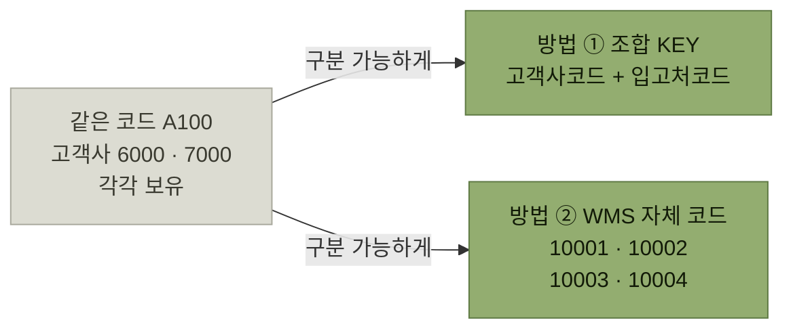

# 거래처관련 기준정보

> [기준정보](./README.md)

## 빠른 복습
- 거래처 관련 기준정보는 **WMS에 재고의 입출고를 일으키는 주체들을 정의하고 관리하기 위한 코드들**이다.
- **고객사 · 입고처 · 출고처 · 운송사 · 차량**으로 구성되며, **창고코드와 상관없이 전체 시스템에서 공통으로 사용**되는 것이 일반적이다.
- **고객사는 "재고의 주인(소유주)"** 이다. **화주, 하주**로도 불린다. 과거에는 하나의 고객사만 대상으로 구축했지만 **최근에는 다수의 고객사를 서비스하는 것이 일반적**이다.
- 여러 고객사를 함께 서비스하면 **입고처·출고처·제품 코드가 겹치는 문제**가 생긴다. 해법은 두 가지 — **고객사 코드와 조합해 KEY를 구성**하거나, **WMS 자체 코드를 별도로 부여**한다.
- **운송사**는 차량의 소속사이며 **운송비 정산과 운송사별 서비스 지표 분석의 기준**이 된다. **차량**은 운송사 코드를 갖고 **배차와 분석용 항목**을 관리한다.

## 입출고를 일으키는 주체들

원서의 예문 하나로 다섯 코드가 모두 등장한다.

> **[A회사]가 [B공장]에서 [C창고]로 [D제품] 100개를 입고하였다.** 이 재고 중 **50개를 [E업체]에 [F운수]의 [G차량]을 통해 출고**하였다.

| 코드 | 예문에서 무엇인가 |
| --- | --- |
| **고객사** | **A회사** — D제품의 소유 회사 |
| **입고처** | **B공장** — 창고로 들어올 재고를 출고한 공급 주체 |
| **출고처** | **E업체** — 창고에서 나간 재고를 인도받는 목적지 주체 |
| **운송사** | **F운수** — 배송을 위한 위탁 운송 회사 |
| **차량** | **G차량** — 실제 D제품 50개를 E업체에 운송한 차량 |

표를 읽는 법. **C창고는 [창고관련 기준정보](./2-창고관련-기준정보.md)**, **D제품은 [제품관련 기준정보](./4-제품관련-기준정보.md)** 다. 나머지 A회사·B공장·E업체·F운수·G차량이 이 문서에서 다루는 거래처 관련 기준정보다. 그리고 **거래처 기준정보들은 창고코드와 상관없이 전체 시스템에서 공통적으로 사용되는 것이 일반적**이다.

## 가. 고객사

> **고객사는 "재고의 주인(소유주)"** 이라고 생각하면 쉽다. **"화주", "하주"** 등의 용어로도 불린다.

- **과거에는 하나의 고객사만을 대상으로 WMS를 구축하는 경우도 있었지만, 최근에는 다수의 고객사(화주)를 대상으로 서비스하는 경우가 일반적**이다.
- 고객사에서 필수적으로 관리하는 항목들은 **주소, 사업번호, 대표자** 등의 기본 정보 외에도 **결제나 청구를 위한 정보** 등 다양한 정보를 관리하기도 한다.

원서 [그림 3-7]의 예시는 고객사코드 `6000`(서울물산) · `7000`(부산실업)에 **사업번호, 대표자, 주소, 업태, 종목, 담당자, 연락처, 비고사항**이 붙는 구성이다. [1절에서 "고객사를 하나만 관리하도록 설계하면 시스템을 새로 만들어야 할 수 있다"](./1-기준정보-개요.md#단순한-구조가-만드는-큰-차이)고 했던 그 고객사가 이 코드다.

## 나. 입고처

**재고 입고 시 입고 물량이 출고된 위치 또는 주체**를 의미한다. 보통 **"입고처", "공급처", "상대출고처"** 등으로 불린다. **재고를 생성하기 위한 입고 관련 업무 시에 필수적으로 필요한 기준정보**다.

### 코드가 겹친다

> **WMS에서 여러 고객사(화주)를 동시에 관리할 경우 고객사는 다르지만 입고처 코드가 동일한 경우가 발생**되기도 한다. **입고처코드는 동일하지만 실제로는 완전히 다른 입고처**다.
> (예: 고객사 `6000`이 운영하는 입고처 코드 `A100` 삼성공장, 고객사 `7000`이 운영하는 입고처 코드 `A100` LG공장)

**WMS는 이러한 상황에서 고객사 코드와 입고처 코드를 조합하여 KEY를 구성할 수도 있고, WMS에서 별도의 입고처 코드를 부여하여 구분 관리할 수도 있다.**

*코드 중복을 푸는 두 갈래. 이 그림은 입고처 · 출고처 · 제품에서 똑같이 반복된다*

<table>
<thead>
<tr>
<th style="text-align:center; white-space:nowrap">방식</th>
<th style="text-align:center; white-space:nowrap">WMS 입고처코드</th>
<th style="text-align:center; white-space:nowrap">고객사코드</th>
<th style="text-align:center; white-space:nowrap">입고처코드</th>
<th style="text-align:center; white-space:nowrap">입고처명</th>
<th style="text-align:center; white-space:nowrap">주소</th>
</tr>
</thead>
<tbody>
<tr>
<td style="text-align:center; white-space:nowrap">조합 KEY</td>
<td style="text-align:center; white-space:nowrap">—</td>
<td style="text-align:center; white-space:nowrap">6000</td>
<td style="text-align:center; white-space:nowrap">A100</td>
<td style="text-align:center; white-space:nowrap">이천공장</td>
<td style="text-align:center; white-space:nowrap">경기 이천시</td>
</tr>
<tr>
<td style="text-align:center; white-space:nowrap">조합 KEY</td>
<td style="text-align:center; white-space:nowrap">—</td>
<td style="text-align:center; white-space:nowrap">7000</td>
<td style="text-align:center; white-space:nowrap">A100</td>
<td style="text-align:center; white-space:nowrap">여수공장</td>
<td style="text-align:center; white-space:nowrap">전남 여수시</td>
</tr>
<tr>
<td style="text-align:center; white-space:nowrap">WMS 코드 추가</td>
<td style="text-align:center; white-space:nowrap">10001</td>
<td style="text-align:center; white-space:nowrap">6000</td>
<td style="text-align:center; white-space:nowrap">A100</td>
<td style="text-align:center; white-space:nowrap">이천공장</td>
<td style="text-align:center; white-space:nowrap">경기 이천시</td>
</tr>
<tr>
<td style="text-align:center; white-space:nowrap">WMS 코드 추가</td>
<td style="text-align:center; white-space:nowrap">10003</td>
<td style="text-align:center; white-space:nowrap">7000</td>
<td style="text-align:center; white-space:nowrap">A100</td>
<td style="text-align:center; white-space:nowrap">여수공장</td>
<td style="text-align:center; white-space:nowrap">전남 여수시</td>
</tr>
</tbody>
</table>

*원서 [그림 3-8] 입고처 기준정보 설정 예시에서 중복이 걸린 두 행만 뽑았다*

표를 읽는 법. 두 방식의 차이는 **KEY를 늘리느냐, 값을 새로 만드느냐**다. 조합 KEY는 **고객사가 준 코드를 그대로 보존**하고, WMS 자체 코드는 **WMS 안에서 단일 키 하나로 다룰 수 있게** 만든다. 원서 주석도 그렇게 갈라 적혀 있다 — **"고객사와 입고처의 조합으로 중복 문제를 해결함"**, **"별도의 WMS 전용 입고처코드를 추가"**.

## 다. 출고처

**재고가 배송, 납품되는 최종 위치 또는 주체**를 의미한다. **"배송처", "목적지", "도착처", "인도처"** 등의 다양한 용어로도 사용된다. **출고 오더 등록 등의 업무에서 필수적으로 사용되는 기준정보**다.

> **입고처와 마찬가지로 여러 고객사의 물류 업무를 수행할 경우 고객사의 출고처 코드가 동일해서 문제가 되는 경우가 있다.** (예: 고객사 코드 `6000`과 `7000`의 출고처 코드가 `B100`으로 동일한 경우) **고객사 코드와 출고처 코드의 조합으로 구분하거나 별도의 WMS 자체 출고처 코드를 생성하여 문제를 해결할 수 있다.**

원서 [그림 3-9]가 입고처와 완전히 같은 구조로 반복된다 — 조합 KEY 방식과 **WMS 출고처코드 `50001`~`50004`** 를 추가하는 방식이다.

## 라. 운송사

**일반적으로 재고의 입출고 시 차량이 투입되는 경우가 많은데, 그 차량의 소속사인 "운송사"를 등록 관리**한다.

> **향후 운송 결과에 대한 운송비 정산이나 운송사별 서비스 지표 분석 등의 업무를 할 때 기준이 되는 코드**다.

원서 [그림 3-10]의 예시는 **운송사코드 `SP01`(미래운수) · `SP02`(전진운송)** 에 사업번호, 대표자, 업태(운수), 종목(육상운송 / 육상·해상운송), 주소가 붙는 구성이다.

## 마. 차량

**차량 기준정보는 재고를 입고 또는 출고 시에 투입되는 차량에 관련된 정보를 관리**한다. **차량 기준정보에는 앞에서 본 [운송사] 코드를 입력하여 해당 차량이 어느 운송사 소속인지를 관리**할 수 있다.

**차량의 유형, 적재 톤수, 기준연비, 탑차 유무 등의 배차나 분석을 위한 항목들**을 관리한다.

<table>
<thead>
<tr>
<th style="text-align:center; white-space:nowrap">차량코드</th>
<th style="text-align:center; white-space:nowrap">차량명</th>
<th style="text-align:center; white-space:nowrap">운송사코드</th>
<th style="text-align:center; white-space:nowrap">운전자명</th>
<th style="text-align:center; white-space:nowrap">연락처</th>
<th style="text-align:center; white-space:nowrap">유형</th>
<th style="text-align:center; white-space:nowrap">톤수</th>
<th style="text-align:center; white-space:nowrap">기준연비</th>
</tr>
</thead>
<tbody>
<tr>
<td style="text-align:center; white-space:nowrap">6701</td>
<td style="text-align:center; white-space:nowrap">02마6701</td>
<td style="text-align:center; white-space:nowrap">SP01</td>
<td style="text-align:center; white-space:nowrap">김정식</td>
<td style="text-align:center; white-space:nowrap">010-211-1112</td>
<td style="text-align:center; white-space:nowrap">냉장</td>
<td style="text-align:center; white-space:nowrap">5</td>
<td style="text-align:center; white-space:nowrap">5.5</td>
</tr>
<tr>
<td style="text-align:center; white-space:nowrap">7308</td>
<td style="text-align:center; white-space:nowrap">09오7308</td>
<td style="text-align:center; white-space:nowrap">SP02</td>
<td style="text-align:center; white-space:nowrap">김명진</td>
<td style="text-align:center; white-space:nowrap">010-554-9119</td>
<td style="text-align:center; white-space:nowrap">일반</td>
<td style="text-align:center; white-space:nowrap">11</td>
<td style="text-align:center; white-space:nowrap">7.0</td>
</tr>
</tbody>
</table>

*원서 [그림 3-11] 차량 기준정보 구성 예시 — 원서 주석: **6701 차량은 SP01 미래운수 소속, 7308 차량은 SP02 전진운송 소속 차량이다.***

표를 읽는 법. **유형(냉장/일반)과 톤수**가 여기 있다는 것이 요점이다. 배차할 때 **냉장 화물에 일반 차량을 붙이지 않으려면** 이 항목이 기준정보에 있어야 한다. ["관리하지 않는 것은 분석할 수 없다"](./1-기준정보-개요.md#관리하지-않는-것은-분석할-수-없다)가 배차에도 그대로 적용된다.

## 함께 읽기

- [제품관련 기준정보 — 코드 중복 문제가 세 번째로 반복된다](./4-제품관련-기준정보.md)
- [입고예정수신 — 입고처 코드가 실제로 쓰이는 자리](../4-입고-프로세스/1-입고예정수신.md)
- [출고 프로세스 — 출고처·운송사·차량이 쓰이는 자리](../5-출고-프로세스/README.md)
