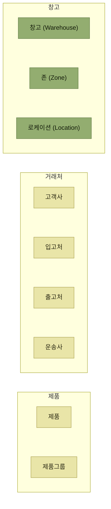

# 기준정보

> [WMS 원리와 이해](../README.md)

## 기준정보는 왜 "나중에 고칠 수 없는가"

**기준정보**는 말 그대로 **시스템에 있어서 기준이 되는 데이터**다. 구조가 단순해서 초급 담당자가 맡는 경우가 많고 중요하게 여겨지지 않는 일이 많지만, 이 장의 주장은 반대다.

> 실제로는 **WMS 시스템의 유연성, 확장성, 완성도 등 전반적인 체계와 성능에 매우 큰 영향을 미치는 영역**이다. 따라서 기준정보 영역은 반드시 **핵심 설계자, 개발자 및 담당자의 설계와 참여, 운영이 필수적인 영역**이다.

WMS는 세 갈래의 기준정보를 기반으로 운영된다. **재고를 보관 관리하기 위한 주체인 "창고"**, **재고를 입고받거나 출고해야 할 대상인 "거래처"**, 그리고 **창고에 보관되는 "제품"** 이다.

*[그림 3-1] 기준정보 주요 구성 — 창고 쪽 세 단계가 ERP와 WMS를 가르는 지점이다*

## 이 장에서 확인할 것

- 기준정보를 잘못 설계하면 무엇을 못 하게 되는가 (중량별 출고량 분석과 50,000종의 제품)
- 창고 · 존 · 로케이션은 어떤 계층인가, 왜 아파트에 비유되는가
- 여러 고객사를 함께 서비스할 때 **코드 중복 문제**를 어떻게 푸는가
- 좋은 기준정보 코드의 다섯 가지 원칙은 무엇인가

## 목차

- [기준정보 개요](./1-기준정보-개요.md)
- [창고관련 기준정보](./2-창고관련-기준정보.md)
- [거래처관련 기준정보](./3-거래처관련-기준정보.md)
- [제품관련 기준정보](./4-제품관련-기준정보.md)
- [코드의 효율적인 설계와 운영](./5-코드의-효율적인-설계와-운영.md)

## 함께 읽기

- 존과 로케이션의 개념은 [2장의 로케이션과 존](../2-wms-주요-프로세스/1-로케이션과-존.md)에서 프로세스 관점으로 먼저 다뤘다. 3장은 그것을 **기준정보(데이터)의 관점**에서 다시 본다.
- 여기서 정의한 입고처·출고처가 실제로 쓰이는 곳은 [4장 입고 프로세스](../4-입고-프로세스/README.md)와 [5장 출고 프로세스](../5-출고-프로세스/README.md)다.
